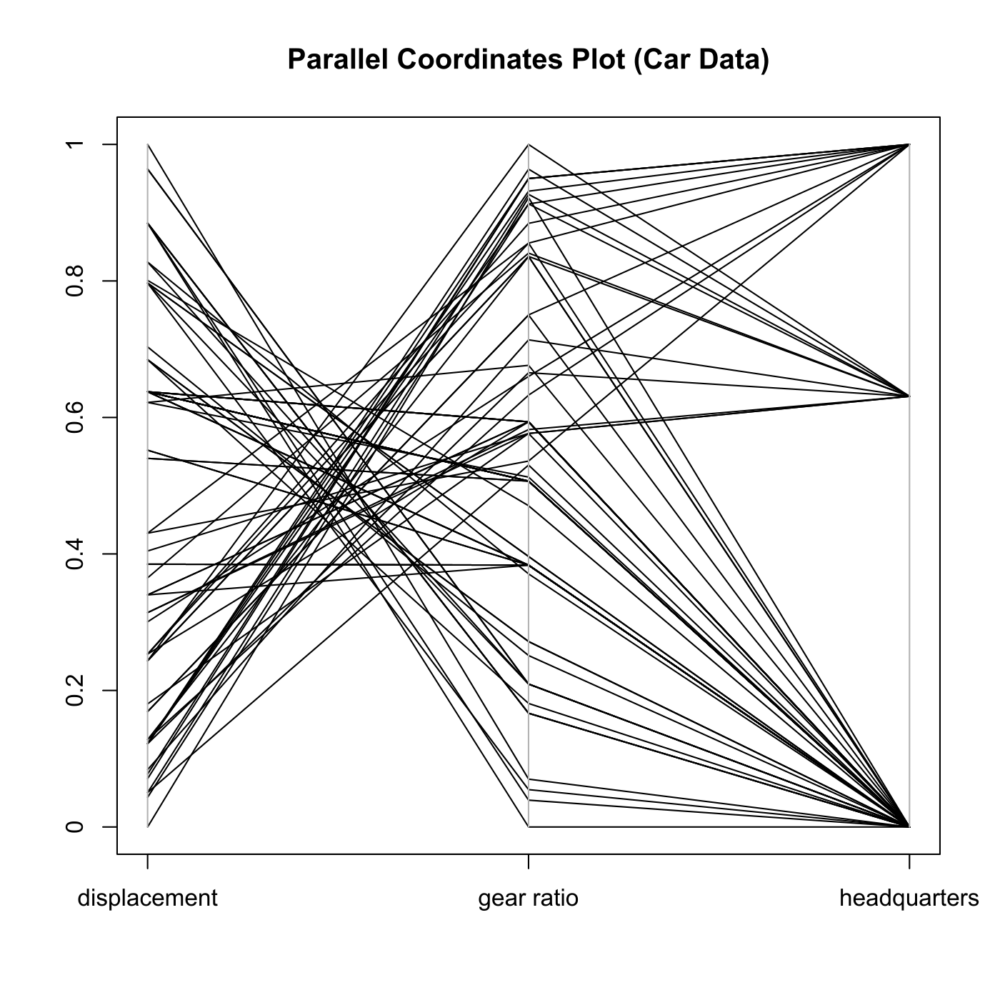

[](http://quantlet.de/)

## [](http://quantlet.de/) **MVApcp4** [](http://quantlet.de/)

```yaml

Name of QuantLet : MVApcp4

Published in : Applied Multivariate Statistical Analysis

Description : 'Computes parallel coordinates plot for variables displacement, gear ratio for high
gear and company headquarters of the car data set.'

Keywords : 'pcp, parallel-coordinates-plot, financial, data visualization, plot, graphical
representation'

See also : MVApcphousing, MVApcp1, MVApcp2, MVApcp3, MVApcp5, MVApcp6, MVApcp7, MVApcp8

Author : Ji Cao, Vladimir Georgescu, Awdesch Melzer, Song Song

Submitted : Tue, September 09 2014 by Awdesch Melzer

Datafile : carc.txt

```




### R Code:
```r

# clear all variables
rm(list = ls(all = TRUE))
graphics.off()

# install and load packages
libraries = c("MASS")
lapply(libraries, function(x) if (!(x %in% installed.packages())) {
    install.packages(x)
})
lapply(libraries, library, quietly = TRUE, character.only = TRUE)

# load data
x = read.table("carc.txt")
frame = data.frame(x[, 11:13])
colnames(frame) = c("displacement", "gear ratio", "headquarters")

# Plot
parcoord(log(frame[, c(1, 2, 3)]), frame = TRUE, main = "Parallel Coordinates Plot (Car Data)")
axis(side = 2, at = seq(0, 1, 0.2), labels = seq(0, 1, 0.2)) 

```
