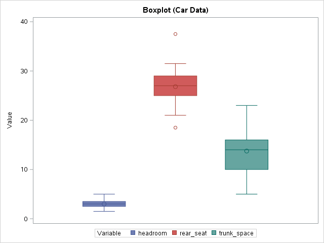

[](http://quantlet.de/)

## [](http://quantlet.de/) **MVApcp6** [](http://quantlet.de/)

```yaml

Name of QuantLet : MVApcp6

Published in : Applied Multivariate Statistical Analysis

Description : 'Computes boxplots for variables headroom, rear seat clearance and trunk space of the
car data set.'

Keywords : 'pcp, parallel-coordinates-plot, boxplot, financial, data visualization, plot, graphical
representation, sas'

See also : MVApcphousing, MVApcp1, MVApcp2, MVApcp3, MVApcp4, MVApcp5, MVApcp7, MVApcp8

Author : Ji Cao, Song Song, Vladimir Georgescu, Awdesch Melzer

Author[SAS] : Svetlana Bykovskaya

Submitted : Tue, September 09 2014 by Awdesch Melze

Submitted[SAS] : Wen, April 6 2016 by Svetlana Bykovskaya

Datafile : carc.txt, carc_sas.txt

```





### R Code:
```r

# clear all variables
rm(list = ls(all = TRUE))
graphics.off()

# load data
x = read.table("carc.txt")
frame = data.frame(x[, 5:7])
colnames(frame) = c("headroom", "rear seat", "trunk space")

m1 = mean(frame[, 1])
m2 = mean(frame[, 2])
m3 = mean(frame[, 3])

# Plot
boxplot(frame, lwd = 1)
title("Boxplot (Car Data)")
lines(c(0.6, 1.4), c(m1, m1), lty = "dotted", lwd = 1.5, col = "red3")
lines(c(1.6, 2.4), c(m2, m2), lty = "dotted", lwd = 1.5, col = "red3")
lines(c(2.6, 3.4), c(m3, m3), lty = "dotted", lwd = 1.5, col = "red3") 

```

### SAS Code:
```sas

* Import the data;
data carc;
  id + 1;
  infile '/folders/myfolders/data/carc_sas.txt';
  input t1 $ t2 $ t3 $ t4 $ t5 $ t6 $ t7 $ t8 $ t9 $ t10 $ t11 $ t12 $ t13 $;
  headroom    = input(t5, 8.);
  rear_seat   = input(t6, 8.);
  trunk_space = input(t7, 8.);
  drop t1--t13;
run;

proc transpose data = carc out = car_t;
  by id;
run;

data car_t;
  set car_t;
  label _name_ = "Variable";
  label col1 = "Value";
run;

title "Boxplot (Car Data)";
proc sgplot data = car_t;
  vbox col1 / group = _name_ ;
run;
```
