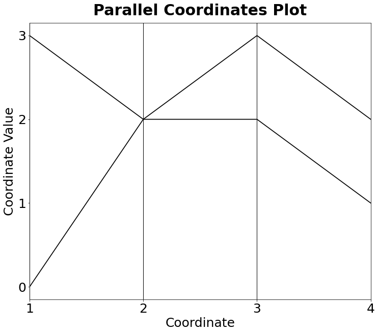

[](http://quantlet.de/)

## [](http://quantlet.de/) **MVApcp7** [](http://quantlet.de/)

```yaml

Name of QuantLet: MVApcp7

Published in: Applied Multivariate Statistical Analysis

Description: Computes parallel coordinates plot with intersection.

Keywords: pcp, parallel-coordinates-plot, financial, data visualization, plot, graphical representation

See also: MVApcphousing, MVApcp1, MVApcp2, MVApcp3, MVApcp4, MVApcp5, MVApcp6, MVApcp8

Author: Ji Cao, Song Song, Vladimir Georgescu, Awdesch Melzer, Felix Jung
Author[Python]: Matthias Fengler, Tim Dass

Submitted: Tue, September 09 2014 by Awdesch Melzer
Submitted[Python]: Tue, April 16 2024 by Tim Dass

Input: 
- z1 : first data point
- z2 : second data point

```




### PYTHON Code
```python

#works on pandas 1.5.2, numpy 1.23.5 and matplotlib 3.6.2
import pandas as pd
import numpy as np
import matplotlib.pyplot as plt
from pandas.plotting import parallel_coordinates

data = {"name":["A","B"],1:[0,3],2:[2,2],3:[3,2],4:[2,1]}
df = pd.DataFrame(data)

fig, ax = plt.subplots(figsize = (12,10))

parallel_coordinates(df, "name", color=("black"), linewidth ="1.7")
plt.legend().set_visible(False)
ax.tick_params(axis='both', labelsize = 25)
ax.set_xlabel("Coordinate", fontsize = 25)
ax.set_ylabel("Coordinate Value", fontsize = 25)
ax.yaxis.set_ticks(np.arange(0, 3.1, 1))
plt.title(label = "Parallel Coordinates Plot", 
          fontsize = 30, fontweight = "bold", pad = 15)
ax.grid(False)
plt.show()

```

automatically created on 2024-04-25

### R Code
```r


# clear all variables
rm(list = ls(all = TRUE))
graphics.off()

# parameter settings
z1 = c(0, 2, 3, 2)
z2 = c(3, 2, 2, 1)

# Plot
plot(z1, type = "l", ylim = c(0, 3), xlim = c(1, 4), xlab = "Coordinate", lwd = 2, 
    ylab = "Coordinate Value", frame = TRUE, axes = FALSE)
lines(z2, lwd = 2)
axis(side = 1, at = seq(1, 4), labels = seq(1, 4))
axis(side = 2, at = seq(0, 3), labels = seq(0, 3))
title("Parallel Coordinates Plot") 

```

automatically created on 2024-04-25