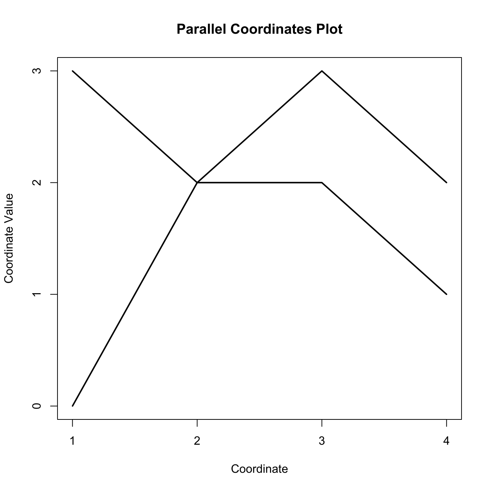

[](http://quantlet.de/)

## [](http://quantlet.de/) **MVApcp7** [](http://quantlet.de/)

```yaml

Name of QuantLet : MVApcp7

Published in : Applied Multivariate Statistical Analysis

Description : Computes parallel coordinates plot with intersection.

Keywords : 'pcp, parallel-coordinates-plot, financial, data visualization, plot, graphical
representation'

See also : MVApcphousing, MVApcp1, MVApcp2, MVApcp3, MVApcp4, MVApcp5, MVApcp6, MVApcp8

Author : Ji Cao, Song Song, Vladimir Georgescu, Awdesch Melzer, Felix Jung

Submitted : Tue, September 09 2014 by Awdesch Melzer

Input: 
- z1: first data point
- z2: second data point

```




### R Code:
```r

# clear all variables
rm(list = ls(all = TRUE))
graphics.off()

# parameter settings
z1 = c(0, 2, 3, 2)
z2 = c(3, 2, 2, 1)

# Plot
plot(z1, type = "l", ylim = c(0, 3), xlim = c(1, 4), xlab = "Coordinate", lwd = 2, 
    ylab = "Coordinate Value", frame = TRUE, axes = FALSE)
lines(z2, lwd = 2)
axis(side = 1, at = seq(1, 4), labels = seq(1, 4))
axis(side = 2, at = seq(0, 3), labels = seq(0, 3))
title("Parallel Coordinates Plot") 

```
