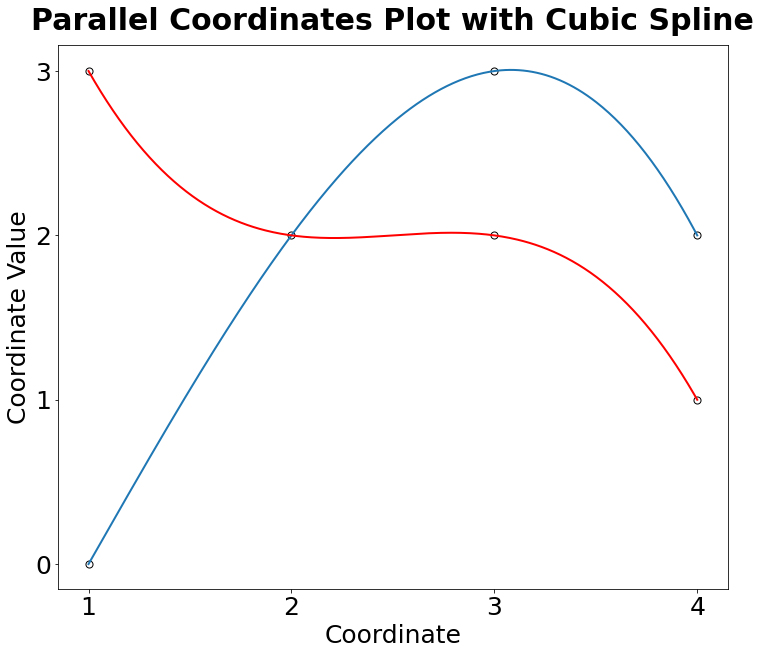
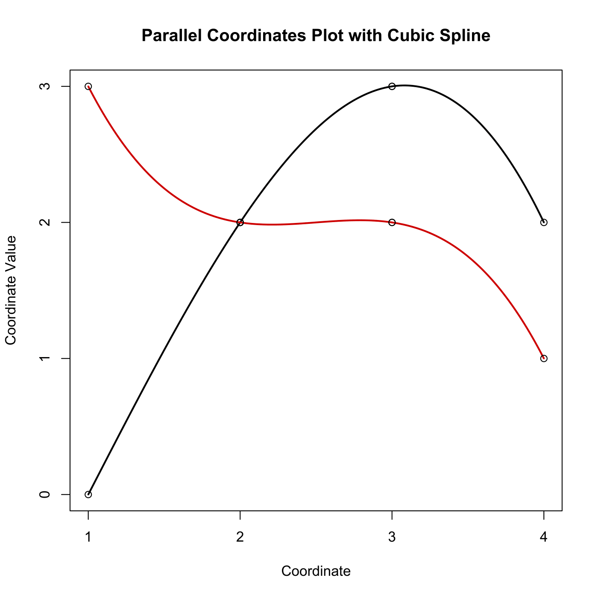

[](http://quantlet.de/)

## [](http://quantlet.de/) **MVApcp8** [](http://quantlet.de/)

```yaml

Name of QuantLet: MVApcp8

Published in: Applied Multivariate Statistical Analysis

Description: Computes parallel coordinates plot with cubic spline interpolation.

Keywords: pcp, parallel-coordinates-plot, financial, spline, interpolation, data visualization, plot, graphical representation

See also: MVApcphousing, MVApcp1, MVApcp2, MVApcp3, MVApcp4, MVApcp5, MVApcp6, MVApcp7

Author: Ji Cao, Song Song, Vladimir Georgescu, Awdesch Melzer
Author[Python]: Matthias Fengler, Tim Dass

Submitted: Tue, September 09 2014 by Awdesch Melzer
Submitted[Python]: Tue, April 16 2024 by Tim Dass

Input:
- z1 : first data point
- z2 : second data point

```





### PYTHON Code
```python

# tested under numpy 1.23.5, matplotlib 3.7.0 and scipy 1.10.0
import numpy as np
import matplotlib.pyplot as plt
from scipy.interpolate import CubicSpline

z1 = np.array([0, 2, 3, 2])
z2 = np.array([3, 2, 2, 1])
n = 400

x1 = np.linspace(1, 4, n)
y1 = CubicSpline(np.arange(len(z1)), z1)(np.linspace(0, 3, n))
x2 = np.linspace(1, 4, n)
y2 = CubicSpline(np.arange(len(z2)), z2)(np.linspace(0, 3, n))

fig, ax = plt.subplots(figsize = (12,10))

ax.plot(x1, y1, lw=2)
ax.plot(x2, y2, lw=2, color="red")

ax.scatter([1, 1, 2, 3, 3, 4, 4], [0, 3, 2, 2, 3, 1, 2], 
           c = "w", edgecolors = "k", s = 50)

ax.yaxis.set_ticks(np.arange(0, 3.1, 1))
ax.xaxis.set_ticks(np.arange(1, 4.1, 1))
ax.set_xlabel("Coordinate", fontsize = 25)
ax.set_ylabel("Coordinate Value", fontsize = 25)
ax.tick_params(axis='both', labelsize = 25)
ax.set_title("Parallel Coordinates Plot with Cubic Spline",fontsize = 30, fontweight = "bold", pad = 15)
plt.show()

```

automatically created on 2024-04-25

### R Code
```r


# clear all variables
rm(list = ls(all = TRUE))
graphics.off()

# parameter settings
z1  = c(0, 2, 3, 2)
z2  = c(3, 2, 2, 1)
n   = 400

x1  = spline(z1, n = n)
x2  = spline(z2, n = n)

# Plot
plot(x1, lwd = 2, type = "l", ylab = "Coordinate Value", xlab = "Coordinate", frame = TRUE, 
    axes = FALSE, xlim = c(1, 4), ylim = c(0, 3))
lines(x2, lwd = 2, col = "red3")
points(c(1, 2), c(3, 2))
points(c(1, 2), c(0, 2))
points(c(2, 3), c(2, 2))
points(c(2, 3), c(2, 3))
points(c(3, 4), c(3, 2))
points(c(3, 4), c(2, 1))
axis(side = 1, at = seq(1, 4), labels = seq(1, 4))
axis(side = 2, at = seq(0, 3), labels = seq(0, 3))
title("Parallel Coordinates Plot with Cubic Spline") 

```

automatically created on 2024-04-25