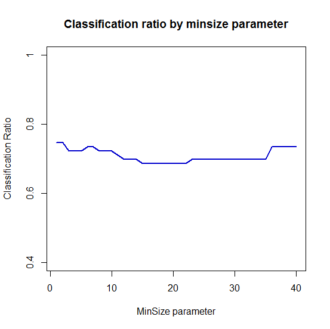

[](http://quantlet.de/)

## [](http://quantlet.de/) **MVAbankruptcydis** [](http://quantlet.de/)

```yaml

Name of Quantlet : MVAbankruptcydis

Published in : Applied Multivariate Statistical Analysis

Description : Computes classification ratio dynamic over the number of terminal nodes.

Keywords : classification, cross-validation, plot, data visualization, graphical representation

See also : SMSlassocar, SMSlassologit

Author : Song Song, Vladimir Georgescu, Awdesch Melzer

Submitted : Wed, June 04 2014 by Felix Jung

Example : Classification ratio by minsize parameter.

```




### R Code:
```r

# clear variables and close windows
rm(list = ls(all = TRUE))
graphics.off()

x = c(1, 2, 3, 4, 5, 6, 7, 8, 9, 10, 11, 12, 13, 14, 15, 16, 17, 18, 19, 20, 21, 
    22, 23, 24, 25, 26, 27, 28, 29, 30, 31, 32, 33, 34, 35, 36, 37, 38, 39, 40)
y = c(62, 62, 60, 60, 60, 61, 61, 60, 60, 60, 59, 58, 58, 58, 57, 57, 57, 57, 57, 
    57, 57, 57, 58, 58, 58, 58, 58, 58, 58, 58, 58, 58, 58, 58, 58, 61, 61, 61, 61, 
    61)
p = y / 83

# plot
plot(p, type = "l", ylim = c(0.4, 1), axes = FALSE, frame = TRUE, ylab = "Classification Ratio", 
    xlab = "MinSize parameter", col = "blue3", lwd = 2)
axis(side = 1, at = seq(0, 40, 10), labels = seq(0, 40, 10))
axis(side = 2, at = seq(0, 1, 0.2), labels = seq(0, 1, 0.2))
title("Classification ratio by minsize parameter")

```
