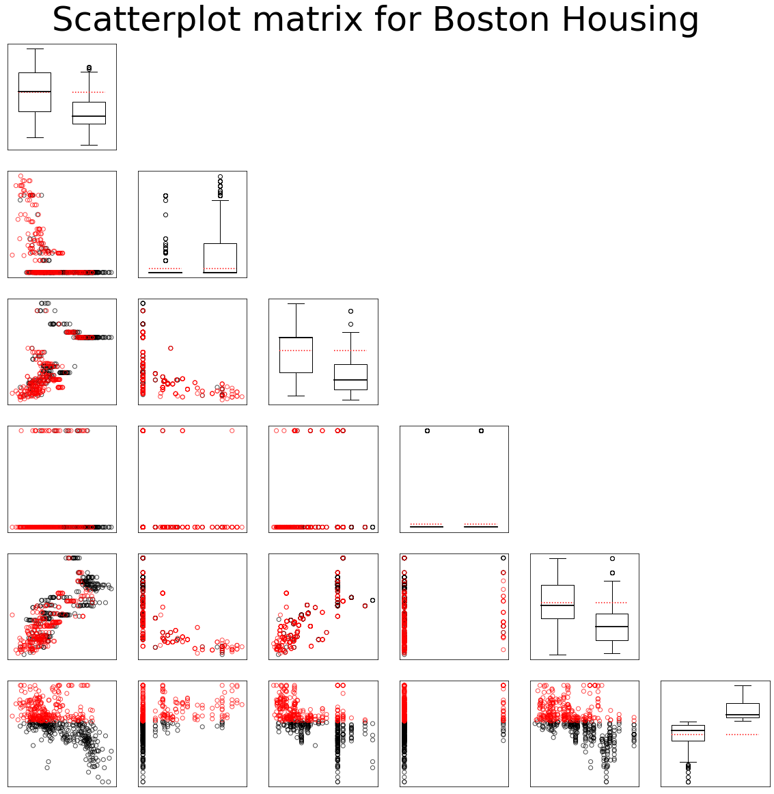

[](http://quantlet.de/)

## [](http://quantlet.de/) **MVAdrafthousingt** [](http://quantlet.de/)

```yaml

Name of QuantLet: MVAdrafthousingt

Published in: Applied Multivariate Statistical Analysis

Description: Plots the scatterplot matrix for the transformed Boston housing data variables X1, ... , X5 and X14.

Keywords: financial, data visualization, boxplot, scatterplot, plot, graphical representation

See also: MVAdrafthousing, MVApcphousing

Author: Vladimir Georgescu, Jorge Patron, Song Song, Julia Wandke, Awdesch Melzer
Author[Python]: Matthias Fengler, Tim Dass

Submitted: Tue, September 09 2014 by Awdesch Melzer
Submitted[Python]: Tue, April 16 2024 by Tim Dass

Datafile: bostonh.dat

```




### PYTHON Code
```python

#works on pandas 1.5.2, numpy 1.23.5 and matplotlib 3.7.0
import pandas as pd
import numpy as np
import matplotlib.pyplot as plt

df = pd.read_csv('bostonh.dat', sep='\s+', header=None, names=np.arange(1,15,1))

med14 = df[14].median()
K = [2 if c > med14 else 1 for c in df[14]]

df_x = pd.DataFrame(data = {1: np.log(df[1]), 2: df[2], 3: df[3], 4: df[4],
                            5: np.log(df[5]), 14: np.log(df[14]), "K": K})

z1 = df_x[df_x["K"] == 1]
z2 = df_x[df_x["K"] == 2]
m1 = np.mean(z1, axis = 0)
m2 = np.mean(z2, axis = 0)

fig, axs = plt.subplots(6,6, figsize=(20,20))

for i in range(6):
    for j in range(6):
        if i == j:
            axs[i,j].boxplot([df_x[df_x["K"] == 1].iloc[:, i], df_x[df_x["K"] == 2].iloc[:, i]],
                             widths = 0.6, medianprops = dict(color="black",linewidth=1.8))
            axs[i, j].plot([0.7, 1.3], [m1.iloc[i], m1.iloc[i]], linestyle="dotted", linewidth=1.5, color="red")
            axs[i, j].plot([1.7, 2.3], [m1.iloc[i], m1.iloc[i]], linestyle="dotted", linewidth=1.5, color="red")
            axs[i, j].set_xticks([])
            axs[i, j].set_yticks([])
        
        if i > j:    
            axs[i,j].scatter(df_x[df_x["K"] == 1].iloc[:, j], df_x[df_x["K"] == 1].iloc[:, i],
                             alpha = 0.7, facecolors='none', edgecolors='black')
            axs[i,j].scatter(df_x[df_x["K"] == 2].iloc[:, j], df_x[df_x["K"] == 2].iloc[:, i], 
                             alpha = 0.7, facecolors='none', edgecolors='r')
            axs[i, j].set_xticks([])
            axs[i, j].set_yticks([])
        
        if j > i:
            axs[i, j].axis("off")
            
fig.suptitle("Scatterplot matrix for Boston Housing", fontsize=50, y=0.92)
plt.show()

```

automatically created on 2024-04-25

### R Code
```r


# clear all variables
rm(list = ls(all = TRUE))
graphics.off()

# load data
data = read.table("bostonh.dat")
x    = data

# data transfomation
K = as.numeric(data[, 14] > median(data[, 14])) + 1
x = cbind(log(x[, 1]), x[, 2], x[, 3], x[, 4], log(x[, 5]), log(x[, 14]), K)

# subset creation for subset means
z    = data.frame(x)
z1   = subset(z, z$K == 1)
z2   = subset(z, z$K == 2)
m1   = apply(z1, 2, mean)
m2   = apply(z2, 2, mean)
i    = 0
op   = par(mfrow = c(6, 6), cex = 0.15)

while (i < 6) {
    i = i + 1
    j = 0
    while (j < 6) {
        j = j + 1
        
        if (i == j) {
            boxplot(x[, i] ~ K, at = 1:2, axes = FALSE)
            lines(c(0.6, 1.4), c(m1[i], m1[i]), lty = "dotted", lwd = 1.2, col = "red3")
            lines(c(1.6, 2.4), c(m1[i], m1[i]), lty = "dotted", lwd = 1.2, col = "red3")
        }
        
        if (i > j) {
            yy = cbind(x[, j], x[, i], K)
            plot(yy[, -3], col = as.numeric(K), xlab = "X", ylab = "Y", cex = 4, 
                axes = FALSE)
        }
        
        if (i < j) {
            plot(i, type = "n", axes = FALSE, xlab = "", ylab = "", main = "")
        }
    }
}

title(main = list("Scatterplot matrix for transformed Boston Housing", cex = 8), 
    line = -16, outer = TRUE) 

```

automatically created on 2024-04-25