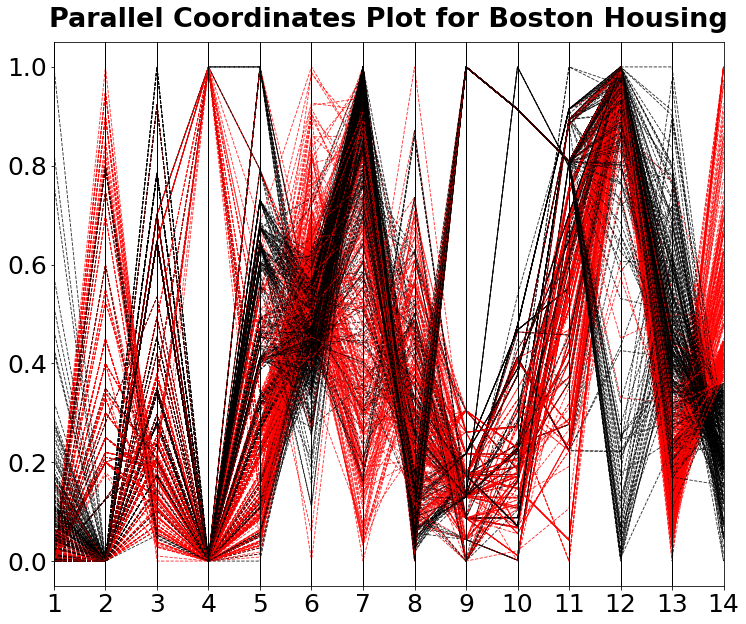

[](http://quantlet.de/)

## [](http://quantlet.de/) **MVApcphousing** [](http://quantlet.de/)

```yaml

Name of QuantLet: MVApcphousing

Published in: Applied Multivariate Statistical Analysis

Description: Computes Parallel Coordinates Plot (PCP) for Boston Housing data.

Keywords: pcp, parallel-coordinates-plot, financial, data visualization, plot, graphical representation

See also: MVAdrafthousing, MVAdrafthousingt, MVApcp1, MVApcp2, MVApcp3, MVApcp4, MVApcp5, MVApcp6, MVApcp7, MVApcp8

Author: Vladimir Georgescu, Jorge Patron, Song Song, Awdesch Melzer
Author[Python]: Matthias Fengler, Tim Dass

Submitted: Wed, February 29 2012 by Dedy Dwi Prastyo
Submitted[Python]: Tue, April 16 2024 by Tim Dass

Datafile: bostonh.dat

Example: In order to highlight the relations of X14 to the remaining 13 variables all the observations with X14 > median(X14) are coloured as red lines.

```




### PYTHON Code
```python

#works on pandas 1.5.2, numpy 1.23.5 and matplotlib 3.6.2
import pandas as pd
import numpy as np
import matplotlib.pyplot as plt
from pandas.plotting import parallel_coordinates

df = pd.read_csv('bostonh.dat', sep='\s+', header=None, names=np.arange(1,15,1))

df["name"] = df[14]

df.loc[df["name"] <= df["name"].median(), ["name"]] = 1
df.loc[df["name"] > df["name"].median(), ["name"]] = 2


for i in df.columns:
    df[i] = (df[i]-np.min(df[i])) / np.ptp(df[i])

fig, ax = plt.subplots(figsize = (12,10))

parallel_coordinates(df, "name", linewidth ="0.9", color = ("red","black"),
                     linestyle= "dashed", alpha = 0.8)

plt.legend().set_visible(False)
ax.tick_params(axis='both', labelsize=25)
ax.grid(False)
plt.title(label = "Parallel Coordinates Plot for Boston Housing", 
          fontsize = 27, fontweight = "bold", pad = 15)

plt.show()
```

automatically created on 2024-04-25

### R Code
```r


# clear all variables
rm(list = ls(all = TRUE))
graphics.off()

# install and load packages
libraries = c("MASS")
lapply(libraries, function(x) if (!(x %in% installed.packages())) {
    install.packages(x)
})
lapply(libraries, library, quietly = TRUE, character.only = TRUE)

# load data
x = read.table("bostonh.dat")

z = x[, 14]
z[x[, 14] <= median(x[, 14])] = 1
z[x[, 14] > median(x[, 14])] = 2

parcoord(x[, seq(1, 14, 1)], lty = z, lwd = 0.7, col = z, main = "Parallel Coordinates Plot for Boston Housing", 
    frame = TRUE)
axis(side = 2, at = seq(0, 1, 0.2), labels = seq(0, 1, 0.2)) 

```

automatically created on 2024-04-25