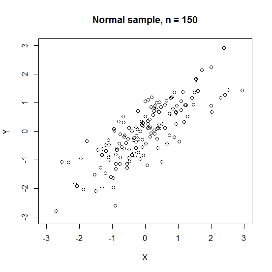

[](http://quantlet.de/)

## [](http://quantlet.de/) **MVAcorrnorm** [](http://quantlet.de/)

```yaml

Name of QuantLet : MVAcorrnorm

Published in : Applied Multivariate Statistical Analysis

Description : Computes a two dimensional scatterplot of two correlated normal random variables.

Keywords : 'correlation, gaussian, plot, graphical representation, normal, normal-distribution,
random, scatterplot, variable'

See also : 'MVAregbank, MVAregpull, MVAscabank45, MVAscabank56, MVAscabank456, MVAscacar,
MVAscapull1, MVAscapull2, MVAdraftbank4, MVAdrafthousing, MVAdrafthousingt'

Author : Vladimir Georgescu, Jorge Patron, Song Song, Awdesch Melzer

Submitted : Mon, September 15 2014 by Awdesch Melzer

Input: 
- sig: Covariance matrix

```




### R Code:
```r

# clear all variables
rm(list = ls(all = TRUE))
graphics.off()

# install and load packages
libraries = c("matlab")
lapply(libraries, function(x) if (!(x %in% installed.packages())) {
    install.packages(x)
})
lapply(libraries, library, quietly = TRUE, character.only = TRUE)

set.seed(80)
n      = 150
sig    = rbind(c(1, 0.8), c(0.8, 1))               # Define a covariance matrix
value  = flipud(eigen(sig)$values)                 # Compute the eigentvalues
vector = fliplr(eigen(sig)$vectors)                # and eigenvectors for sig
ll     = rbind(c(sqrt(value[1]), 0), c(0, sqrt(value[2])))    # Square root of the eigenvalues
sh     = vector %*% ll %*% vector 
nr     = cbind(rnorm(n, 0, 1), rnorm(n, 0, 1))     # Normal random variables
y      = nr %*% t(sh)

# сreate scatterplot
plot(y[, 1], y[, 2], ylab = "Y", xlab = "X", ylim = c(-3, 3), xlim = c(-3, 3))
title(paste("Normal sample, n =", n))

```
