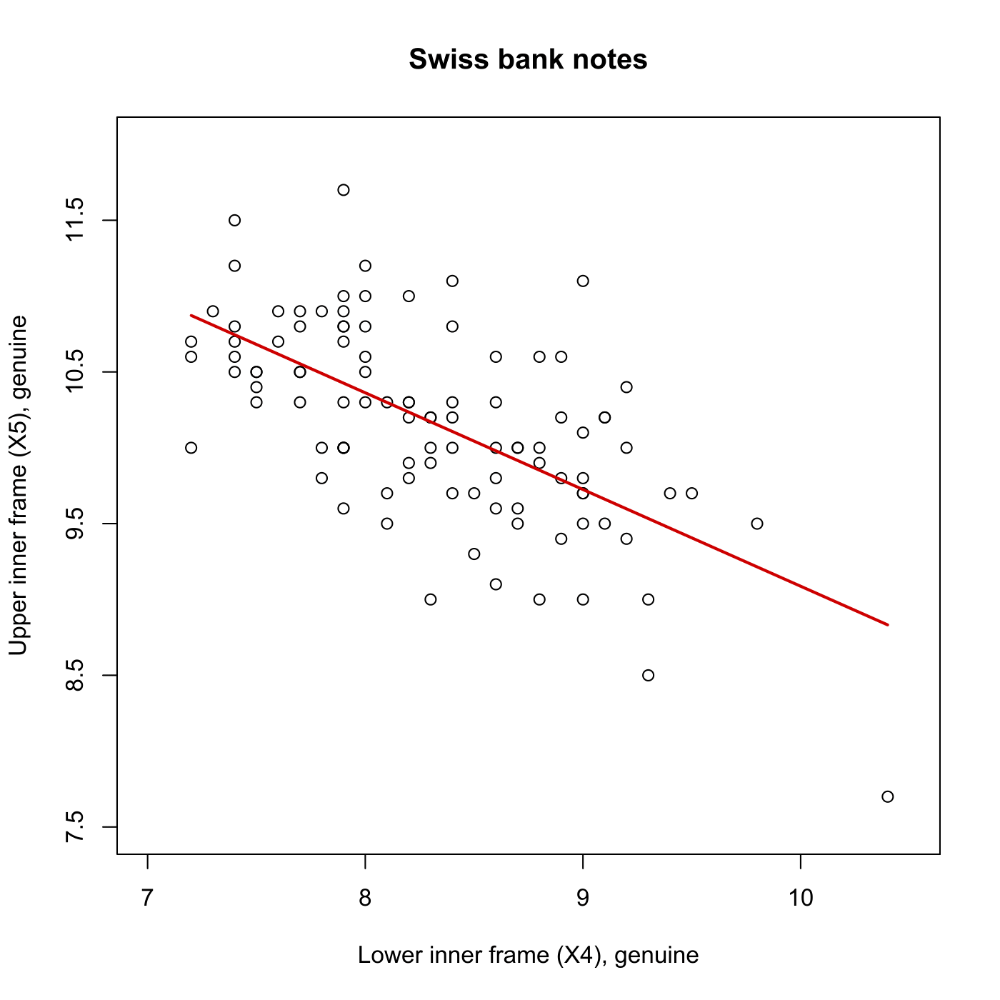
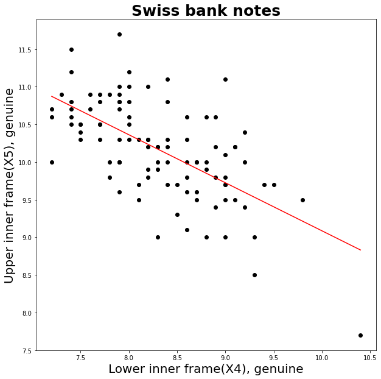
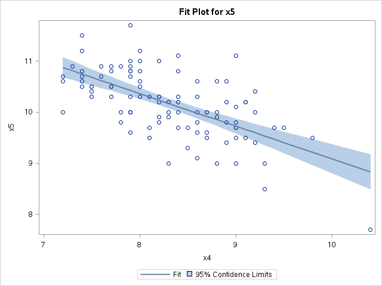

[](http://quantlet.de/)

## [](http://quantlet.de/) **MVAregbank** [](http://quantlet.de/)

```yaml

Name of QuantLet: MVAregbank

Published in: Applied Multivariate Statistical Analysis

Description: Computes a linear regression of column 5 (upper inner frame) and column 4 (lower inner frame) for the genuine Swiss bank notes.

Keywords: data visualization, graphical representation, plot, linear-model, linear-regression, regression, scatterplot, financial, sas

See also: MVAregpull, MVAregzoom

Author: Jorge Patron, Vladimir Georgescu, Song Song, Awdesch Melzer
Author[SAS]: Svetlana Bykovskaya
Author[Python]: Matthias Fengler, Tim Dass

Submitted: Mon, September 15 2014 by Awdesch Melzer
Submitted[SAS]: Wen, April 6 2016 by Svetlana Bykovskaya
Submitted[Python]: Tue, April 16 2024 by Tim Dass

Datafiles: bank2.dat
```







### R Code
```r


# clear variables and close windows
rm(list = ls(all = TRUE))
graphics.off()

# load data
x  = read.table("bank2.dat")
X4 = x[1:100, 4]
X5 = x[1:100, 5]

b = lm(X5 ~ X4)$coefficients  # regression of (X5) on (X4) price
Y = b[1] + b[2] * X4  # regression line

# plot
plot(X4, X5, xlab = "Lower inner frame (X4), genuine", ylab = "Upper inner frame (X5), genuine", 
    xlim = c(7, 10.5), ylim = c(7.5, 12), frame = TRUE, axes = FALSE)
lines(X4, Y, col = "red3", lwd = 2)
axis(side = 2, seq(7.5, 12.5, 1), seq(7.5, 12.5, 1))
axis(side = 1, seq(7, 12, 1), seq(7, 12, 1))
title("Swiss bank notes")


```

automatically created on 2024-04-25

### PYTHON Code
```python

# works on pandas 1.5.2, numpy 1.23.5 and matplotlib 3.6.3
import pandas as pd
import numpy as np
import matplotlib.pyplot as plt

x = pd.read_csv("bank2.dat", sep = "\s+", header=None)

x1 = x.iloc[:100,3]
y = x.iloc[:100,4]

a, b = np.polyfit(x1,y,1)
xfit = np.linspace(x1.min(),x1.max(),400)
yfit = b + a*xfit

fig, ax = plt.subplots(figsize = (10, 10))
ax.scatter(x1, y, c = "black")
ax.plot(xfit,yfit, c = "r")
plt.xlabel("Lower inner frame(X4), genuine", fontsize = 20)
plt.ylabel("Upper inner frame(X5), genuine", fontsize = 20)
plt.title("Swiss bank notes", fontsize = 25, weight="bold")

plt.show()

```

automatically created on 2024-04-25

### SAS Code
```sas


* Import the data;
data b2;
  infile '/folders/myfolders/Sas-work/data/bank2.dat';
  input x1-x6; 
  drop x1 x2 x3 x6;
run;

data b2;
  set b2 (firstobs = 1 obs = 100);
run;

* regression of (X5) on (X4) price;
ods graphics on;
proc reg data = b2
    plots(only) = (fit(nocli stats=none));
  model x5 = x4;
run;
ods graphics off;
   


```

automatically created on 2024-04-25