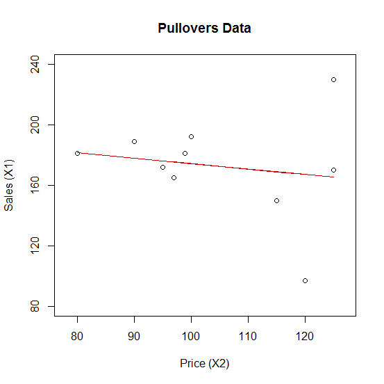
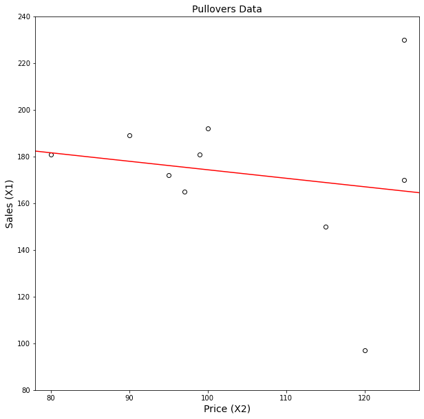
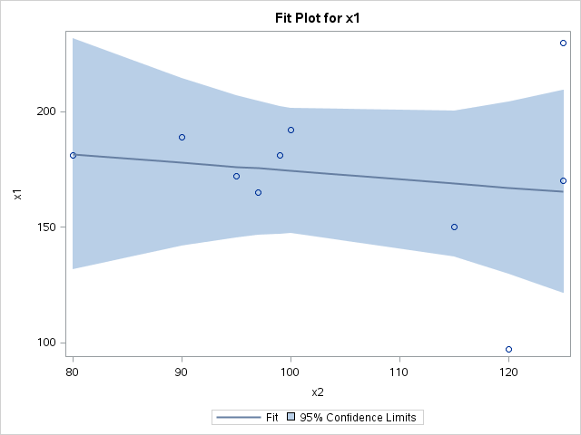

[](http://quantlet.de/)

## [](http://quantlet.de/) **MVAregpull** [](http://quantlet.de/)

```yaml

Name of QuantLet: MVAregpull

Published in: Applied Multivariate Statistical Analysis

Description: Computes and plots a linear regression of sales on price from the pullovers data set.

Keywords: R-squared, Testing, data visualization, graphical representation, linear-regression, regression, scatterplot, plot, financial, sas

See also: MVAlinregbh, MVAcorrnorm, MVAregbank, MVAscabank45, MVAscabank56, MVAscabank456, MVAscacar, MVAscapull1, MVAscapull2, MVAdraftbank4, MVAdrafthousing, MVAdrafthousingt

Author: Jorge Patron, Vladimir Georgescu, Song Song, Awdesch Melzer
Author[SAS]: Svetlana Bykovskaya
Author[Python]: Matthias Fengler, Tim Dass

Submitted: Mon, September 15 2014 by Awdesch Melzer
Submitted[SAS]: Wen, April 6 2016 by Svetlana Bykovskaya
Submitted[Python]: Tue, April 16 2024 by Tim Dass

Datafile: pullover.dat

```







### PYTHON Code
```python

# works on pandas 1.5.2, numpy 1.23.5, scipy 1.10.0 and matplotlib 3.6.2
import pandas as pd
import numpy as np
import scipy.stats as stats
import matplotlib.pyplot as plt

# load the data
x = pd.read_table("pullover.dat", header=None, delim_whitespace=True)

# define variables of the model
y = x.iloc[:, 0]        # X1 (sales)
X2 = x.iloc[:, 1]       # X2 (price)
X = np.column_stack((np.ones(len(X2)), X2))

# fit the model y~X
b = np.linalg.inv(X.T.dot(X)).dot(X.T).dot(y)   # regression of (X1) sales on (X2) price

# degrees of freedom
mn = X.shape
df = mn[0] - mn[1]

yhat = X.dot(b)         # fitted values
r = y - yhat            # residuals
mse = np.sum(r**2)/df   # mean square error
covar = np.linalg.inv(X.T.dot(X)) * mse  # covariance matrix
se = np.sqrt(np.diag(covar)) # standard deviation

# t-test
t = b/se
t2 = abs(t)
k = t2**2/(df + t2**2)
p = 0.5 * (1 + np.sign(t2) * stats.beta.cdf(k, 0.5, 0.5 * df))
Pvalues = 2 * (1 - p)

tablex = np.column_stack((np.round(b, 4), np.round(se, 4), np.round(t, 3), np.round(Pvalues, 4)))
table_columns = ['Coefficient Estimate', 'Standard Error', 't-Statistic', 'p-value']
tablex_df = pd.DataFrame(data=tablex, columns=table_columns)

print(f"{'':<8} {table_columns[0]:<22} {table_columns[1]:<22} {table_columns[2]:<22} {table_columns[3]:<22}")
for i in range(len(tablex)):
    print(f"{'X1' if i == 0 else 'X2':<8} {tablex_df.iloc[i, 0]:<22} {tablex_df.iloc[i, 1]:<22} {tablex_df.iloc[i, 2]:<22} {tablex_df.iloc[i, 3]:<22}")

r2 = np.sum((yhat - np.mean(y))**2)/np.sum((y - np.mean(y))**2)
print(f"R-squared: {r2:.4f}")

# plot of Price X2 vs. Sales X1
xfit = (np.linspace(70,130,400)).reshape((-1, 1))
yfit = b[0] + xfit * b[1]

fig, ax = plt.subplots(figsize = (10, 10))
ax.scatter(x.iloc[:,1], x.iloc[:,0], c = "w", edgecolors = "black")
ax.plot(xfit,yfit, c = 'r')
plt.xlim(78, 127)
plt.ylim(80, 240)
plt.xlabel("Price (X2)", fontsize = 14)
plt.ylabel("Sales (X1)", fontsize = 14)
plt.title("Pullovers Data", fontsize = 14)
plt.show()
```

automatically created on 2024-04-25

### R Code
```r


# clear all variables
rm(list = ls(all = TRUE))
graphics.off()

# load data
x  = read.table("pullover.dat")

# define variables of the model
y  = x[, 1]         # X1 (sales)
X2 = x[, 2]         # X2 (price)
X  = cbind(rep(1, length(X2)), X2)

# fit the model y~X
b  = solve(t(X) %*% X) %*% t(X) %*% y   # regression of (X1) sales on (X2) price

# degrees of freedom
mn = dim(X)
df = mn[1] - mn[2]

yhat  = X %*% b           # fitted values
r     = y - yhat          # residuals
mse   = t(r) %*% r/df     # mean square error
covar = solve(t(X) %*% X) %*% diag(rep(mse, 2))  # covariance matrix
se    = sqrt(diag(covar)) # standard deviation

# t-test
t = b/se
t2 = abs(t)
k = t2^2/(df + t2^2)
p = 0.5 * (1 + sign(t2) * pbeta(k, 0.5, 0.5 * df))
Pvalues = 2 * (1 - p)

tablex = cbind(round(b, 4), round(se, 4), round(t, 3), round(Pvalues, 4))
print("Table with coefficient estimates, Standard error, value of the t-statistic and ")
print("p-value (for the intercept (first line) and the price X2)")
tablex

# r-square
(r2 = sum((yhat - mean(y))^2)/sum((y - mean(y))^2))

# plot of Price X2 vs. Sales X1
plot(X2, y, xlab = "Price (X2)", ylab = "Sales (X1)", xlim = c(78, 127), ylim = c(80, 
    240), frame = TRUE, axes = FALSE)
lines(X2, yhat, col = "red3", lwd = 1.5)
title("Pullovers Data")
axis(side = 2, seq(80, 240, 40), seq(80, 240, 40))
axis(side = 1, seq(80, 130, 10), seq(80, 130, 10))

```

automatically created on 2024-04-25

### SAS Code
```sas


* Import the data;
data pull;
  infile '/folders/myfolders/Sas-work/data/pullover.dat';
  input x1-x4; 
  drop x3 x4;
run;

* regression of (X1) sales on (X2) price;
ods graphics on;
proc reg data = pull
    plots(only) = (fit(nocli stats=none));
  model x1 = x2;
run;
ods graphics off;
   

```

automatically created on 2024-04-25