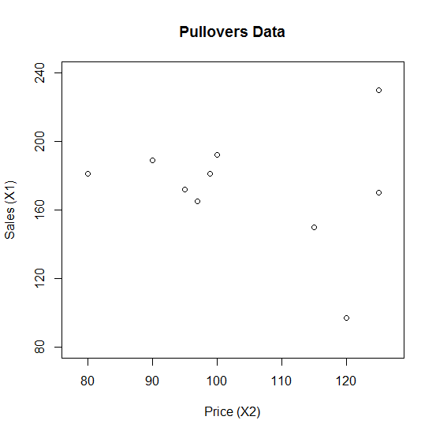
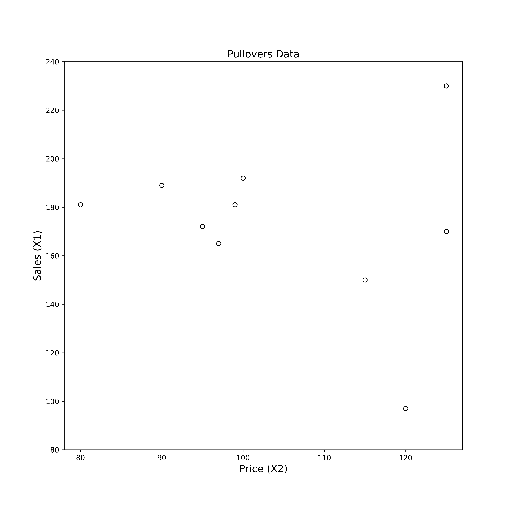

[](http://quantlet.de/)

## [](http://quantlet.de/) **MVAscapull1** [](http://quantlet.de/)

```yaml

Name of QuantLet: MVAscapull1

Published in: Applied Multivariate Statistical Analysis

Description: Computes a two dimensional scatterplot of price and sales from the pullovers data set.

Keywords: data visualization, graphical representation, scatterplot, financial, plot, sas

See also: MVAcorrnorm, MVAregbank, MVAregpull, MVAscabank45, MVAscabank56, MVAscabank456, MVAscacar, MVAscapull2, MVAdraftbank4, MVAdrafthousing, MVAdrafthousingt

Author: Vladimir Georgescu, Jorge Patron, Song Song, Awdesch Melzer
Author[SAS]: Svetlana Bykovskaya
Author[Python]: 'Matthias Fengler, Liudmila Gorkun-Voevoda'

Submitted: Mon, September 15 2014 by Awdesch Melzer
Submitted[SAS]: Wen, April 6 2016 by Svetlana Bykovskaya
Submitted[Python]: 'Wed, January 6 2021 by Liudmila Gorkun-Voevoda'

Datafile: pullover.dat

```






### PYTHON Code
```python

import pandas as pd
import matplotlib.pyplot as plt

x = pd.read_csv("pullover.dat", sep = "\s+", header=None)

fig, ax = plt.subplots(figsize = (10, 10))
ax.scatter(x.iloc[:,1], x.iloc[:,0], c = "w", edgecolors = "black")
plt.xlim(78, 127)
plt.ylim(80, 240)
plt.xlabel("Price (X2)", fontsize = 14)
plt.ylabel("Sales (X1)", fontsize = 14)
plt.title("Pullovers Data", fontsize = 14)
plt.show()
```

automatically created on 2021-01-08

### R Code
```r


# clear all variables
rm(list = ls(all = TRUE))
graphics.off()

# load data
x = read.table("pullover.dat")

# plot
plot(x[, 2], x[, 1], main = "Pullovers Data", ylab = "Sales (X1)", xlab = "Price (X2)", 
    xlim = c(78, 127), ylim = c(80, 240), frame = TRUE, axes = FALSE)
axis(side = 2, seq(80, 240, 40), seq(80, 240, 40))
axis(side = 1, seq(80, 130, 10), seq(80, 130, 10))

```

automatically created on 2021-01-08

### SAS Code
```sas


* Import the data;
data pull;
  infile '/folders/myfolders/Sas-work/data/pullover.dat';
  input x1-x4; 
run;

proc sgplot data = pull
    noautolegend;
  title 'Pullovers Data';
  scatter x = x2 y = x1 / markerattrs = (color = blue);
  xaxis min = 78 max = 127 label = 'Price (X2)';
  yaxis min = 80 max = 240 label = 'Sales (X1)';
run;
```

automatically created on 2021-01-08