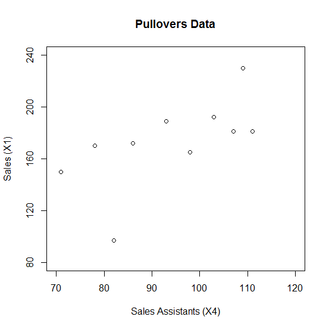
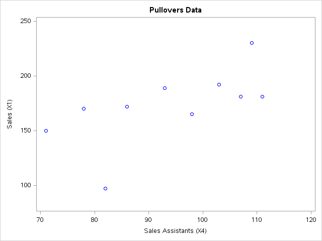

[](http://quantlet.de/)

## [](http://quantlet.de/) **MVAscapull2** [](http://quantlet.de/)

```yaml

Name of QuantLet : MVAscapull2

Published in : Applied Multivariate Statistical Analysis

Description : 'Computes a two dimensional scatterplot of assistants and sales from the pullovers
data set.'

Keywords : data visualization, graphical representation, scatterplot, financial, plot, sas

See also : 'MVAcorrnorm, MVAregbank, MVAregpull, MVAscabank45, MVAscabank56, MVAscabank456,
MVAscacar, MVAscapull1, MVAdraftbank4, MVAdrafthousing, MVAdrafthousingt'

Author : Jorge Patron, Vladimir Georgescu, Song Song, Awdesch Melzer

Author[SAS] : Svetlana Bykovskaya

Submitted : Mon, September 15 2014 by Awdesch Melzer

Submitted[SAS] : Wen, April 6 2016 by Svetlana Bykovskaya

Datafile : pullover.dat

```






### R Code:
```r

# clear all variables
rm(list = ls(all = TRUE))
graphics.off()

# load data
x = read.table("pullover.dat")

# plot
plot(x[, 4], x[, 1], xlab = "Sales Assistants (X4)", ylab = "Sales (X1)", xlim = c(70, 
    120), ylim = c(80, 240), frame = TRUE, axes = FALSE)
title("Pullovers Data")
axis(side = 2, seq(80, 240, 40), seq(80, 240, 40))
axis(side = 1, seq(70, 130, 10), seq(70, 130, 10))

```

### SAS Code:
```sas

* Import the data;
data pull;
  infile '/folders/myfolders/Sas-work/data/pullover.dat';
  input x1-x4; 
run;

proc sgplot data = pull
    noautolegend;
  title 'Pullovers Data';
  scatter x = x4 y = x1 / markerattrs = (color = blue);
  xaxis min = 70 max = 120 label = 'Sales Assistants (X4)';
  yaxis min = 80 max = 240 label = 'Sales (X1)';
run;
```
