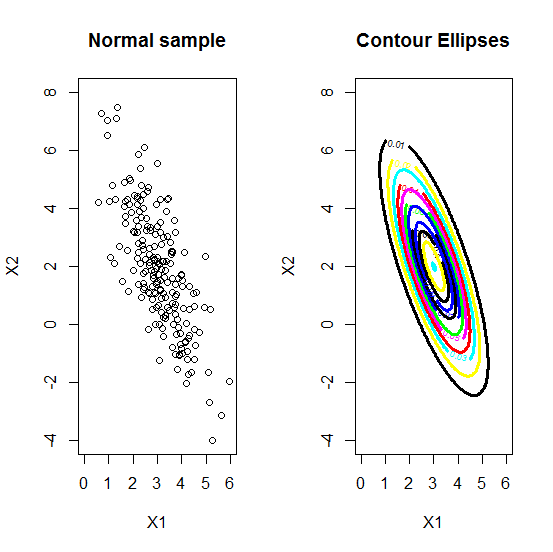

[](http://quantlet.de/)

## [](http://quantlet.de/) **MVAcontnorm** [](http://quantlet.de/)

```yaml

Name of QuantLet : MVAcontnorm

Published in : Applied Multivariate Statistical Analysis

Description : 'Computes a scatterplot of a normal sample and the contour ellipses for mu =(3,2) and
sigma = (1,-1.5)~(-1.5,4).'

Keywords : bivariate, graphical representation, contour, normal-distribution, plot, scatterplot

See also : 'MVAcontbank2, MVAdenbank2, MVAdenbank3, MVAscabank45, MVAscabank56, MVAscacar,
MVAscapull1, MVAscapull2'

Author : Franziska Schulz, Maria Osipenko

Submitted : Mon, February 09 2015 by Lukas Borke

```




### R Code:
```r

# clear variables and close windows
rm(list = ls(all = TRUE))
graphics.off()

# install and load packages
libraries = c("MASS", "mnormt")
lapply(libraries, function(x) if (!(x %in% installed.packages())) {
install.packages(x)
})
lapply(libraries, library, quietly = TRUE, character.only = TRUE)

# parameter settings
n   = 200  # number of draws
mu  = c(3, 2)  # mean vector
sig = matrix(c(1, -1.5, -1.5, 4), ncol = 2)  # covariance matrix

# bivariate normal sample
set.seed(80)
y = mvrnorm(n, mu, sig, 2)

# bivariate normal density
xgrid = seq(from = (mu[1] - 3 * sqrt(sig[1, 1])), to = (mu[1] + 3 * sqrt(sig[1, 1])), 
    length.out = 200)
ygrid = seq(from = (mu[2] - 3 * sqrt(sig[2, 2])), to = (mu[2] + 3 * sqrt(sig[2, 2])), 
    length.out = 200)
z     = outer(xgrid, ygrid, FUN = function(xgrid, ygrid) {
    dmnorm(cbind(xgrid, ygrid), mean = mu, varcov = sig)
})

# Plot
par(mfrow = c(1, 2))
plot(y, col = "black", ylab = "X2", xlab = "X1", xlim = range(xgrid), ylim = range(ygrid))
title("Normal sample")

# Contour ellipses
contour(xgrid, ygrid, z, xlim = range(xgrid), ylim = range(ygrid), nlevels = 10, col = c("blue", 
    "black", "yellow", "cyan", "red", "magenta", "green", "blue", "black"), lwd = 3, 
    cex.axis = 1, xlab = "X1", ylab = "X2")
title("Contour Ellipses")

```
