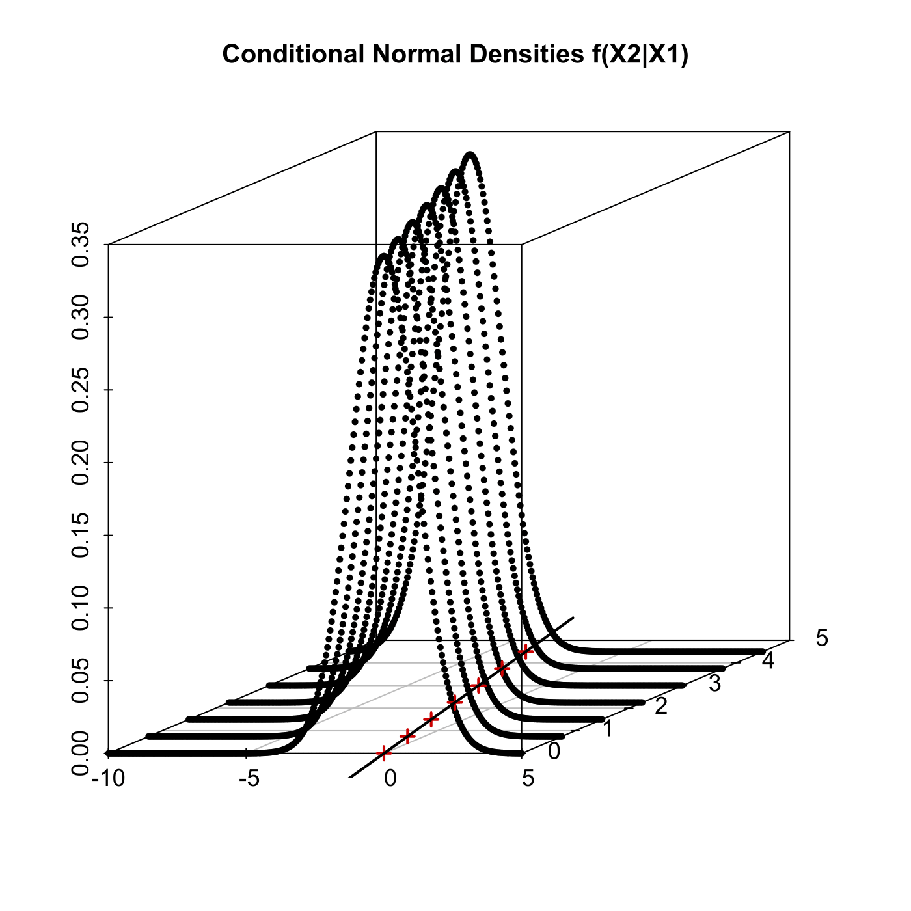
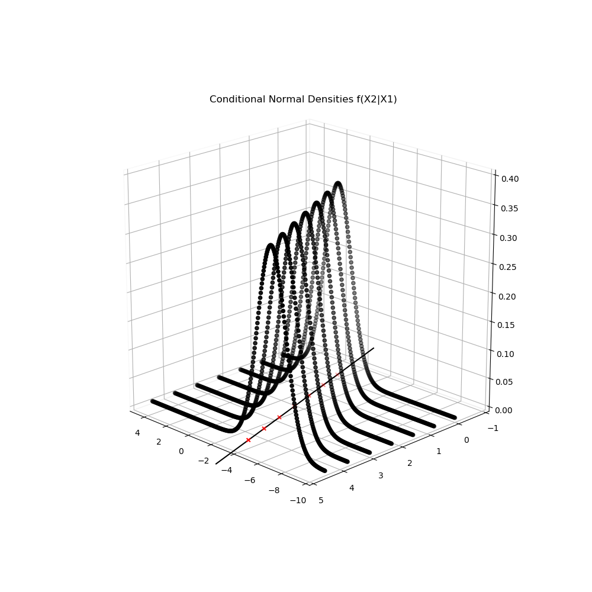

[](http://quantlet.de/)

## [](http://quantlet.de/) **MVAcondnorm** [](http://quantlet.de/)

```yaml

Name of QuantLet: MVAcondnorm

Published in: Applied Multivariate Statistical Analysis

Description: Computes conditional normal densities f(x2|x1) where the joint distribution has mean=(0|0) and cov=(1|-0.8)~(-0.8|2).

Keywords: conditional density, conditional distribution, conditional mean, density, joint distribution, normal-distribution, plot, graphical representation

Author: Maria Osipenko, Franziska Schulz

Author[Python]: 'Matthias Fengler, Liudmila Gorkun-Voevoda'

Submitted: Mon, February 09 2015 by Lukas Borke

Submitted[Python]: 'Wed, April 22 2020 by Liudmila Gorkun-Voevoda'

```





### R Code
```r


# clear variables and close windows
rm(list = ls(all = TRUE))
graphics.off()

# install and load packages
libraries = c("scatterplot3d")
lapply(libraries, function(x) if (!(x %in% installed.packages())) {
install.packages(x)
})
lapply(libraries, library, quietly = TRUE, character.only = TRUE)

# input parameters
Sigma = matrix(c(1, -0.8, -0.8, 2), 2, 2)                            # Covariance matrix of the Bivariate Normal distribution
c = sqrt(Sigma[2, 2] - Sigma[2, 1] * 1/(Sigma[1, 1]) * Sigma[1, 2])  # SD of conditional f(X2|X1)

# Create grid for x1,x2 and compute conditional pdf

x1  = rep(seq(0, 4.5, by = 0.75), times = 301)                # grid values for x1\t\t
x2  = rep(seq(-10, 5, by = 0.05), each = length(unique(x1)))  # grid values for x2
f   = dnorm(0, (x2 - Sigma[1, 1]/Sigma[1, 2] * x1)/c, 1)/c    # conditional pdf f(X2|X1)
xx1 = cbind(x1, x2, f)

# Conditional means
xm  = unique(x1)                                              # realized x1
m   = cbind(xm, Sigma[2, 1] * xm, rep(0, length(xm)))         # conditional mean
xmf = c(-2, xm, 6)

# plot: shifts in the conditional density
s3d = scatterplot3d(xx1[, 2], xx1[, 1], xx1[, 3], lwd = 0.05, pch = 20, ylab = "", 
    xlab = "", zlab = "", scale.y = 0.7, cex.axis = 1.1, angle = 40)
s3d$points3d(m[, 2], m[, 1], m[, 3], pch = 3, col = "red3", lwd = 2)
s3d$points3d(Sigma[2, 1] * xmf, xmf, rep(0, 9), type = "l", col = "black", lwd = 2)

title("Conditional Normal Densities f(X2|X1)")
```

automatically created on 2020-04-22

### PYTHON Code
```python

import pandas as pd
import numpy as np
from scipy.stats import norm
import matplotlib.pyplot as plt
from mpl_toolkits.mplot3d import Axes3D

# input parameters
Sigma = np.array([[1, -0.8], [-0.8, 2]]) # Covariance matrix of the Bivariate Normal distribution
c = np.sqrt(Sigma[1, 1] - Sigma[1, 0] * 1/(Sigma[0, 0]) * Sigma[0, 1]) # SD of conditional f(X2|X1)

# Create grid for x1,x2 and compute conditional pdf
x1 = np.ravel([np.arange(0, 4.51, 0.75)]*301) # grid values for x1\t\t
x2 = np.repeat(np.arange(-10, 5.01, 0.05), len(np.unique(x1))) # grid values for x2
f = norm.pdf(0, (x2 - Sigma[0, 0]/Sigma[0, 1] * x1)/c, 1)/c # conditional pdf f(X2|X1)
xx1 = pd.DataFrame(data = {"x1":x1,"x2": x2,"f": f}, columns = ["x1", "x2", "f"])

# Conditional means
xm  = np.unique(x1) # realized x1
m = pd.DataFrame(data = {"xm": xm, "1": Sigma[1, 0] * xm, "2": [0]*len(xm)}, columns = ["xm", "1", "2"]) # conditional mean
xmf = [-2] + list(xm) + [6]


# plot: shifts in the conditional density
fig = plt.figure(figsize=(10, 10))
ax = fig.add_subplot(111, projection='3d')
ax.scatter(xx1.iloc[:, 1], xx1.iloc[:, 0], xx1.iloc[:, 2], c = "black", edgecolors = "black")
ax.scatter(m.iloc[:, 1], m.iloc[:, 0], m.iloc[:, 2], marker = "x", c = "r")
ax.plot(Sigma[1, 0] * np.array(xmf), np.array(xmf), [0]*9, c = "black")
ax.view_init(20, 135)

ax.set_xlim(-10, 5)
ax.set_ylim(-1, 5)
ax.set_zlim(0, 0.4)

ax.xaxis.pane.fill = False
ax.yaxis.pane.fill = False
ax.zaxis.pane.fill = False

plt.title("Conditional Normal Densities f(X2|X1)")
    
plt.show()


```

automatically created on 2020-04-22