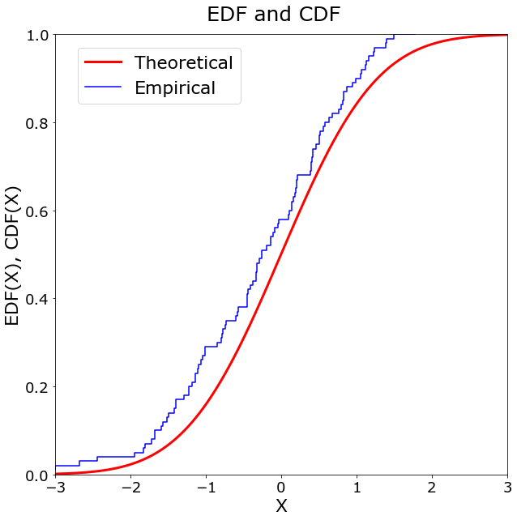
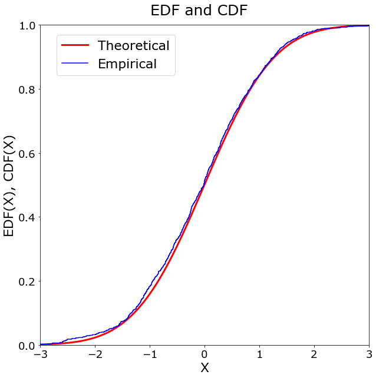

[](http://quantlet.de/)

## [](http://quantlet.de/) **MVAedfnormal** [](http://quantlet.de/)

```yaml

Name of QuantLet: MVAedfnormal

Published in: Applied Multivariate Statistical Analysis

Description: Draws n observations from a standard normal distribution and plots its empirical distribution function (edf) vs. the normal cumulative distribution function (cdf). Number of draws can be entered interactively.

Keywords: standard-normal, multivariate, plot, graphical representation, edf, cdf, standard, normal, distribution

See also: MVAedfbootstrap

Author: Vladimir Georgescu, Jorge Patron, Song Song, Awdesch Melzer
Author[Python]: Matthias Fengler, Tim Dass

Submitted: Wed, March 14 2012 by Dedy Dwi Prastyo
Submitted[Python]: Tue, April 16 2024 by Tim Dass

Example: Shows the EDF and CDF for the empirical and theoretical distribution with n=100 and n=1000.

```






### PYTHON Code
```python

# works on numpy 1.24.3, scipy 1.10.1, statsmodels 0.14.0 and matplotlib 3.6.2
import numpy as np
import matplotlib.pyplot as plt
from scipy.stats import norm
from statsmodels.distributions.empirical_distribution import ECDF

n = [100,1000]
xx = np.arange(-3, 3, 0.01)
theoretical = norm.cdf(xx)

for i in n:
    fig, ax = plt.subplots(1,1, figsize=(10,10))
    y = norm.rvs(size=i)
    y = ECDF(y)
    
    ax.plot(xx, theoretical, label="Theoretical", c = "r", lw = 3)
    ax.step(y.x, y.y, label="Empirical", c = "b")
    fig.suptitle("EDF and CDF", fontsize = 25, y = 0.93)
    ax.set_xlim(-3, 3)
    ax.set_ylim(0, 1)
    ax.set_xlabel("X", fontsize = 22)
    ax.set_ylabel("EDF(X), CDF(X)", fontsize = 22)
    ax.tick_params(axis='x', labelsize=18)
    ax.tick_params(axis='y', labelsize=18)
    fig.legend(loc =(0.15, 0.8), fontsize = 22)
    
plt.show()
```

automatically created on 2024-04-25

### R Code
```r


# close windows and clear variables
graphics.off()
rm(list = ls(all = TRUE))

# input parameters
print("Please input number of draws n as: 100")
print("then press enter two times")
para = scan()

while (length(para) < 1) {
  print("Not enough input arguments. Please input a scalar like 100")
  print(" ")
  print("[n]=")
  para = scan()
}
n = para[1]

if (n <= 1) {
  print("MVAedfnormal: Number of observations must be larger than 0. Please input again. n=")
  n = scan()
}
set.seed(80)

# Generate standard normal random numbers
y = rnorm(n, 0, 1)  
y = ecdf(y)

# Plot of empirical distribution function
plot(y, pch = NaN, verticals = TRUE, col = "blue3", lwd = 1.5, xlim = c(-3, 
  3), main = "EDF and CFD", ylab = "EDF(X), CDF(X)", xlab = "X")  
lines(seq(-3, 3, 0.1), pnorm(seq(-3, 3, 0.1), 0, 1), col = "red3", lwd = 2.5)
legend(x = -3, y = 1, legend = c("Empirical", "Theoretical"), pch = c(20, 
  20), col = c("blue3", "red3"))

```

automatically created on 2024-04-25