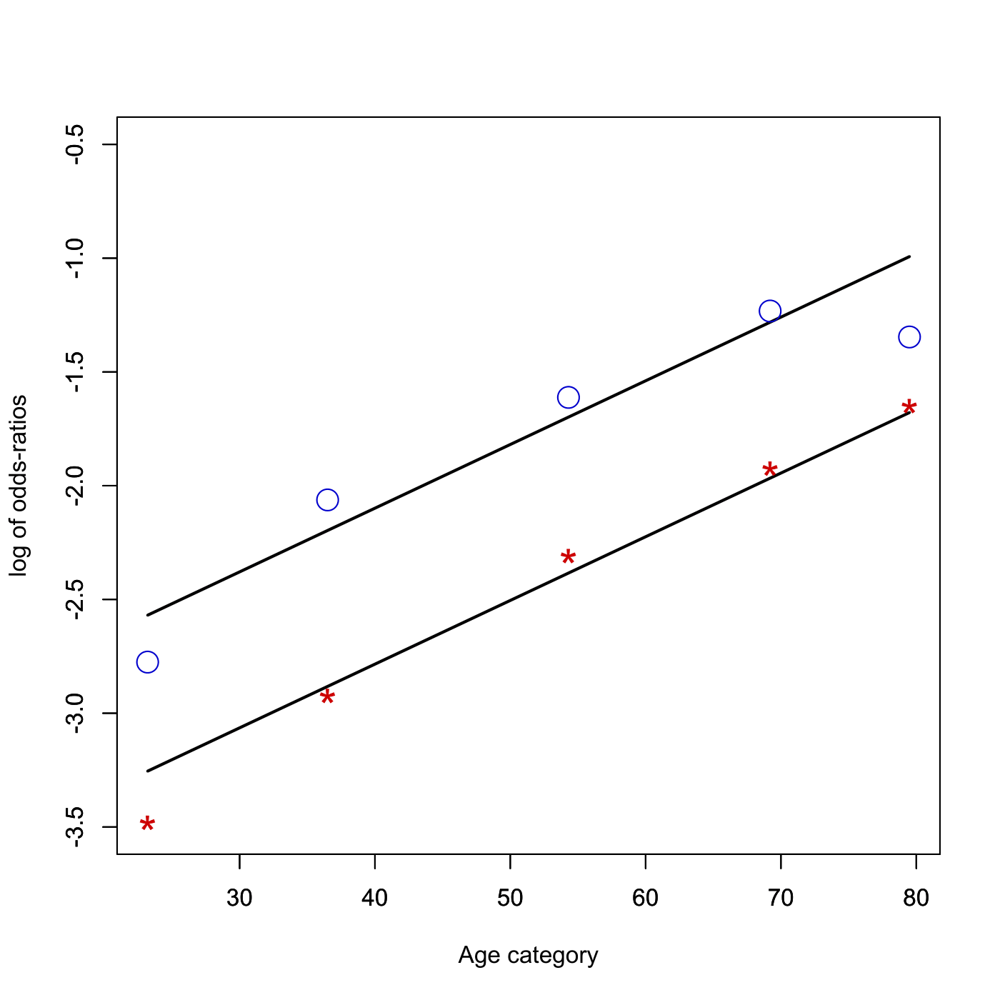
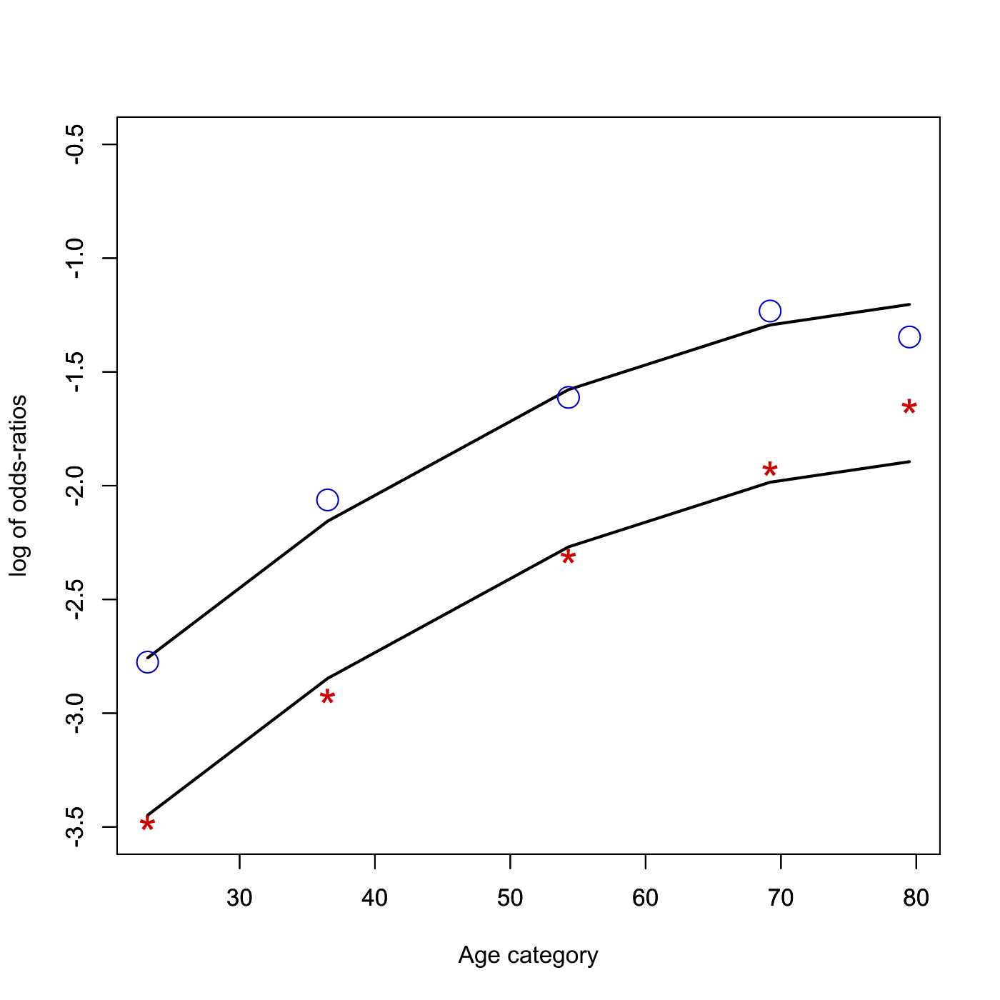
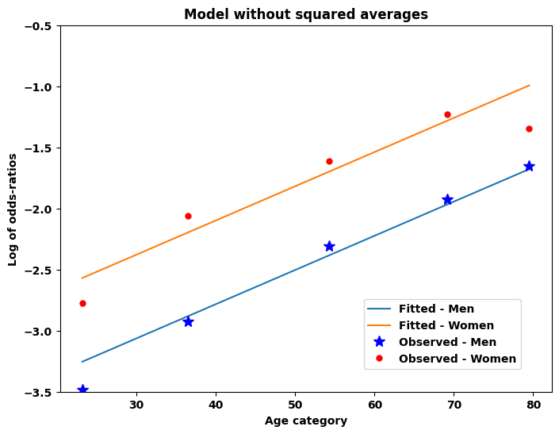
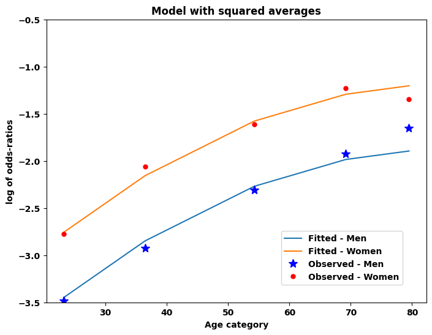

[](http://quantlet.de/)

## [](http://quantlet.de/) **MVAdrugLogistic** [](http://quantlet.de/)

```yaml

Name of QuantLet: MVAdrugLogistic

Published in: Applied Multivariate Statistical Analysis

Description: Calculates and plots the odds-ratios of the probability of taking drugs in a logit model for a gender-age group combination and tests two models (one without a curvature and more general model with a curvature term).

Keywords: probability, logit, plot, graphical representation, regression

See also: MVAdrug3waysTab, MVAdrug

Author: Awdesch Melzer
Author[Python]: Matthias Fengler, Tim Dass

Submitted: Wed, April 04 2012 by Dedy Dwi Prastyo
Submitted[Python]: Tue, April 23 2024 by Tim Dass

Example: Fit of the log of the odds-ratios for taking drugs. Men are the stars and women are the circles.

```









### R Code
```r


# clear all variables
rm(list = ls(all = TRUE))
graphics.off()

# Drug data
zi = rbind(c(1, 0, 1, 0, 1, 0, 0, 0, 0, 21), c(1, 0, 1, 0, 0, 1, 0, 0, 0, 32), c(1, 
    0, 1, 0, 0, 0, 1, 0, 0, 70), c(1, 0, 1, 0, 0, 0, 0, 1, 0, 43), c(1, 0, 1, 0, 
    0, 0, 0, 0, 1, 19), c(1, 0, 0, 1, 1, 0, 0, 0, 0, 683), c(1, 0, 0, 1, 0, 1, 0, 
    0, 0, 596), c(1, 0, 0, 1, 0, 0, 1, 0, 0, 705), c(1, 0, 0, 1, 0, 0, 0, 1, 0, 295), 
    c(1, 0, 0, 1, 0, 0, 0, 0, 1, 99), c(0, 1, 1, 0, 1, 0, 0, 0, 0, 46), c(0, 1, 1, 
        0, 0, 1, 0, 0, 0, 89), c(0, 1, 1, 0, 0, 0, 1, 0, 0, 169), c(0, 1, 1, 0, 0, 
        0, 0, 1, 0, 98), c(0, 1, 1, 0, 0, 0, 0, 0, 1, 51), c(0, 1, 0, 1, 1, 0, 0, 
        0, 0, 738), c(0, 1, 0, 1, 0, 1, 0, 0, 0, 700), c(0, 1, 0, 1, 0, 0, 1, 0, 
        0, 847), c(0, 1, 0, 1, 0, 0, 0, 1, 0, 336), c(0, 1, 0, 1, 0, 0, 0, 0, 1, 
        196))
y = zi[, 10]

# Design matrix
I = 2  # sex M - F
J = 2  # drug Yes - No
K = 5  # age category 16-29, 30-44, 45-64, 65-74, 75++

# Mean age per group: for Men and for Women
average = c(c(23.2, 36.5, 54.3, 69.2, 79.5), c(23.2, 36.5, 54.3, 69.2, 79.5))
X   = rbind(c(1, 1), c(1, 1), c(1, 1), c(1, 1), c(1, 1), c(1, -1), c(1, -1), c(1, -1), 
    c(1, -1), c(1, -1))
X1  = cbind(X, average)  # Xi=design matrix for group i=1,2

n   = dim(X1)
n1  = n[1]
n2  = n[2]
df  = n1 - n2

label = zi[, 3] == 1
n1jk  = y[label]  # nijk is the effective in each cell, i=1,2
label = zi[, 3] == 0
n2jk  = y[label]

b0 = 0 * rep(1, n2)  # current value of beta

# max likelihood in logistic models for 3-way contingency tables
ff = function(b0) {
    -sum(n1jk * log(matrix(1, length(n1jk), 1)/(matrix(1, length(n1jk), 1) + exp(-X1 %*% 
        b0)))) - sum(n2jk * log(matrix(1, dim(matrix(1, length(n1jk), 1)/(matrix(1, 
        length(n1jk), 1) + exp(-X1 %*% b0)))) - matrix(1, length(n1jk), 1)/(matrix(1, 
        length(n1jk), 1) + exp(-X1 %*% b0))))
}
(b      = optim(b0, ff)$par)
loglik  = optim(b0, ff)$value
N       = sum(y)
p1      = matrix(1, length(n1jk), 1)/(matrix(1, length(n1jk), 1) + exp(-X1 %*% b))
p2      = matrix(1, length(n2jk), 1)/(matrix(1, length(n2jk), 1) + exp(X1 %*% b))
nfit    = rbind((n1jk + n2jk) * p1, (n1jk + n2jk) * p2)
nobs    = c(n1jk, n2jk)
e       = log(nobs) - log(nfit)
print("degree of freedom")
print(df)
(G2     = 2 * sum(nobs * e))
(pvalG2 = 1 - pchisq(G2, df))
(chi2   = sum(((nobs - nfit)^2)/nfit))
(pvalG2 = 1 - pchisq(G2, df))
print(" ")
print("  observed    fitted")
print("    values    values")
cbind(nobs, nfit)
print(" ")

oddratfit = log(p1/p2)
oddrat    = log(n1jk/n2jk)
plot(X1[1:K, 3], oddratfit[1:K], type = "l", ylim = c(-3.5, -0.5), ylab = "", xlab = "", 
    lwd = 2)
par(new = TRUE)
plot(X1[(K + 1):(2 * K), 3], oddratfit[(K + 1):(2 * K)], type = "l", ylim = c(-3.5, 
    -0.5), xlab = "Age category", ylab = "log of odds-ratios", lwd = 2)
points(X1[1:K, 3], oddrat[1:K], pch = "*", cex = 2, col = "red3")
points(X1[(K + 1):(2 * K), 3], oddrat[(K + 1):(2 * K)], cex = 2, col = "blue3")
title(paste("Fit of the log of the odds-ratios "))

# logistic model with curvature term: log(y)~gender + age + age^2
(X2 = cbind(X, average, average * average))
n   = dim(X2)
n1  = n[1]
n2  = n[2]
df2 = n1 - n2

label = zi[, 3] == 1
n1jk  = y[label]
label = zi[, 3] == 0
n2jk  = y[label]

b0 = 0 * rep(1, n2)

f2 = function(b0) {
    -sum(n1jk * log(matrix(1, length(n1jk), 1)/(matrix(1, length(n1jk), 1) + exp(-X2 %*% 
        b0)))) - sum(n2jk * log(matrix(1, dim(matrix(1, length(n1jk), 1)/(matrix(1, 
        length(n1jk), 1) + exp(-X2 %*% b0)))) - matrix(1, length(n1jk), 1)/(matrix(1, 
        length(n1jk), 1) + exp(-X2 %*% b0))))
}
(b = optim(b0, f2)$par)

loglik  = optim(b0, f2)$value
N       = sum(y)
p1      = matrix(1, length(n1jk), 1)/(matrix(1, length(n1jk), 1) + exp(-X2 %*% b))
p2      = matrix(1, length(n2jk), 1)/(matrix(1, length(n2jk), 1) + exp(X2 %*% b))
nfit    = rbind((n1jk + n2jk) * p1, (n1jk + n2jk) * p2)
nobs    = c(n1jk, n2jk)
e       = log(nobs) - log(nfit)
print("degree of freedom")
print(df2)
(GG2      = 2 * sum(nobs * e))
(pvalGG2  = 1 - pchisq(GG2, df2))
(chi2     = sum(((nobs - nfit)^2)/nfit))
(pvalG2   = 1 - pchisq(GG2, df2))
print(" ")
print("  observed    fitted")
print("    values    values")
cbind(nobs, nfit)
print(" ")

oddratfit = log(p1/p2)
oddrat    = log(n1jk/n2jk)
dev.new()
plot(X2[1:K, 3], oddratfit[1:K], type = "l", ylim = c(-3.5, -0.5), ylab = "", xlab = "", 
    lwd = 2)
par(new = TRUE)
plot(X2[(K + 1):(2 * K), 3], oddratfit[(K + 1):(2 * K)], type = "l", ylim = c(-3.5, 
    -0.5), xlab = "Age category", ylab = "log of odds-ratios", lwd = 2)
points(X2[1:K, 3], oddrat[1:K], pch = "*", cex = 2, col = "red3")
points(X2[(K + 1):(2 * K), 3], oddrat[(K + 1):(2 * K)], cex = 2, col = "blue3")
title(paste("Fit of the log of the odds-ratios "))

# test model one against model two
print("degree of freedom")
print(df - df2)
(overallG2  = G2 - GG2)
(pvaloG2    = 1 - pchisq(overallG2, df - df2)) 

```

automatically created on 2024-04-25

### PYTHON Code
```python

#works on numpy 1.25.2, scipy 1.11.2 and matplotlib 3.8.0
import numpy as np
import scipy.optimize as opt
import matplotlib.pyplot as plt
from scipy import stats

# Drug data
zi = np.array([
    [1, 0, 1, 0, 1, 0, 0, 0, 0, 21],
    [1, 0, 1, 0, 0, 1, 0, 0, 0, 32],
    [1, 0, 1, 0, 0, 0, 1, 0, 0, 70],
    [1, 0, 1, 0, 0, 0, 0, 1, 0, 43],
    [1, 0, 1, 0, 0, 0, 0, 0, 1, 19],
    [1, 0, 0, 1, 1, 0, 0, 0, 0, 683],
    [1, 0, 0, 1, 0, 1, 0, 0, 0, 596],
    [1, 0, 0, 1, 0, 0, 1, 0, 0, 705],
    [1, 0, 0, 1, 0, 0, 0, 1, 0, 295],
    [1, 0, 0, 1, 0, 0, 0, 0, 1, 99],
    [0, 1, 1, 0, 1, 0, 0, 0, 0, 46],
    [0, 1, 1, 0, 0, 1, 0, 0, 0, 89],
    [0, 1, 1, 0, 0, 0, 1, 0, 0, 169],
    [0, 1, 1, 0, 0, 0, 0, 1, 0, 98],
    [0, 1, 1, 0, 0, 0, 0, 0, 1, 51],
    [0, 1, 0, 1, 1, 0, 0, 0, 0, 738],
    [0, 1, 0, 1, 0, 1, 0, 0, 0, 700],
    [0, 1, 0, 1, 0, 0, 1, 0, 0, 847],
    [0, 1, 0, 1, 0, 0, 0, 1, 0, 336],
    [0, 1, 0, 1, 0, 0, 0, 0, 1, 196]
])

y = zi[:, 9]

I, J, K = 2, 2, 5
average = np.array([[23.2], [36.5], [54.3], [69.2], [79.5], [23.2], [36.5], [54.3], [69.2], [79.5]])
X = np.array([
    [1, 1],
    [1, 1],
    [1, 1],
    [1, 1],
    [1, 1],
    [1, -1],
    [1, -1],
    [1, -1],
    [1, -1],
    [1, -1]
])

X1 = np.hstack((X, average))

n1jk = y[zi[:, 2] == 1]
n2jk = y[zi[:, 2] == 0]

b0 = np.zeros(X1.shape[1])

def ff(b0):
    p1 = np.exp(X1 @ b0) / (1 + np.exp(X1 @ b0))
    p2 = 1 - p1
    return -np.sum(n1jk * np.log(p1) + n2jk * np.log(p2))

b = opt.minimize(ff, b0).x

p1 = np.exp(X1 @ b) / (1 + np.exp(X1 @ b))
p2 = 1 - p1
nfit = np.hstack(((n1jk + n2jk) * p1, (n1jk + n2jk) * p2))
nobs = np.concatenate((n1jk, n2jk))

e = np.log(nobs) - np.log(nfit)

df = X1.shape[0] - X1.shape[1]
G2 = 2 * np.sum(nobs * e)
pvalG2 = 1 - stats.chi2.cdf(G2, df)
chi2 = np.sum(((nobs - nfit) ** 2) / nfit)

print("Degrees of freedom:", df)
print("G2:", round(G2,4))
print("p-value G2:", round(pvalG2,4))
print("Chi-squared:", round(chi2,4))

oddratfit = np.log(p1 / p2)
oddrat = np.log(n1jk / n2jk)

fig, ax = plt.subplots(1,1, figsize=(8,6))

ax.plot(X1[:K, -1], oddratfit[:K], label="Fitted - Men")
ax.plot(X1[K:2 * K, -1], oddratfit[K:2 * K], label="Fitted - Women")
ax.plot(X1[:K, -1], oddrat[:K], 'b*', markersize=10, label="Observed - Men")
ax.plot(X1[K:2 * K, -1], oddrat[K:2 * K], 'r.', markersize=10, label="Observed - Women")
ax.set_xlabel("Age category")
ax.set_ylabel("Log of odds-ratios")
ax.set_ylim(-3.5, -0.5)
ax.set_title("Model without squared averages")
fig.legend(loc=(0.65,0.15))
plt.show()

#model with squared averages
X2 = np.hstack((X1,average**2))
n, n2 = X2.shape
df2 = n - n2

n1jk = y[zi[:, 2] == 1]
n2jk = y[zi[:, 2] == 0]

b0 = np.zeros(X2.shape[1])

def f2(b0):
    p1 = np.exp(X2 @ b0) / (1 + np.exp(X2 @ b0))
    p2 = 1 - p1
    return -np.sum(n1jk * np.log(p1) + n2jk * np.log(p2))

b = opt.minimize(f2, b0).x

p1 = np.exp(X2 @ b) / (1 + np.exp(X2 @ b))
p2 = 1 - p1
nfit = np.hstack(((n1jk + n2jk) * p1, (n1jk + n2jk) * p2))
nobs = np.concatenate((n1jk, n2jk))
e = np.log(nobs) - np.log(nfit)

GG2 = 2 * np.sum(nobs * e)
pvalGG2 = 1 - stats.chi2.cdf(GG2, df2)
chi2 = np.sum(((nobs - nfit) ** 2) / nfit)

print("Degrees of freedom:", df2)
print("G2:", round(GG2,4))
print("p-value G2:", round(pvalGG2,4))
print("Chi-squared:", round(chi2,4))

oddratfit = np.log(p1 / p2)
oddrat = np.log(n1jk / n2jk)

fig, ax = plt.subplots(1,1, figsize=(8,6))
ax.plot(X2[:K, -2], oddratfit[:K], label="Fitted - Men")
ax.plot(X2[K:2 * K, -2], oddratfit[K:2 * K], label="Fitted - Women")
ax.plot(X2[:K, -2], oddrat[:K], 'b*', markersize=10, label="Observed - Men")
ax.plot(X2[K:2 * K, -2], oddrat[K:2 * K], 'r.', markersize=10, label="Observed - Women")
ax.set_ylim(-3.5, -0.5)
ax.set_xlabel("Age category")
ax.set_ylabel("log of odds-ratios")
ax.set_title("Model with squared averages")
fig.legend(loc=(0.65,0.15))
plt.show()

#Comparing the two models:
print("Comparing the two models:")
print("Degrees of freedom:", df-df2)
overallG2 = G2-GG2
print("G2:", round(overallG2,4))
pvaloG2 = 1 - stats.chi2.cdf(overallG2, df-df2)
print("p-value G2:", round(pvaloG2,4))

```

automatically created on 2024-04-25