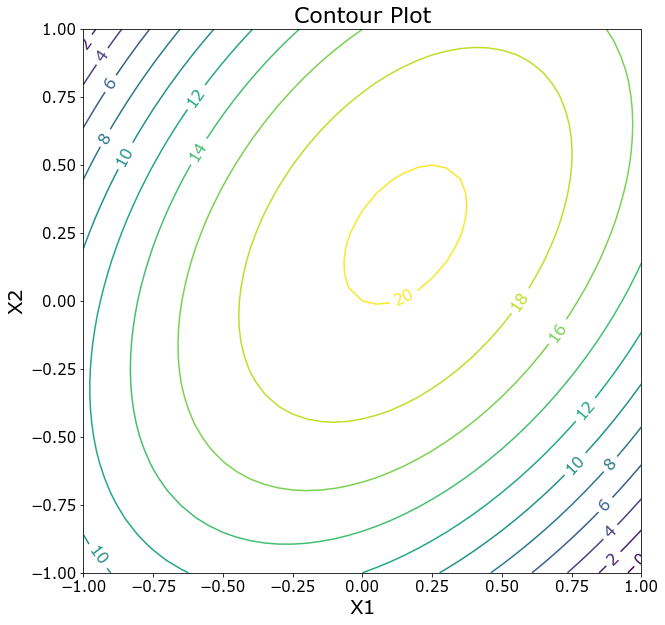
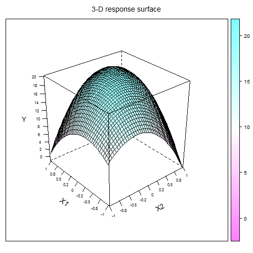
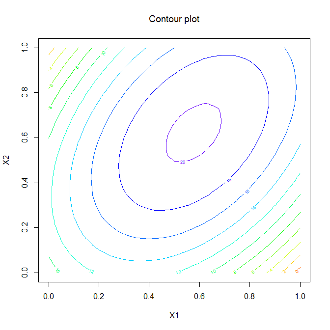

[](http://quantlet.de/)

## [](http://quantlet.de/) **MVAresponsesurface** [](http://quantlet.de/)

```yaml

Name of QuantLet: MVAresponsesurface

Published in: Applied Multivariate Statistical Analysis

Description: Plots 3D response surfaces and a contour plot for the variable y and the two factors that explain the variation of y via the quadratic response model.

Keywords: 3D, surface, contour, plot, graphical representation, response-model, regression

See also: MVAdrug

Author: Awdesch Melzer
Author[Python]: Matthias Fengler, Tim Dass

Submitted: Wed, April 04 2012 by Dedy Dwi Prastyo
Submitted[Python]: Tue, April 16 2024 by Tim Dass

```








### PYTHON Code
```python

# works on numpy 1.24.3 and matplotlib 3.6.2
import numpy as np
import matplotlib.pyplot as plt

x1 = np.arange(-1, 1.05, 0.05)
n1 = len(x1)
x2 = np.arange(-1, 1.05, 0.05)
n2 = len(x2)

# Set beta
b = np.array([20, 1, 2, -8, -6, 6])

L = np.empty((n1, n2))
x = np.empty((n1, n2))

# Calculate y
for i in range(n1):
    xi = x1[i]
    temp = np.empty(n2)
    for j in range(n2):
        xj = x2[j]
        Lij = b[0] + b[1] * xi + b[2] * xj + b[3] * xi**2 + b[4] * xj**2 + b[5] * xi * xj
        temp[j] = Lij
    L[i] = temp

fig, ax = plt.subplots(1,1, figsize = (10,10), subplot_kw=dict(projection='3d'))

x1, x2 = np.meshgrid(x1, x2)
ax.plot_surface(x1, x2, L, cmap='viridis')
ax.set_xlabel('X1', fontsize = 15)
ax.set_ylabel('X2', fontsize = 15)
ax.set_zlabel('Y', fontsize = 15)
ax.set_title('3-D Response Surface', fontsize = 22, y = 0.96)
ax.tick_params(labelsize=12)
ax.view_init(20, -110)
plt.show()

# Contour plot
contours = np.arange(0,22,2)
fig, ax = plt.subplots(1,1, figsize = (10,10))
CS = ax.contour(x1, x2, L, contours)
ax.clabel(CS, contours, fontsize = 16)
ax.set_xlabel('X1', fontsize = 20)
ax.set_ylabel('X2', fontsize = 20)
ax.tick_params(labelsize=15)
ax.set_title('Contour Plot', fontsize = 22)
plt.show()

```

automatically created on 2024-04-25

### R Code
```r


# clear variables and close windows
rm(list = ls(all = TRUE))
graphics.off()

# install and load packages
libraries = c("lattice")
lapply(libraries, function(x) if (!(x %in% installed.packages())) {
    install.packages(x)
})
lapply(libraries, library, quietly = TRUE, character.only = TRUE)

# Define x1 and x2 between [-1:1].
x1 = seq(-1, 1, 0.05)
n1 = length(x1)
x2 = seq(-1, 1, 0.05)
n2 = length(x2)

# Set beta
b = c(20, 1, 2, -8, -6, 6)

L = NULL
x = NULL

# Calculate y
for (i in 1:n1) {
    xi = x1[i]
    temp = NULL
    for (j in 1:n2) {
        xj = x2[j]
        Lij = b[1] + b[2] * xi + b[3] * xj + b[4] * xi^2 + b[5] * xj^2 + b[6] * xi * 
            xj
        temp = cbind(temp, Lij)
    }
    L = rbind(L, temp)
}

wireframe(L, drape = T, xlab = list("X2", rot = 30, cex = 1.2), main = expression(paste("3-D response surface")), 
    ylab = list("X1", rot = -40, cex = 1.2), zlab = list("Y", cex = 1.1), scales = list(arrows = FALSE, 
        col = "black", distance = 1, tick.number = 8, cex = 0.7, x = list(at = seq(1, 
            41, 5), labels = round(seq(-1, 1, length = 9), 1)), y = list(at = seq(1, 
            41, 5), labels = round(seq(-1, 1, length = 9), 1))))

dev.new()
contour(L, col = rainbow(15), xlab = "X1", ylab = "X2", main = expression(paste("Contour plot")), 
    ) 

```

automatically created on 2024-04-25