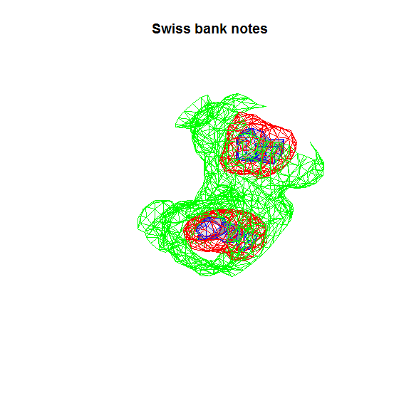
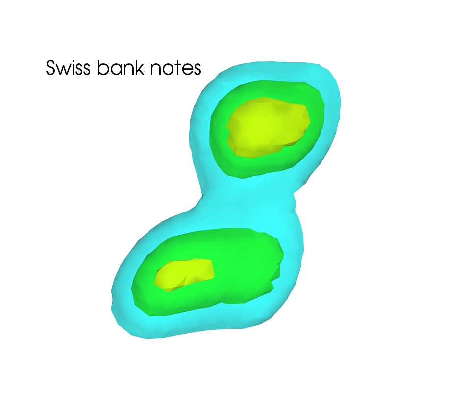

[](http://quantlet.de/)

## [](http://quantlet.de/) **MVAcontbank3** [](http://quantlet.de/)

```yaml


Name of QuantLet: MVAcontbank3

Published in: Applied Multivariate Statistical Analysis

Description: 'Gives a contour plot of the kernel density estimate of variables X4, X5 and X6 of the Swiss bank notes.'

Keywords: 3D, data visualization, plot, graphical representation, financial, density, descriptive, descriptive-statistics, empirical, gaussian, kde, kernel, smoothing, univariate, visualization

See also: MVAboxbank6, MVAdenbank2, MVAdenbank3, MVAdraftbank4, MVAscabank45, MVAscabank56, MVAscabank456, SPMdenepatri, SPMkdeconstruct, SPMkernel

Author: Song Song

Author[Python]: 'Matthias Fengler, Liudmila Gorkun-Voevoda'

Submitted: Tue, September 09 2014 by Awdesch Melzer

Submitted[Python]: 'Wed, April 22 2020 by Liudmila Gorkun-Voevoda'

Datafiles: bank2.dat

```





### R Code
```r


# clear variables and close windows
rm(list = ls(all = TRUE))
graphics.off()

# install and load packages
libraries = c("KernSmooth", "misc3d")
lapply(libraries, function(x) if (!(x %in% installed.packages())) {
install.packages(x)
})
lapply(libraries, library, quietly = TRUE, character.only = TRUE)

# load data
xx = read.table("bank2.dat")

d  = kde3d(xx[, 4], xx[, 5], xx[, 6], n = 15)

# plot
contour3d(d$d, level = c(max(d$d[10, 10, ]) * 0.02, max(d$d[10, 10, ]) * 0.5, max(d$d[10, 
    10, ]) * 1.3), fill = c(FALSE, FALSE, TRUE), col.mesh = c("green", "red", "blue"), 
    engine = "standard", screen = list(z = 210, x = -40, y = -295), scale = TRUE)
title("Swiss bank notes")

```

automatically created on 2020-04-22

### PYTHON Code
```python

import pandas as pd
import numpy as np
import scipy.stats as st
from mayavi import mlab

xx = pd.read_csv("bank2.dat", sep = "\s+", header=None)

d = st.gaussian_kde(np.array(xx.iloc[:, 3:]).T)

for i, j in zip(["x", "y", "z"], range(3, 6)):
    globals()[i+"_min"] = min(np.array(xx.iloc[:, j]))-1
    globals()[i+"_max"] = max(np.array(xx.iloc[:, j]))+1

xi, yi, zi = np.mgrid[x_min:x_max:30j, y_min:y_max:30j, z_min:z_max:30j]

coords = np.vstack([item.ravel() for item in [xi, yi, zi]]) 
density = d(coords).reshape(xi.shape)


figure = mlab.figure('DensityPlot', bgcolor = (1, 1, 1))

mlab.contour3d(xi, yi, zi, density, opacity=0.5)
mlab.title("Swiss bank notes", color = (0,0,0))
mlab.axes(extent = [x_min, x_max, y_min, y_max, z_min, z_max], 
          x_axis_visibility = False, y_axis_visibility= False, z_axis_visibility = False)
mlab.show()


```

automatically created on 2020-04-22