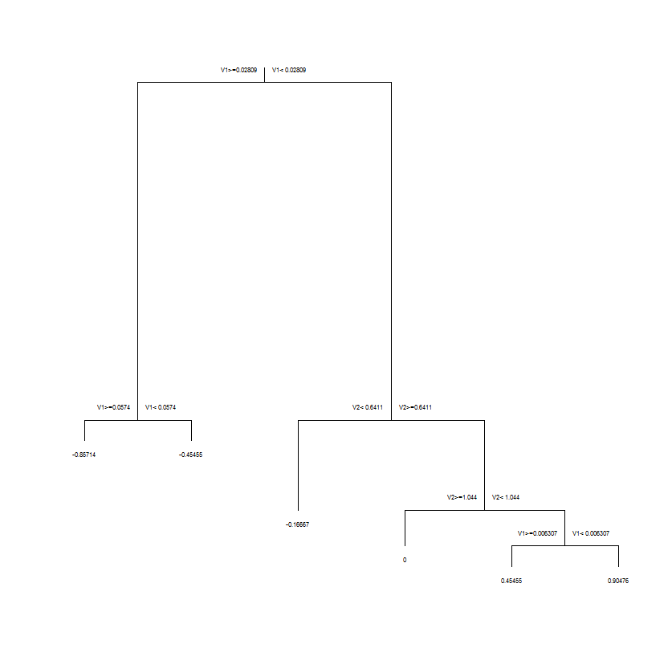

[](http://quantlet.de/)

## [](http://quantlet.de/) **MVACARTBan1** [](http://quantlet.de/)

```yaml

Name of Quantlet : MVACARTBan1

Published in : Applied Multivariate Statistical Analysis

Description : 'Performs classification analysis for the US bankruptcy data with 84 companies
employing the Gini index and a constraint. It plots a decision tree.'

Keywords : 'plot, graphical representation, classification, analysis, financial, decision-tree,
data visualization, Gini index'

Author : Awdesch Melzer

Submitted : Sat, May 10 2014 by Felix Jung

Datafile : bankruptcy.dat

Outdated : 'Package mvpart was removed from the CRAN repository. Formerly available versions can be
obtained from the archive.'

```




### R Code:
```r

# clear variables and close windows
rm(list = ls(all = TRUE))
graphics.off()

# install and load packages
libraries = c("mvpart")
lapply(libraries, function(x) if (!(x %in% installed.packages())) {
  install.packages(x)
})
lapply(libraries, library, quietly = TRUE, character.only = TRUE)

# load data
x  = read.table("bankruptcy.dat")
xx = data.frame(x)

# set constraint: # of observations per node = 30
my.control = rpart.control(minsplit = 30, usesurrogate = 1, minbucket = 1,
                           maxdepth = 30)

# create classification tree
t2 = rpart(V3 ~ V1 + V2, xx, parms = "gini", x = TRUE, y = TRUE,
           control = my.control)

# plot classification tree
plot(t2)
text(t2, cex = 0.5)

```
