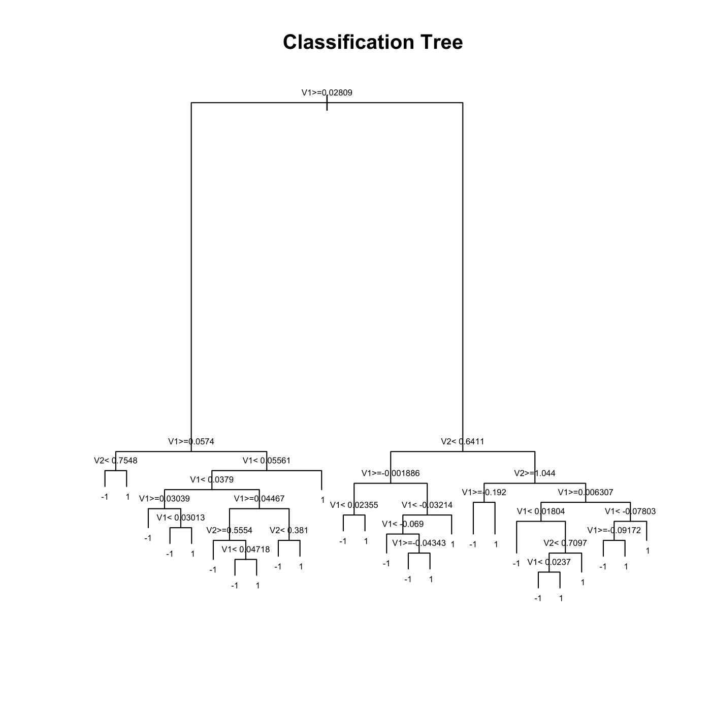

[](http://quantlet.de/)

## [](http://quantlet.de/) **MVACARTGiniTree1** [](http://quantlet.de/)

```yaml

Name of QuantLet : MVACARTGiniTree1

Published in : Applied Multivariate Statistical Analysis

Description : 'Performs classification analysis and plots the classification tree for the US
bankruptcy data with 84 companies employing the Gini rule.'

Keywords : 'plot, graphical representation, classification, analysis, financial, decision-tree,
data visualization'

See also : MVACARTTwoingTree1

Author : Awdesch Melzer

Submitted : Wed, April 25 2012 by Dedy Dwi Prastyo

Datafile : bankruptcy.dat

```




### R Code:
```r

# clear all variables
rm(list = ls(all = TRUE))
graphics.off()

# install and load packages
libraries = c("rpart", "rpartScore")
lapply(libraries, function(x) if (!(x %in% installed.packages())) {
    install.packages(x)
})
lapply(libraries, library, quietly = TRUE, character.only = TRUE)

# load data
x  = read.table("bankruptcy.dat")
xx = data.frame(x)

# set control
my.control = rpart.control(minsplit = 1, usesurrogate = 2, minbucket = 1, maxdepth = 30, 
    surrogatestyle = 1, cp = 0)

# create classification tree R (>= 2.14.2)
t2 = rpartScore(V3 ~ V1 + V2, xx, split = "quad", control = my.control)

# if your R version is R (< 2.14.2) uncomment the following line t2 =
# rpart(V3~V1+V2,xx,parms='gini',x=TRUE,y=TRUE,control=my.control)

# plot classification tree
plot(t2)
text(t2, cex = 0.5)
title(paste("Classification Tree ")) 

```
