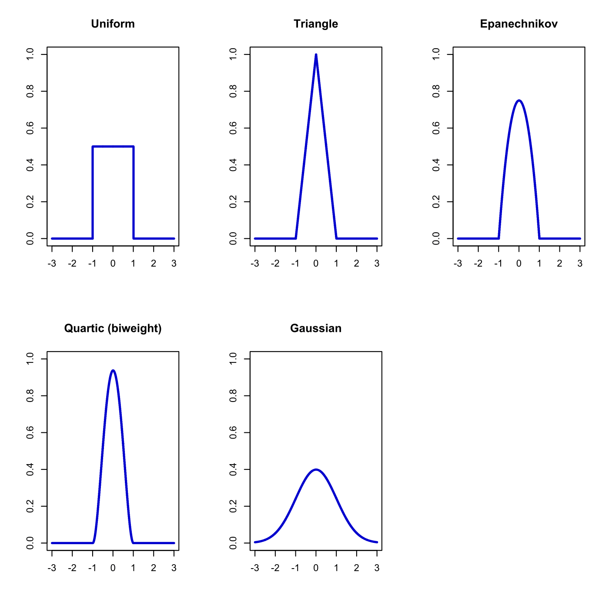
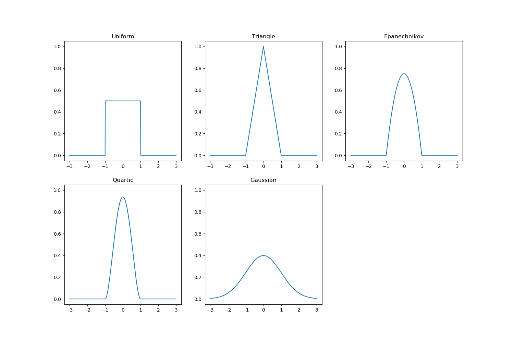

[](http://quantlet.de/)

## [](http://quantlet.de/) **MVAkernelfunctions** [](http://quantlet.de/)

```yaml

Name of QuantLet: MVAkernelfunctions

Published in: Applied Multivariate Statistical Analysis

Description: 'Plots different kernel functions: Uniform, Triangle, Epanechnikov, Quartic (biweight), Gaussian.'

Keywords: gaussian, kde, kernel, kernel smoothing, quartic, smoothing, uniform, gaussian, Epanechnikov, quartic, plot, graphical representation

See also: SPMdenepatri, SPMdensity, SPMkdeconstruct, SPMkernel

Author: Andrija Mihoci, Awdesch Melzer

Author[Python]: 'Matthias Fengler, Liudmila Gorkun-Voevoda'

Submitted: Tue, September 09 2014 by Awdesch Melzer

Submitted[Python]: 'Wed, April 22 2020 by Liudmila Gorkun-Voevoda'


```





### R Code
```r


# clear variables and close windows
rm(list = ls(all = TRUE))
graphics.off()

# Different Kernel Functions
u = seq(-3, 3, 0.01) 

K_Uniform      = 0.5 * (abs(u) <= 1)                    # kernel of uniform distribution
K_Triangle     = (1 - abs(u)) * (abs(u) <= 1)           # kernel of triangle distribution
K_Epanechnikov = 0.75 * (1 - u^2) * (abs(u) <= 1)       # epanechnikov kernel
K_Quartic      = 0.9375 * (1 - u^2)^2 * (abs(u) <= 1)   # kernel of quadratic biweighted distribution
K_Gaussian     = 0.3989 * exp(-0.5 * u^2)               # kernel of a gaussian distribution

# Plot Kernels
par(mfrow = c(2, 3))

plot(u, K_Uniform, type = "s", col = "blue3", ylim = c(0, 1), ylab = "", xlab = "", 
    lwd = 2.5)
title("Uniform")

plot(u, K_Triangle, type = "s", col = "blue3", ylim = c(0, 1), ylab = "", xlab = "", 
    lwd = 2.5)
title("Triangle")

plot(u, K_Epanechnikov, type = "s", col = "blue3", ylim = c(0, 1), ylab = "", xlab = "", 
    lwd = 2.5)
title("Epanechnikov")

plot(u, K_Quartic, type = "s", col = "blue3", ylim = c(0, 1), ylab = "", xlab = "", 
    lwd = 2.5)
title("Quartic (biweight)")

plot(u, K_Gaussian, type = "s", col = "blue3", ylim = c(0, 1), ylab = "", xlab = "", 
    lwd = 2.5)
title("Gaussian")


```

automatically created on 2020-04-22

### PYTHON Code
```python

import pandas as pd
import numpy as np
import matplotlib.pyplot as plt

# Different Kernel Functions
u = np.arange(-3, 3.01, 0.01)

K_Uniform = 0.5 * (abs(u) <= 1) # kernel of uniform distribution
K_Triangle = (1 - abs(u)) * (abs(u) <= 1) # kernel of triangle distribution
K_Epanechnikov = 0.75 * (1 - u**2) * (abs(u) <= 1) # epanechnikov kernel
K_Quartic = 0.9375 * (1 - u**2)**2 * (abs(u) <= 1) # kernel of quadratic biweighted distribution
K_Gaussian = 0.3989 * np.exp(-0.5 * u**2) # kernel of a gaussian distribution

kernels = ["K_Uniform", "K_Triangle", "K_Epanechnikov", "K_Quartic", "K_Gaussian"]


# Plot Kernels
fig, axes = plt.subplots(2, 3, figsize = (15, 10))
kernels = ["K_Uniform", "K_Triangle", "K_Epanechnikov", "K_Quartic", "K_Gaussian"]
k = 0
for c in range(0, 3):
    axes[0,c].plot(u, eval(kernels[k]))
    axes[0,c].set_ylim(-0.05,1.05)
    axes[0,c].set_title(kernels[k][2:])
    k += 1
    
for c in range(0, 2):
    axes[1,c].plot(u, eval(kernels[k]))
    axes[1,c].set_ylim(-0.05,1.05)
    axes[1,c].set_title(kernels[k][2:])
    k += 1


fig.delaxes(axes[1,2])
plt.show()


```

automatically created on 2020-04-22