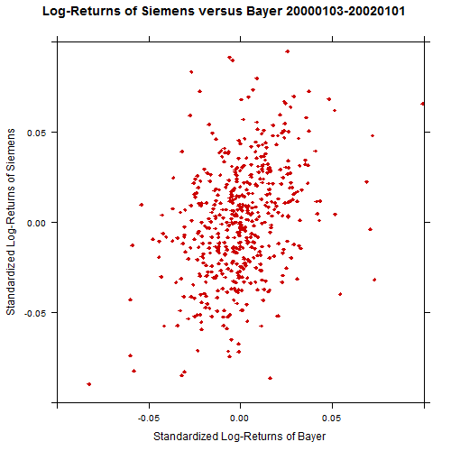
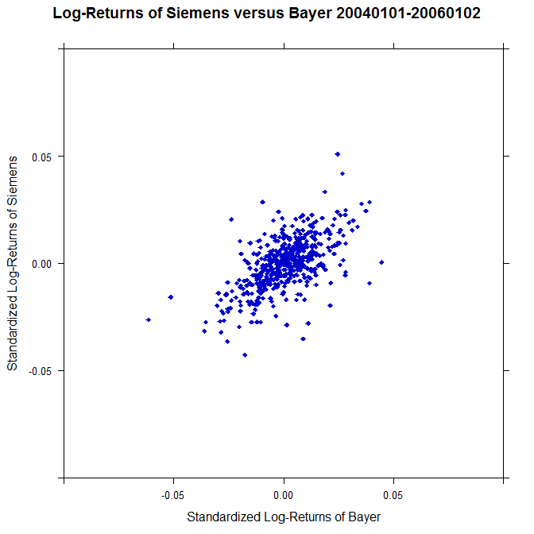

[](http://quantlet.de/)

## [](http://quantlet.de/) **MVAscalogret** [](http://quantlet.de/)

```yaml

Name of QuantLet : MVAscalogret

Published in : Applied Multivariate Statistical Analysis

Description : Provides a scatterplot of daily standardized log-returns of Siemens versus Bayer.

Keywords : 'log-returns, returns, financial, plot, graphical representation, scatterplot,
multivariate, standardization, data visualization'

Author : Awdesch Melzer

Submitted : Fri, May 18 2012 by Dedy Dwi Prastyo

Datafile : BAYER_close_99_06.dat, SIEMENS_close_99_06.dat

```






### R Code:
```r

# clear variables and close windows
rm(list = ls(all = TRUE))
graphics.off()

# install and load packages
libraries = c("lattice")
lapply(libraries, function(x) if (!(x %in% installed.packages())) {
    install.packages(x)
})
lapply(libraries, library, quietly = TRUE, character.only = TRUE)

# load data
x1  = read.table("SIEMENS_close_99_06.dat")
x2  = read.table("BAYER_close_99_06.dat")

X   = data.frame(cbind(x1[262:782, 2], x2[262:782, 2]))
XX  = cbind(diff(log(X[, 1])), diff(log(X[, 2])))
X   = data.frame(XX)

# Scatterplot of Log-returns of Siemens vs. Bayer
xyplot(X1 ~ X2, data = X, col = "red3", pch = 18, ylab = "Standardized Log-Returns of Siemens", 
    xlab = "Standardized Log-Returns of Bayer", xlim = c(-0.1, 0.1), ylim = c(-0.1, 
        0.1), main = "Log-Returns of Siemens versus Bayer 20000103-20020101")

dev.new()

Y   = data.frame(cbind(x1[1305:1826, 2], x2[1305:1826, 2]))
YY  = cbind(diff(log(Y[, 1])), diff(log(Y[, 2])))
Y   = data.frame(YY)

# Scatterplot of Log-returns of Siemens vs. Bayer
xyplot(X1 ~ X2, data = Y, col = "blue3", pch = 18, ylab = "Standardized Log-Returns of Siemens", 
    xlab = "Standardized Log-Returns of Bayer", xlim = c(-0.1, 0.1), ylim = c(-0.1, 
        0.1), main = "Log-Returns of Siemens versus Bayer 20040101-20060102") 

```
