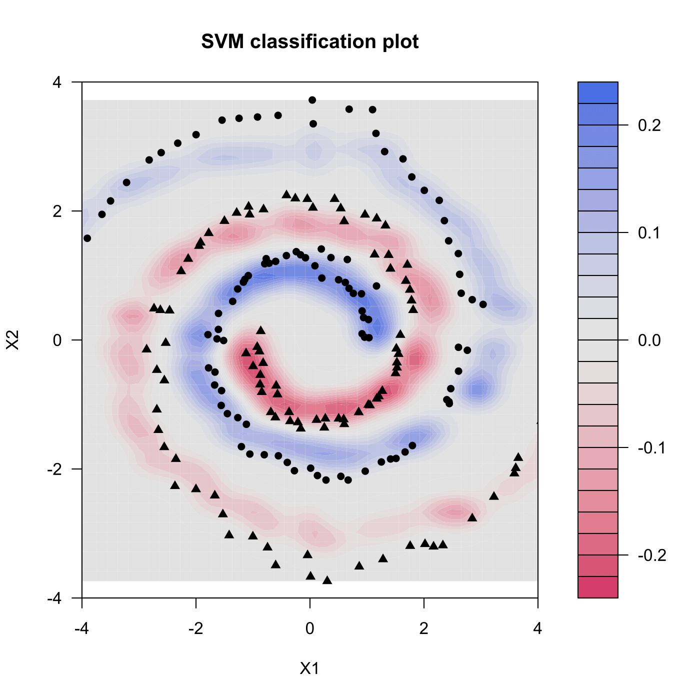

[](http://quantlet.de/)

## [](http://quantlet.de/) **MVAsvmSpiral** [](http://quantlet.de/)

```yaml

Name of QuantLet : MVAsvmSpiral

Published in : Applied Multivariate Statistical Analysis

Description : 'Plots the area of two different groups of spiral data via svm classification using
anisotropic Gaussian kernel.'

Keywords : SVM, anisotropic, gaussian, kernel, plot, graphical representation, classification

See also : MVAsvmOrangePeel, MVAppsib, ppsib, ppsibexample

Author : Dedy D. Prastyo

Submitted : Mon, March 17 2014 by Franziska Schulz

```




### R Code:
```r

# clear variables and close windows
rm(list = ls(all = TRUE))
graphics.off()

# install and load packages
libraries = c("kernlab", "tseries", "quadprog", "zoo")
lapply(libraries, function(x) if (!(x %in% installed.packages())) {
install.packages(x)
})
lapply(libraries, library, quietly = TRUE, character.only = TRUE)

# Generating spiral data
tetha = seq(length = 100, from = 0, to = 3)
a = 1
b = 0.5  # b is near to zero, spiral approaches a circle
r = a * exp(b * tetha)

# X(+1) members of first group, centering in (c1p,c2p)
c1p = 0
c2p = 0
X1p = c1p + r * cos(tetha * pi)
X2p = c2p + r * sin(tetha * pi)

# X(-1) members of second group, centering in (c1n,c2n)
c1n = 1
c2n = 0
X1n = 1 - (c1n + r * cos(tetha * pi))
X2n = -(c2n + r * sin(tetha * pi))

# Aggregating data
X1 = c(X1p, X1n)
X2 = c(X2p, X2n)

# Generating indicator variable

yp = array(1:100, dim = c(100, 1))
yn = array(1:100, dim = c(100, 1))
for (i in 1:100) {
    yp[i] = 1
    yn[i] = -1
}
Y = c(yp, yn)

# Generating noise, N(0,0.01)
e = rnorm(200, mean = 0, sd = 0.1)
X1 = X1 + e
X2 = X2 + e

Spiral.noise = cbind(X2, X1)

# define gaussian kernel function
gaussian = function(xi, xj) {
    exp(-sum((xi - xj) * RB * (xi - xj)))
}
class(gaussian) = "kernel"

# compute Radial Basis (RB)
r = 0.1  # parameter r in anisotropic gaussian kernel

X = cbind(X2, X1)
RB = solve(cov(X))/(r)^2

# compute SVM score value
SpiralModel = ksvm(Spiral.noise, Y, type = "C-svc", kernel = gaussian, kpar = list(RB), 
    C = 10/200, prob.model = TRUE, cross = 4)


# C-svc : SVM for classification C : cost of constraints violation in the term
# of Lagrangian formulation

# create SVM classification plot
plot(SpiralModel, data = Spiral.noise, xlim = c(-4, 4), ylim = c(-4, 4))

```
