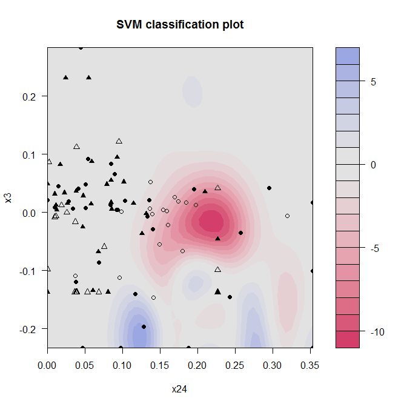

[](http://quantlet.de/)

## [](http://quantlet.de/) **MVAsvmSig05C200** [](http://quantlet.de/)

```yaml

Name of QuantLet : MVAsvmSig05C200

Published in : Applied Multivariate Statistical Analysis

Description : Plots an SVM classification plot of bankruptcy data set with sigma = 0.5 and C = 200.

Keywords : 'SVM, financial, plot, graphical representation, classification, kernel, data
visualization'

See also : STF2svm01 , MVAsvmSig100C1 , MVAsvmSig2C1

Author : Dedy D. Prastyo

Submitted : Thu, October 18 2012 by Dedy Dwi Prastyo

Datafile : Bankruptcy100by100noNA.txt

```




### R Code:
```r

# clear variables and close windows
rm(list = ls(all = TRUE))
graphics.off()

# install and load packages
libraries = c("kernlab", "tseries", "quadprog", "zoo")
lapply(libraries, function(x) if (!(x %in% installed.packages())) {
    install.packages(x)
})
lapply(libraries, library, quietly = TRUE, character.only = TRUE)

# load data and create an SVM classification model of type 'ksvm
G = read.matrix("Bankruptcy100by100noNA.txt", header = TRUE, sep = "")
bankmodel_draw = ksvm(G[, c(7, 28)], G[, c(3)], type = "C-svc", kernel = "rbfdot", 
    kpar = list(sigma = 1/0.5), C = 200)

# Print output of SVM
print(bankmodel_draw)

# Create plot of SVM classification model
plot(bankmodel_draw, data = G[, c(7, 28)]) 

```
