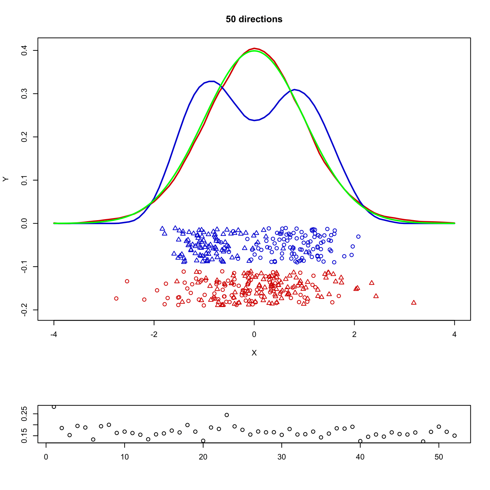

[](http://quantlet.de/)

## [](http://quantlet.de/) **MVAppexample** [](http://quantlet.de/)

```yaml

Name of QuantLet : MVAppexample

Published in : Applied Multivariate Statistical Analysis

Description : 'Reads the Swiss banknote data and spheres them to run Exploratory Projection Pursuit
(EPP) on them. We select n (=50) randomly chosen one-dimensional projections in the six-dimensional
space of the data. For each set of projected data the Friedman-Tukey-Index is applied to judge the
interestingness of the projection.'

Keywords : 'projection-pursuit, projection, EPP, exploratory-projection-pursuit, plot, graphical
representation, Jones and Sibson index, estimation, density, data visualization, financial'

See also : 'MVAppsib, MVAsimdep1, MVAsirdata, MVAsir2data, MVAsimdepex, ppsib, ppsibexample,
ppexample, ppf'

Author : Awdesch Melzer

Submitted : Wed, April 24 2013 by Maria Osipenko

Datafile : bank2.dat

Example : 'Projection Pursuit for the Swiss bank notes data. The figure shows the density for the
standard, normally distributed data (green) and the estimated densities for the best (red) and the
worst (blue) projections found. A dotplot of the projections is also presented. In the lower part
we see the values of the Friedman-Tukey-Index.'

```




### R Code:
```r

# clear all variables
rm(list = ls(all = TRUE))
graphics.off()

# install and load packages
libraries = c("locpol")
lapply(libraries, function(x) if (!(x %in% installed.packages())) {
    install.packages(x)
})
lapply(libraries, library, quietly = TRUE, character.only = TRUE)

# ppf computes the Friedman Tukey index (integral about the squared density of
# the projected data) via kernel density estimation
ppf = function(px, h) {
    dens = PRDenEstC(sort(px), xeval = seq(min(px), max(px), length = length(px)), 
        bw = h, kernel = EpaK)$den
    ind = mean(dens)
    return(ind)
}

ppexample = function(x, h, n) {
    xg = seq(-4, by = 0.1, length = 81)
    id = rbind(matrix(3, 100, 1), matrix(4, 100, 1))
    
    # select a starting vector
    p = rnorm(ncol(x))
    p = p/sqrt(sum(p^2))
    
    # compute index for starting vector
    xp      = x %*% p
    imin    = ppf(xp, h)
    imax    = imin
    
    xi      = cbind(xp, runif(length(xp), 0, 1))
    xi[, 2] = -0.11 - 0.08 * xi[, 2]
    fi      = PRDenEstC(xp, xeval = xg, bw = h, kernel = EpaK)
    xa      = cbind(xp, runif(length(xp), 0, 1))
    xa[, 2] = -0.01 - 0.08 * xa[, 2]
    fa      = PRDenEstC(xp, xeval = xg, bw = h, kernel = EpaK)
    
    # plot
    plot(xa, type = "n", ylab = "Y", xlab = "X", ylim = c(-0.2, max(fi[, 2], fa[, 
        2])), xlim = c(-4, 4))
    points(xi, col = "red3", pch = c(rep(1, 100), rep(2, 100)))
    points(xa, col = "blue3", pch = c(rep(1, 100), rep(2, 100)))
    lines(fi, col = "red3", lwd = 2, lty = 1)
    lines(fa, col = "blue3", lwd = 2)
    inds = c(1/sqrt(4 * pi), imax)
    pind = cbind((1:length(inds)), inds)
    
    # search for better projection vector
    i       = 0
    pmin    = 1
    pmax    = 1
    while (i < n) {
        i       = i + 1
        tit     = toString(paste(i, "directions"))
        p       = rnorm(ncol(x))
        p       = p/sqrt(sum(p^2))
        xp      = x %*% p
        ind     = ppf(xp, h)
        inds    = c(inds, ind)
        pind    = cbind(1:length(inds), inds)
        cind    = rbind(2, 1)
        cind[which.max(inds)] = 4
        cind[which.min(inds)] = 1
        cind[1] = 2
        
        if (ind > imax) {
            imax    = ind
            xa      = cbind(xp, runif(xp, 0, 1))
            xa[, 2] = -0.01 - 0.08 * xa[, 2]
            fa      = PRDenEstC(xp, xeval = xg, bw = h, kernel = EpaK)  # line red dashed
            
            # plot
            plot(xa, type = "n", ylab = "Y", xlab = "X", ylim = c(-0.2, max(fi[, 
                2], fa[, 2])), xlim = c(-4, 4))
            points(xi, col = "red3", pch = c(rep(1, 100), rep(2, 100)))
            points(xa, col = "blue3", pch = c(rep(1, 100), rep(2, 100)))
            lines(fi, col = "red3", lwd = 2, lty = 1)
            lines(fa, col = "blue3", lwd = 2)
            title(tit)
            pmin = i
        }
        if (ind < imin) {
            imin    = ind
            xi      = cbind(xp, runif(xp, 0, 1))
            xi[, 2] = -0.11 - 0.08 * xi[, 2]
            fi      = PRDenEstC(xp, xeval = xg, bw = h, kernel = EpaK)  # blue line
            
            # plot
            plot(xa, type = "n", ylab = "Y", xlab = "X", ylim = c(-0.2, max(fi[, 
                2], fa[, 2])), xlim = c(-4, 4))
            points(xi, col = "red3", pch = c(rep(1, 100), rep(2, 100)))
            points(xa, col = "blue3", pch = c(rep(1, 100), rep(2, 100)))
            lines(fi, col = "red3", lwd = 2, lty = 1)
            lines(fa, col = "blue3", lwd = 2)
            title(tit)
            pmax = i
            mini = p
        }
    }
    return(list(xa = xa, xi = xi, fa = fa, fi = fi, tit = tit, pind = pind, cind = cind))
}

# sphere data transform
sphere = function(x) {
    x = x - matrix(colMeans(x), nrow = 200, ncol = 6, byrow = T)
    s = svd(var(x))
    s = s$u/matrix(sqrt(s$d), nrow(s$u), ncol(s$u), byrow = T)
    x = as.matrix(x) %*% as.matrix(s)
    return(x)
}

# load data
x = read.table("bank2.dat")

x       = sphere(as.matrix(x))      # sphere the data
set.seed(0)
h       = 2.62 * nrow(x)^(-1/5)     # choose bandwidth related to Scott's rule
n       = 50                        # choose number of projections
inde    = ppexample(as.matrix(x), h, n)

layout(c(1, 1, 1, 2))

# Plot
plot(inde$xa, type = "n", ylab = "Y", xlab = "X", ylim = c(-0.2, max(inde$fi[, 2], 
    inde$fa[, 2])), xlim = c(-4, 4))
points(inde$xi, col = "red3", pch = c(rep(1, 100), rep(2, 100)))
points(inde$xa, col = "blue3", pch = c(rep(1, 100), rep(2, 100)))
lines(inde$fi, col = "red3", lwd = 2, lty = 1)
lines(inde$fa, col = "blue3", lwd = 2)
title(inde$tit)
lines(seq(-4, 4, by = 0.01), dnorm(seq(-4, 4, by = 0.01), 0, 1), col = "green", lwd = 2)
plot(inde$pind, xlab = "", ylab = "") 

```
