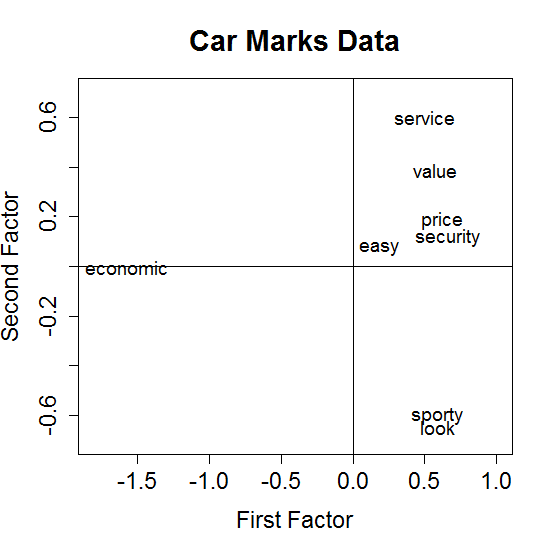
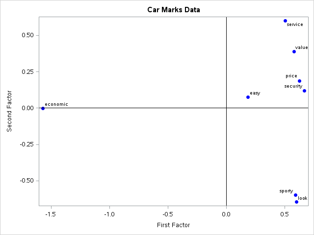

[](http://quantlet.de/)

## [](http://quantlet.de/) **MVAfactcarm** [](http://quantlet.de/)

```yaml

Name of QuantLet : MVAfactcarm

Published in : Applied Multivariate Statistical Analysis

Description : 'Performs a factor analysis for the car marks data and shows the eigenvalues of r-psi
and a plot of the factor loadings for the first two factors.'

Keywords : 'eigenvalues, factor, factor analysis, factor-loadings, spectral-decomposition, data
visualization, plot, graphical representation, financial, sas'

See also : 'SMSfactbank, SMSfactfood, SMSfacthletic, SMSfactsigma, SMSfactushealth, MVAdecofood,
SMSdecobank'

Author : Zografia Anastasiadou, Awdesch Melzer

Author[SAS] : Svetlana Bykovskaya

Submitted : Wed, June 04 2014 by Felix Jung

Submitted[SAS] : Wen, April 6 2016 by Svetlana Bykovskaya

Datafiles : carmean.dat, carmean_sas.dat

```






### R Code:
```r

# clear variables and close windows
rm(list = ls(all = TRUE))
graphics.off()


# Note: R decomposes matrices differently from Matlab and Xplore, and hence some
# of the eigenvectors have different signs. This does not change the results, but
# it does change the order of the graph by inverting the axes around the origin
# (Not always, and not necessarily all of the axis; it depends on which
# eigenvectors we choose to plot)


# load data
xdat = read.table("carmean.dat")

# delete first column
x = xdat[, -1]

# define variable names
colnames(x) = c("economic", "service", "value", "price", "look", "sporty", "security", 
    "easy")

# correlation matrix
r = cor(x)
m = r

for (i in 1:ncol(r)) {
    m[i, i] = r[i, i] - 1
}

psi = matrix(1, 8, 8)
for (i in 1:8) {
    psi[i, i] = 1 - max(abs(m[, i]))
}

# spectral decomposition
eig = eigen(r - psi)
ee  = eig$values[1:2]
vv  = eig$vectors[, 1:2]
vv  = t(t(vv[, 1:2]) * sign(vv[2, 1:2]))
q1  = sqrt(ee[1]) * vv[, 1]
q2  = sqrt(ee[2]) * vv[, 2]
q   = cbind(q1, q2)

# plot
plot(q, type = "n", xlab = "First Factor", ylab = "Second Factor", main = "Car Marks Data", 
    xlim = c(-1.8, 1), ylim = c(-0.7, 0.7), cex.lab = 1.4, cex.axis = 1.4, cex.main = 1.8)
text(q, colnames(x), cex = 1.2, xpd = NA)
abline(v = 0)
abline(h = 0)

```

### SAS Code:
```sas
* Import the data;
data carmean;
  infile '/folders/myfolders/data/carmean.dat';
  input temp1 $ temp2-temp9;
run;

proc iml;
  * Read data into a matrix;
  use carmean;
    read all var _ALL_ into x; 
  close carmean;
  
  colnames = {"economic", "service", "value", "price", "look", "sporty", "security", 
    "easy"}; 
  
  * correlation matrix;
  r = corr(x);
  m = r;
  
  do i = 1 to ncol(r);
    m[i, i] = r[i, i] - 1;
  end;
  
  psi = j(8,8,1);
  
  do i = 1 to 8;
    psi[i, i] = 1 - max(abs(m[, i]));
  end;
  
  * spectral decomposition;
  eig = r - psi;
  ee  = eigval(eig)[1:2];
  vv  = eigvec(eig)[, 1:2];
  vv  = vv[, 1:2] # sign(vv[2, 1:2]);
  q1  = sqrt(ee[1]) # vv[, 1];
  q2  = sqrt(ee[2]) # vv[, 2];

  create plot var {"q1" "q2" "colnames"};
    append;
  close plot;
quit;

proc sgplot data = plot
    noautolegend;
  title 'Car Marks Data';
  scatter x = q1 y = q2 / markerattrs = (color = blue symbol = circlefilled)
    datalabel = colnames;
  refline 0 / lineattrs = (color = black);
  refline 0 / axis = x lineattrs = (color = black);
  xaxis label = 'First Factor';
  yaxis label = 'Second Factor';
run;

```
