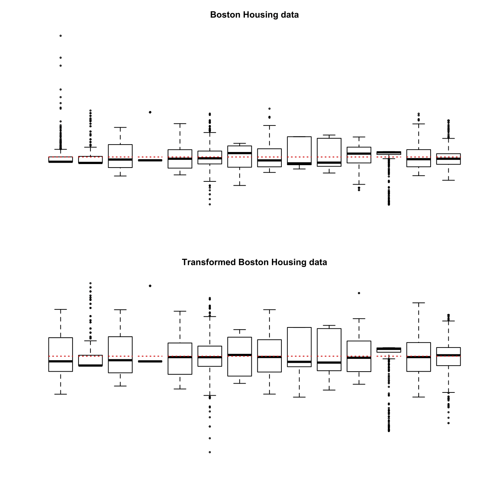
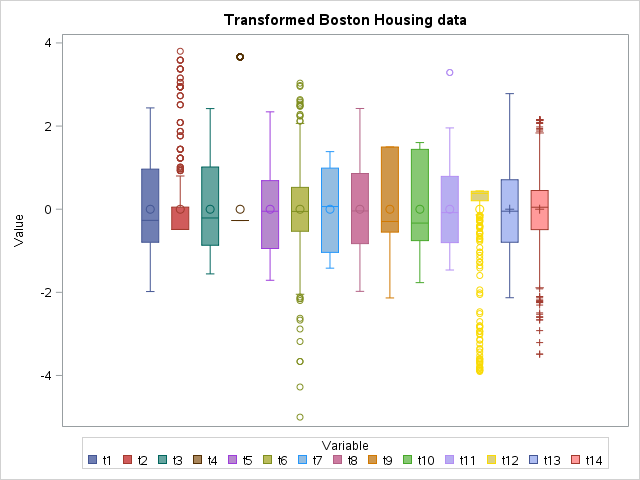

[](http://quantlet.de/)

## [](http://quantlet.de/) **MVAboxbhd** [](http://quantlet.de/)

```yaml

Name of QuantLet : MVAboxbhd

Published in : Applied Multivariate Statistical Analysis

Description : Computes boxplots for the 14 variables of Boston Housing data.

Keywords : 'descriptive, descriptive-statistics, financial, standardize, transformation, data
visualization, boxplot, plot, graphical representation, sas'

See also : MVAboxbank1, MVAboxbank6, MVAboxbhd, MVAboxcar

Author : Julia Wandke, Franziska Schulz

Author[SAS] : Svetlana Bykovskaya

Submitted : Tue, September 09 2014 by Awdesch Melzer

Submitted[SAS] : Wen, April 6 2016 by Svetlana Bykovskaya

Datafiles : bostonh.dat

```







### R Code:
```r

# clear variables and close windows
rm(list = ls(all = TRUE))
graphics.off()

# load data
x  = read.table("bostonh.dat")
zz = x
i  = 1

while (i <= 14) {
    zz[, i] = (x[, i] - mean(x[, i]))/(sqrt(var(x[, i])))
    i = i + 1
}

xt = cbind(log(x[, 1]), x[, 2], x[, 3], x[, 4], log(x[, 5]), log(x[, 6]), (x[, 
    7]^(2.5)), log(x[, 8]), log(x[, 9]), log(x[, 10]), exp(0.4 * x[, 11]), x[, 
    12], sqrt(x[, 13]), log(x[, 14]))

tt = x
i  = 1

while (i <= 14) {
    tt[, i] = (xt[, i] - mean(xt[, i]))/(sqrt(var(xt[, i])))
    i = i + 1
}

# plot
par(mfrow = c(2, 1), ask = FALSE, cex = 0.5)
boxplot(zz, at = 1:14, axes = FALSE, main = "Boston Housing data", cex.main = 1.5)

for (i in 1:14) {
    lines(c(i - 0.4, i + 0.4), c(mean(zz[, i]), mean(zz[, i])), col = "red3", lty = "dotted", 
        lwd = 1.2)
}

boxplot(tt, at = 1:14, axes = FALSE, main = "Transformed Boston Housing data", 
    cex.main = 1.5)

for (i in 1:14) {
    lines(c(i - 0.4, i + 0.4), c(mean(tt[, i]), mean(tt[, i])), col = "red3", lty = "dotted", 
        lwd = 1.2)
}
```

### SAS Code:
```sas
* Import the data;
data bostonh;
  infile '/folders/myfolders/Sas-work/data/bostonh.dat';
  input temp1-temp14;
run;

proc iml;
  * Read data into a matrix;
  use bostonh;
    read all var _ALL_ into x; 
  close bostonh;
  
  zz = x;
  do i = 1 to ncol(x);
     zz[, i] = (x[, i] - mean(x[, i]))/(sqrt(var(x[, i])));
  end;
  zz = (1:nrow(x))` || zz ;
  
  xt = x;
  xt[, 1]  = log(x[, 1]);
  xt[, 5]  = log(x[, 5]);
  xt[, 6]  = log(x[, 6]);
  xt[, 7]  = (x[, 7] ## (2.5))/10000;
  xt[, 8]  = log(x[, 8]);
  xt[, 9]  = log(x[, 9]);
  xt[, 10] = log(x[, 10]);
  xt[, 11] = exp(0.4 * x[, 11])/1000;
  xt[, 13] = sqrt(x[, 13]);
  xt[, 14] = log(x[, 14]);
  
  tt = x;
   do i = 1 to ncol(x);
     tt[, i] = (xt[, i] - mean(xt[, i]))/(sqrt(var(xt[, i])));
  end;
  tt = (1:nrow(x))` || tt ;
  
  create dat1 from zz[colname={"id" "t1" "t2" "t3" "t4" "t5" "t6" "t7" "t8" "t9" "t10" "t11" "t12" "t13" "t14"}];
    append from zz;
  close dat1;
  
  create dat2 from tt[colname={"id" "t1" "t2" "t3" "t4" "t5" "t6" "t7" "t8" "t9" "t10" "t11" "t12" "t13" "t14"}];
    append from tt;
  close dat2;  
quit;

* Boston Housing data;
proc transpose data = dat1 out = dat1_t;
  by id;
run;

data dat1_t;
  set dat1_t;
  label _name_ = "Variable";
  label col1 = "Value";
run;

title "Boston Housing data";
proc sgplot data = dat1_t;
  vbox col1 / group = _name_ ;
run;

*Transformed Boston Housing data;
proc transpose data = dat2 out = dat2_t;
  by id;
run;

data dat2_t;
  set dat2_t;
  label _name_ = "Variable";
  label col1 = "Value";
run;

title "Transformed Boston Housing data";
proc sgplot data = dat2_t;
  vbox col1 / group = _name_ ;
run;
```
