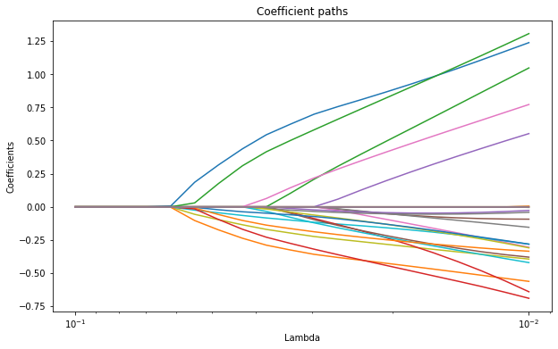

[](http://quantlet.de/)

## [](http://quantlet.de/) **MVAgrouplasso** [](http://quantlet.de/)

```yaml

Name of QuantLet: MVAgrouplasso

Published in: Applied Multivariate Statistical Analysis

Description: Performs a standardized regression using the group Lasso methodology. The estimates of groups of variables become nonzero at a point that means these groups of variables enter the model equation sequentially as the shrinkage parameter increases. The group Lasso technique excludes some of the groups from the model and all coefficients in the remaining groups are non zero. Finally, the resulting group Lasso estimates are plotted.

Keywords: lasso shrinkage, lasso, estimation, regression, plot, graphical representation

See also: LCPvariance

Author: Dedy D. Prastyo, Sergey Nasekin
Author[Python]: Matthias Fengler, Tim Dass

Submitted: Fri, July 18 2014 by Felix Jung
Submitted[Python]: Tue, April 23 2024 by Tim Dass

```




### R Code
```r


# clear variables and close windows
rm(list = ls(all = TRUE))
graphics.off()

# install and load packages
libraries = c("grplasso")
lapply(libraries, function(x) if (!(x %in% installed.packages())) {
install.packages(x)
})
lapply(libraries, library, quietly = TRUE, character.only = TRUE)

data(splice)

contr = list(Pos.1 = "contr.sum", Pos.2 = "contr.sum", Pos.3 = "contr.sum", Pos.4 = "contr.sum")

lambda = lambdamax(y ~ Pos.1 * Pos.2 * Pos.3 * Pos.4, data = splice, model = LogReg(), 
    contrasts = contr, standardize = TRUE) * 0.8^(0:8)

fit = grplasso(y ~ Pos.1 * Pos.2 * Pos.3 * Pos.4, data = splice, model = LogReg(), 
    lambda = lambda, contrasts = contr, standardize = TRUE, control = grpl.control(trace = 0, 
        inner.loops = 0, update.every = 1, update.hess = "lambda"))

# plot
plot(fit, log = "x", lwd = 3)
```

automatically created on 2024-04-25

### PYTHON Code
```python

# tested under numpy 1.26.4, pandas 2.2.1, matplotlib 2.2.5, scikit-learn 1.4.1, group-lasso 1.5.0

import numpy as np
import pandas as pd
import matplotlib.pyplot as plt
from sklearn.preprocessing import StandardScaler
from sklearn.model_selection import train_test_split
from group_lasso import LogisticGroupLasso

splice = pd.read_csv('splice.csv')
X = splice.iloc[:,1:8]
y = splice.iloc[:,0]
X_category = pd.get_dummies(X, dtype=int) # turn the factor variables into dummies

groups = np.repeat([1,2,3,4,5,6,7],4) # define groups (4 dummies per group)

lambda_values = np.logspace(-2, -1, 20)
coefs = np.zeros((len(lambda_values), len(X_category.columns)))

# fit the model for each value of lambda to track the coefficient paths
for i, reg in enumerate(lambda_values):
    model = LogisticGroupLasso(groups = groups, group_reg = reg, l1_reg = 0, 
                               scale_reg = "group_size", supress_warning = True, 
                               fit_intercept = True)
    model.fit(X_category, y)
    coefs[i, :] = model.coef_[:, 1] - model.coef_[:, 0]


plt.figure(figsize=(10, 6))
for i in range(coefs.shape[1]):
    plt.plot(lambda_values, coefs[:, i])

plt.gca().invert_xaxis()

plt.xscale('log')
plt.xlabel('Lambda')
plt.ylabel('Coefficients')
plt.title('Coefficient paths')
plt.show()

```

automatically created on 2024-04-25