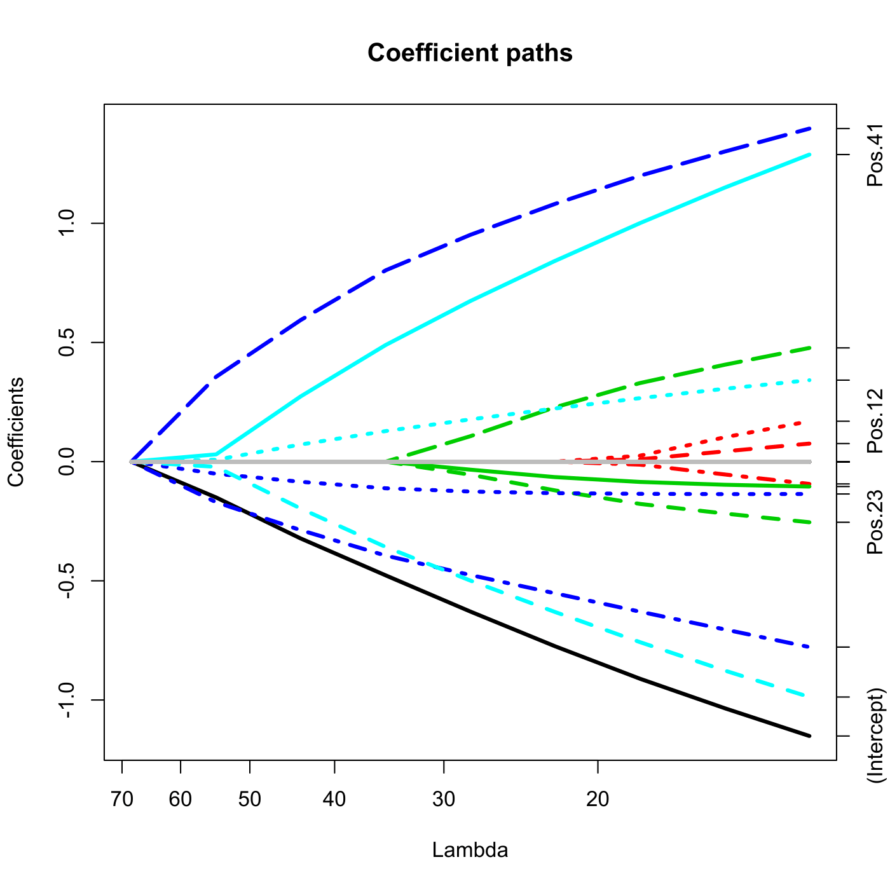

[](http://quantlet.de/)

## [](http://quantlet.de/) **MVAgrouplasso** [](http://quantlet.de/)

```yaml

Name of QuantLet : MVAgrouplasso

Published in : Applied Multivariate Statistical Analysis

Description : 'Performs a standardized regression using the group Lasso methodology. The estimates
of groups of variables become nonzero at a point that means these groups of variables enter the
model equation sequentially as the shrinkage parameter increases. The group Lasso technique
excludes some of the groups from the model and all coefficients in the remaining groups are non
zero. Finally, the resulting group Lasso estimates are plotted.'

Keywords : lasso shrinkage, lasso, estimation, regression, plot, graphical representation

See also : LCPvariance

Author : Dedy D. Prastyo, Sergey Nasekin

Submitted : Fri, July 18 2014 by Felix Jung

```




### R Code:
```r

# clear variables and close windows
rm(list = ls(all = TRUE))
graphics.off()

# install and load packages
libraries = c("grplasso")
lapply(libraries, function(x) if (!(x %in% installed.packages())) {
install.packages(x)
})
lapply(libraries, library, quietly = TRUE, character.only = TRUE)

data(splice)

contr = list(Pos.1 = "contr.sum", Pos.2 = "contr.sum", Pos.3 = "contr.sum", Pos.4 = "contr.sum")

lambda = lambdamax(y ~ Pos.1 * Pos.2 * Pos.3 * Pos.4, data = splice, model = LogReg(), 
    contrasts = contr, standardize = TRUE) * 0.8^(0:8)

fit = grplasso(y ~ Pos.1 * Pos.2 * Pos.3 * Pos.4, data = splice, model = LogReg(), 
    lambda = lambda, contrasts = contr, standardize = TRUE, control = grpl.control(trace = 0, 
        inner.loops = 0, update.every = 1, update.hess = "lambda"))

# plot
plot(fit, log = "x", lwd = 3)
```
