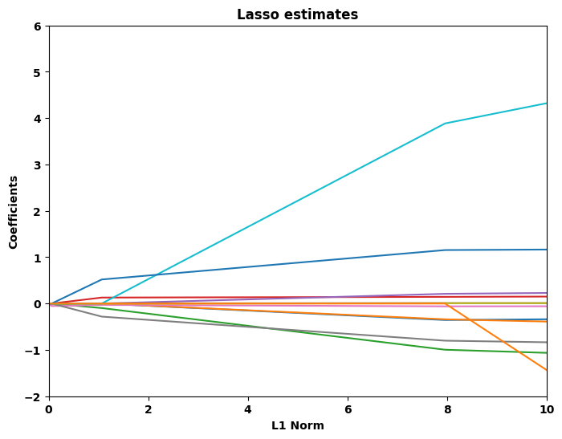
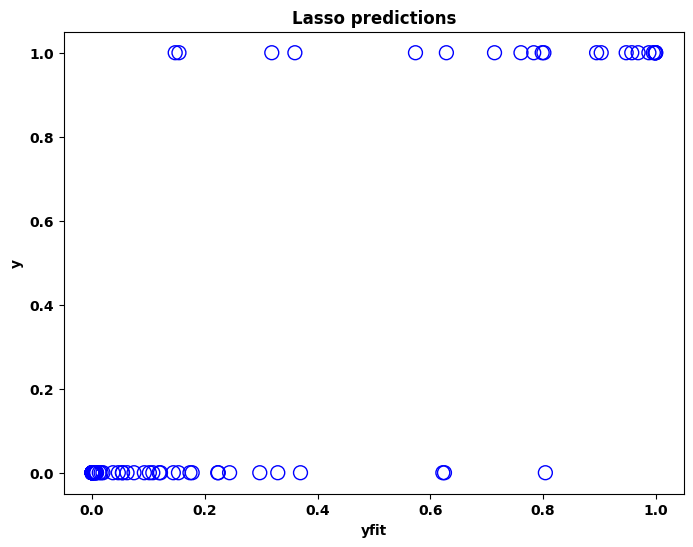
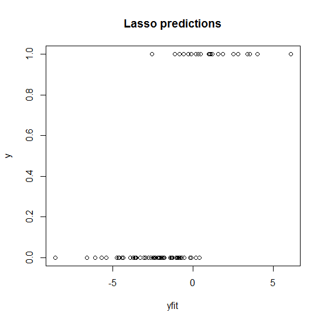

[](http://quantlet.de/)

## [](http://quantlet.de/) **MVAlassologit** [](http://quantlet.de/)

```yaml


Name of QuantLet: MVAlassologit

Published in: Applied Multivariate Statistical Analysis

Description: 'Performs a logit model using the Lasso methodology. The estimates become nonzero at a point that means the variables enter the model equation sequentially as the shrinkage parameter increases. The Lasso technique results in variable selection. Finally, the resulting Lasso estimates and predictions are plotted.'

Keywords: estimation, lasso, lasso shrinkage, logistic, logit, regression, forecast, data visualization, plot, graphical representation, financial

See also: MVAlassocontour, MVAlassoregress, SMSlassocar, SMSlassoridge, LCPvariance

Author: Sergey Nasekin, Dedy D. Prastyo
Author[Python]: Matthias Fengler, Tim Dass

Submitted: Tue, July 29 2014 by Franziska Schulz
Submitted[Python]: Tue, April 23 2024 by Tim Dass

Datafiles: carc.dat

Example: 
- 1: Lasso estimates
- 2: Lasso predictions

```








### R Code
```r


# clear variables and close windows
rm(list = ls(all = TRUE))
graphics.off()

# install and load packages
libraries = c("glmnet")
lapply(libraries, function(x) if (!(x %in% installed.packages())) {
install.packages(x)
})
lapply(libraries, library, quietly = TRUE, character.only = TRUE)

# load data
data = read.table("carc.dat")

# recode the response, y = 1 for y > 6000, otherwise y = 0
y   = data[, 2]
n   = length(y)
y   = ifelse(y <= 6000, 0, 1)

x1  = data[, 3]
x2  = data[, 4]
x3  = data[, 5]
x4  = data[, 6]
x5  = data[, 7]
x6  = data[, 8]
x7  = data[, 9]
x8  = data[, 10]
x9  = data[, 11]
x10 = data[, 12]
x11 = data[, 13]
x12 = data[, 14]

x = cbind(x2, x3, x4, x5, x6, x7, x8, x9, x10, x11, x12)

# lasso
alpa = 1
(lasso.regress = glmnet(x, y, family = "binomial", alpha = alpa, nlambda = 100))
summary(lasso.regress)

# extract coefficients at a single value of lambda
coef(lasso.regress, s = 0.01)

# make predictions
yfit = predict(lasso.regress, newx = x[1:n, ], s = c(0.01))

# plot estimates
win.graph()
plot(lasso.regress, lwd = 3, main = "Lasso estimates")

# plot predictions
plot(yfit, y, main = "Lasso predictions")

```

automatically created on 2024-04-25

### PYTHON Code
```python

# works on numpy 1.23.5, pandas 1.5.2, scikit-learn 1.2.0 and matplotlib 3.6.2
import pandas as pd
import numpy as np
import matplotlib.pyplot as plt
from sklearn import linear_model

data = pd.read_csv("carc.dat", sep = "\s+", header=None)

y = np.where(data.iloc[:, 1] > 6000, 1, 0)

for i in range(1, 13):
    globals()["x" + str(i)] = data[i+1]

x = pd.DataFrame(data=[globals()["x" + str(r)] for r in range(2, 13)]).transpose()

for j in [3, 4]:
    g = []
    for v in x[j]:
        try: g.append(int(v)+1)
        except ValueError:
            g.append(1)
    x[j] = g

for u in [5, 6, 12]:
    x[u] = x[u].astype(float)

for u in list(range(7, 12)) + [13]:
    x[u] = x[u].astype(np.int64)

lasso_regress = linear_model.LogisticRegressionCV(penalty='l1', solver='liblinear', max_iter=1000).fit(x,y)
lasso_path = np.sum(np.abs(lasso_regress.coefs_paths_[1][0]), axis=1)

fig, ax = plt.subplots(figsize=(8, 6))
ax.plot(lasso_path, lasso_regress.coefs_paths_[1][0])
ax.set_xlim((0,10))
ax.set_ylim((-2,6))
ax.set_xlabel('L1 Norm')
ax.set_ylabel('Coefficients')
ax.set_title('Lasso estimates')
plt.show()

y_pred = lasso_regress.predict_proba(x)
fig, ax = plt.subplots(figsize=(8,6))
ax.scatter(y_pred[:,1], y, s = 100, facecolors = 'none', edgecolors = 'b')
ax.set_xlabel('yfit')
ax.set_ylabel('y')
ax.set_title('Lasso predictions')
plt.show()
```

automatically created on 2024-04-25