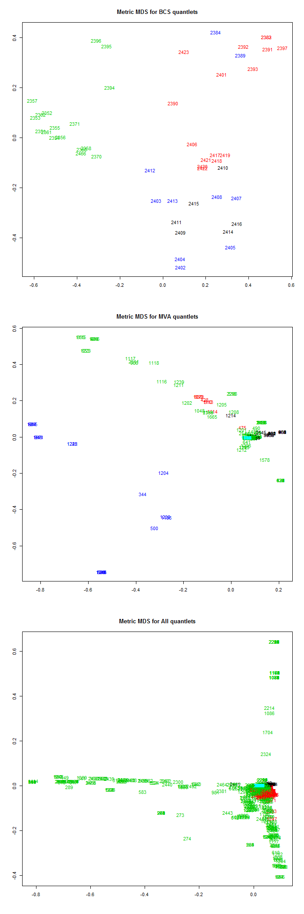

[](http://quantlet.de/)

## [](http://quantlet.de/) **MVAQnetClusKmeansB** [](http://quantlet.de/)

```yaml

Name of QuantLet : MVAQnetClusKmeansB

Published in : Applied Multivariate Statistical Analysis

Description : 'The document similarity of quantlets is calculated based on their keywords. For this
purpose quantlets are taken from the MVA book, BCS project and the whole Quantnet. First the
keywords are transformed into the vector representation, basis model is used. Finally the k-means
algorithm is applied for clustering (four clusters) and the data are represented via MDS
(multidimensional scaling).'

Keywords : 'cluster-analysis, plot, graphical representation, kmeans, distance, euclidean,
euclidean-norm, multi-dimensional, scaling, MDS, similarity, data visualization'

See also : 'MVAQnetClusKmeans, MVAQnetClusKmeansT, MVAclus8p, MVAclusbank, MVAclusbh, MVAclusfood,
MVAclususcrime, MVAdrugsim, SMSclus8p, SMSclus8pd, SMSclus8pmst2, SMSclushealth, SMScluscrimechi2,
SMSclusbank, SMSclusbank2, SMSclusbank3, SMScluscomp, SMScluscrime'

Author : Lukas Borke, Awdesch Melzer, Simon Trimborn

Submitted : Tue, August 26 2014 by Lukas Borke

Datafile : export_q_kw_141.dat, export_q_kw_310.dat, export_q_kw_All.dat

Example : MDS for model B of BCS Qs (upper panel), MVA Qs (middle panel) and all Qs (lower panel).

```




### R Code:
```r

# clear all variables
rm(list = ls(all = TRUE))
graphics.off()

# read data
D     = as.matrix(read.table("export_q_kw_141.dat"))  
G     = as.matrix(read.table("export_q_kw_310.dat"))

# take everything but ID
E     = D[, -1]
H     = G[, -1]

# Quantlet IDs
IDM   = D[, 1]
IDB   = G[, 1]

# transpose and norm to one column-wise, then a column equals the vector representation of a Qlet
norm.E  = apply(t(E), 2, function(v) {
    v/sqrt(sum(v * v))
})
norm.E[is.na(norm.E)] = 0
norm.H  = apply(t(H), 2, function(v) {
    v/sqrt(sum(v * v))
})
norm.H[is.na(norm.H)] = 0
par(mfrow = c(3, 1))              # set plot for 3 columns

# BCS
set.seed(12345)                   # set pseudo random numbers
d       = dist(t(norm.H))         # Euclidean norm
clusBCS = kmeans(t(norm.H), 4)    # kmeans for 4 clusters/centers
mdsBCS  = cmdscale(d, k = 2)      # mds for 2 dimensions
plot(mdsBCS, type = "n", xlab = "", ylab = "", main = "Metric MDS for BCS quantlets")
text(mdsBCS[, 1], mdsBCS[, 2], IDB, col = clusBCS$cluster)

# MVA
set.seed(12345)                   # set pseudo random numbers
d       = dist(t(norm.E))         # Euclidean norm
clusMVA = kmeans(t(norm.E), 4)    # kmeans for 4 clusters/centers
mdsMVA  = cmdscale(d, k = 2)      # mds for 2 dimensions
plot(mdsMVA, type = "n", xlab = "", ylab = "", main = "Metric MDS for MVA quantlets")
text(mdsMVA[, 1], mdsMVA[, 2], IDM, col = clusMVA$cluster)

# Displaying Null-Vectors in cyan color
D_T_141_null = apply(norm.E^2, 2, sum)
text(mdsMVA[D_T_141_null == 0, 1], mdsMVA[D_T_141_null == 0, 2], IDM[D_T_141_null == 
    0], col = 5)

# All Qlets
Qall      = as.matrix(read.table("export_q_kw_All.dat"))
IDall     = Qall[, 1]
E         = Qall[, -1]

# transpose and norm to one column-wise, then a column equals the vector representation of a Qlet
norm.E    = apply(t(E), 2, function(v) {
    v/sqrt(sum(v * v))
})
norm.E[is.na(norm.E)] = 0
D_global  = norm.E

set.seed(12345)                   # set pseudo random numbers
d         = dist(t(D_global))
clusAll   = kmeans(t(D_global), 4)
mdsAll    = cmdscale(d, k = 2)
plot(mdsAll, type = "n", xlab = "", ylab = "", main = "Metric MDS for All quantlets")
text(mdsAll[, 1], mdsAll[, 2], IDall, col = clusAll$cluster)

# Displaying Null-Vectors in cyan color
D_global_null = apply(D_global^2, 2, sum)
text(mdsAll[D_global_null == 0, 1], mdsAll[D_global_null == 0, 2], IDall[D_global_null == 
    0], col = 5)
 
```
