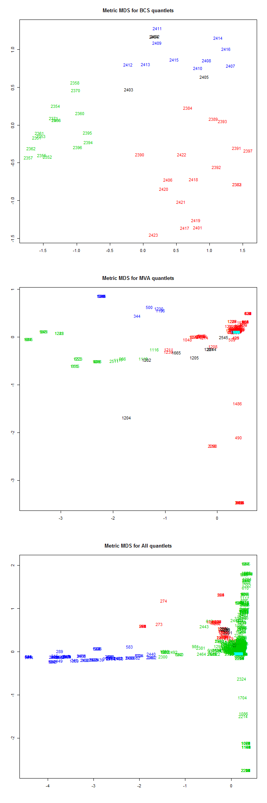

[](http://quantlet.de/)

## [](http://quantlet.de/) **MVAQnetClusKmeansT** [](http://quantlet.de/)

```yaml

Name of QuantLet : MVAQnetClusKmeansT

Published in : Applied Multivariate Statistical Analysis

Description : 'The document similarity of quantlets is calculated based on their keywords. For this
purpose quantlets are taken from the MVA book, BCS project and from the entire Quantnet. First the
keywords are transformed into the vector representation. Then the scalar product is applied
calculating so the similarity measure. The advanced term-term correlation model additionally uses
the term-term correlation matrix between the terms of all documents. Finally the k-means algorithm
with Euclidean norm is applied for clustering (four clusters) and the data are represented via MDS
(multidimensional scaling) showing metric MDS for BCS quantlets, metric MDS for MVA quantlets and
metric MDS for all quantlets.'

Keywords : 'cluster-analysis, plot, graphical representation, kmeans, distance, euclidean,
euclidean-norm, multi-dimensional, scaling, MDS, similarity, data visualization'

See also : 'MVAQnetClusKmeans, MVAQnetClusKmeansB, MVAclus8p, MVAclusbank, MVAclusbh, MVAclusfood,
MVAclususcrime, MVAdrugsim, SMSclus8p, SMSclus8pd, SMSclus8pmst2, SMSclushealth, SMScluscrimechi2,
SMSclusbank, SMSclusbank2, SMSclusbank3, SMScluscomp, SMScluscrime'

Author : Lukas Borke, Awdesch Melzer, Simon Trimborn

Submitted : Tue, August 26 2014 by Lukas Borke

Datafile : export_q_kw_141.dat, export_q_kw_310.dat, export_q_kw_All.dat

Example : Metric MDS for BCS quantlets, metric MDS for MVA quantlets, metric MDS for all quantlets.

```




### R Code:
```r

# clear all variables
rm(list = ls(all = TRUE))
graphics.off()

# read all Qlets
D       = as.matrix(read.table("export_q_kw_All.dat"))

# take everything but ID
E       = D[, -1]
IDall   = D[, 1]        # Quantlet IDs 

# transpose and norm to one columnwise, then a column equals the vector representation of a Qlet
norm.E  = apply(t(E), 2, function(v) {
    v/sqrt(sum(v * v))
})
norm.E[is.na(norm.E)] = 0

# cache global Qlet matrix as norm, needed for following transformations
D_global = norm.E

# read vector matrix from BCS
D       = as.matrix(read.table("export_q_kw_310.dat"))
E       = D[, -1]       # extract everything but ID
IDB     = D[, 1]        # set ID

# transpose and norm to one columnwise, then a column equals the vector
# representation of a Qlet
norm.E  = apply(t(E), 2, function(v) {
    v/sqrt(sum(v * v))
})
norm.E[is.na(norm.E)] = 0

# transpose the BCS vector representation of the basis model into T model
# (term-term-correlation), one column in D_T_310 is equivalent to the vector
# representation of a Qlet in the T model
D_T_310 = t(D_global) %*% norm.E

# read vector matrix from MVA
D       = as.matrix(read.table("export_q_kw_141.dat"))
E       = D[, -1]       # extract everything but ID
IDM     = D[, 1]        # set ID

# transpose and norm to one columnwise, then a column equals the vector representation of a Qlet
norm.E  = apply(t(E), 2, function(v) {
    v/sqrt(sum(v * v))
})
norm.E[is.na(norm.E)] = 0

# transpose the MVA vector representation of the basis model into T model
# (term-term-correlation) one column in D_T_141 is equivalent to the vector
# representation of a Qlet in the T model
D_T_141     = t(D_global) %*% norm.E

# set plot for 3 columns
par(mfrow   = c(3, 1))

# BCS
set.seed(12345)                         # set pseudo random numbers
d           = dist(t(D_T_310))          # Euclidean norm
clusBCS     = kmeans(t(D_T_310), 4)     # kmeans for 4 clusters/centers
mdsBCS      = cmdscale(d, k = 2)        # mds for 2 dimensions
plot(mdsBCS, type = "n", xlab = "", ylab = "", main = "Metric MDS for BCS quantlets")
text(mdsBCS[, 1], mdsBCS[, 2], IDB, col = clusBCS$cluster)

# MVA
set.seed(12345)                         # set pseudo random numbers
d           = dist(t(D_T_141))
clusMVA     = kmeans(t(D_T_141), 4)
mdsMVA      = cmdscale(d, k = 2)
plot(mdsMVA, type = "n", xlab = "", ylab = "", main = "Metric MDS for MVA quantlets")
text(mdsMVA[, 1], mdsMVA[, 2], IDM, col = clusMVA$cluster)

# Displaying Null-Vectors
D_T_141_null = apply(D_T_141^2, 2, sum)
text(mdsMVA[D_T_141_null == 0, 1], mdsMVA[D_T_141_null == 0, 2],
    IDM[D_T_141_null == 0], col = 5)

# All Qlets
D_T_global  = t(D_global) %*% D_global

set.seed(12345)  # set pseudo random numbers
d           = dist(t(D_T_global))
clusAll     = kmeans(t(D_T_global), 4)
mdsAll      = cmdscale(d, k = 2)
plot(mdsAll, type = "n", xlab = "", ylab = "", main = "Metric MDS for All quantlets")
text(mdsAll[, 1], mdsAll[, 2], IDall, col = clusAll$cluster)

# Displaying Null-Vectors
D_T_global_null = apply(D_T_global^2, 2, sum)
text(mdsAll[D_T_global_null == 0, 1], mdsAll[D_T_global_null == 0, 2],
    IDall[D_T_global_null == 0], col = 5)

```
