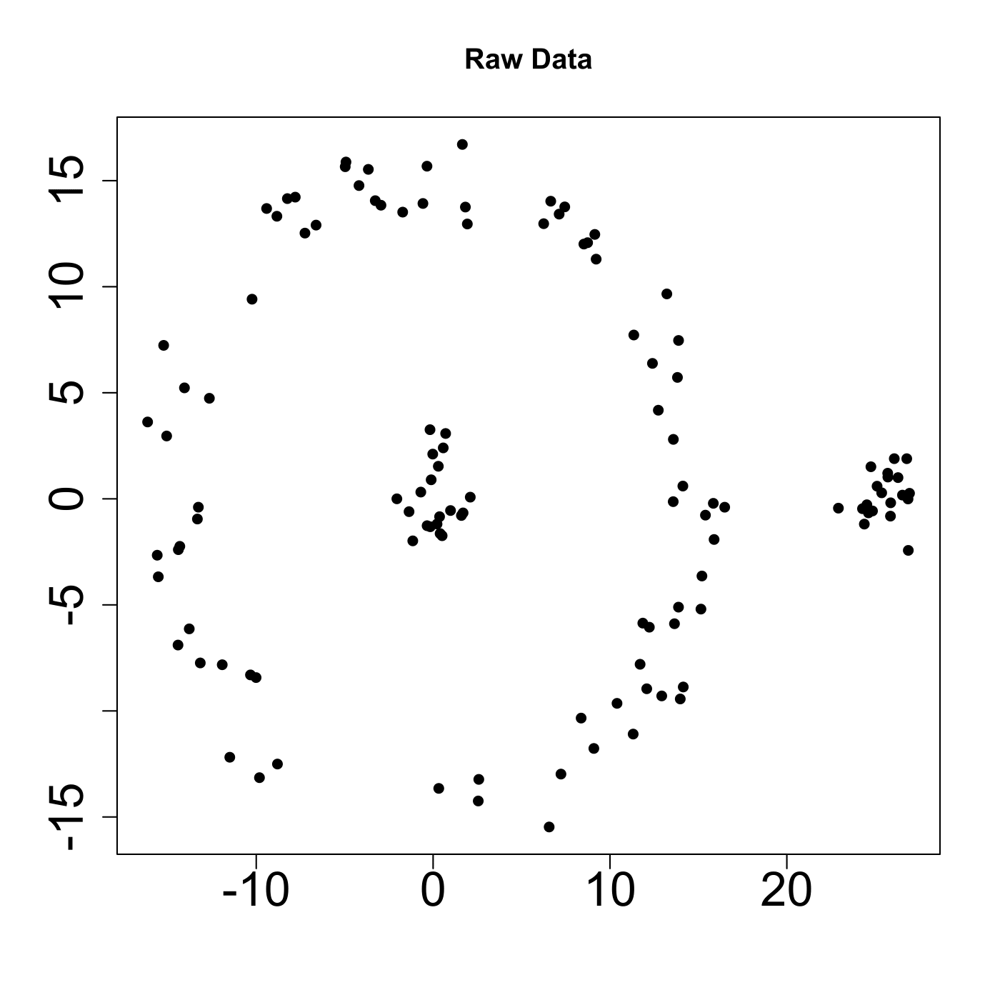
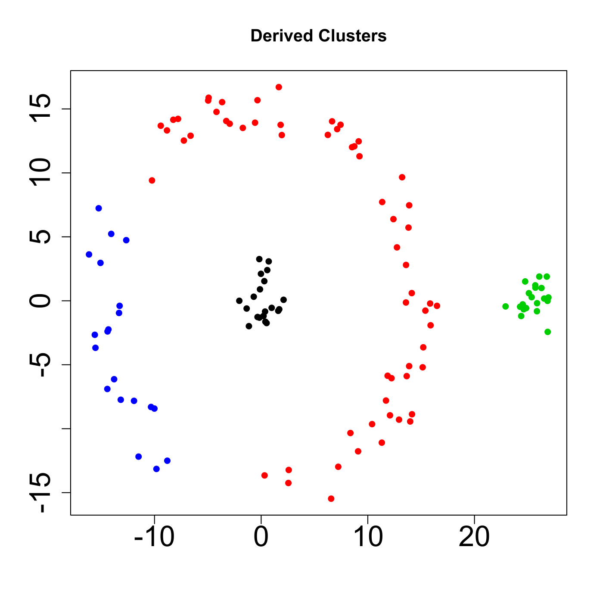

[](http://quantlet.de/)

## [](http://quantlet.de/) **MVAspecclust** [](http://quantlet.de/)

```yaml

Name of QuantLet : MVAspecclust

Published in : Applied Multivariate Statistical Analysis

Description : 'MVAspecclust computes the clusters for the exemplary data based on the Euclidean
distance and predefined number of clusters.'

Keywords : 'cluster-analysis, spectral, plot, graphical representation, distance, euclidean, data
visualization'

See also : 'MVAclus8p, MVAclusbank, MVAclusbh, MVAclusfood, MVAclususcrime, SMSclus8p, SMSclus8pd,
SMSclus8pmst2, SMSclusbank, SMScluscomp, SMScluscrime, SMScluscrimechi2, SMSclushealth'

Author : Piotr Majer

Submitted : Sun, September 07 2014 by Awdesch Melzer

Datafile : data_example.dat

Example: 
- 1: Plot of raw data.
- 2: Plot of derived clusters.

```






### R Code:
```r

# clear all variables
rm(list = ls(all = TRUE))
graphics.off()

# install and load packages
libraries = c("kernlab")
lapply(libraries, function(x) if (!(x %in% installed.packages())) {
    install.packages(x)
})
lapply(libraries, library, quietly = TRUE, character.only = TRUE)

# load data
data = t(read.table("data_example.dat", quote = ""))
sc = specc(data, centers = 4)
centers(sc)
size(sc)
withinss(sc)

# plot 1: raw data
plot(data, col = "black", main = "Raw Data", xlab = "", ylab = "", cex.axis = 2, lwd = 2, pch = 16)

# plot 2: derived clusters
dev.new("")
plot(data, col = sc, main = "Derived Clusters", xlab = "", ylab = "", cex.axis = 2, lwd = 2, pch = 16) 

```
