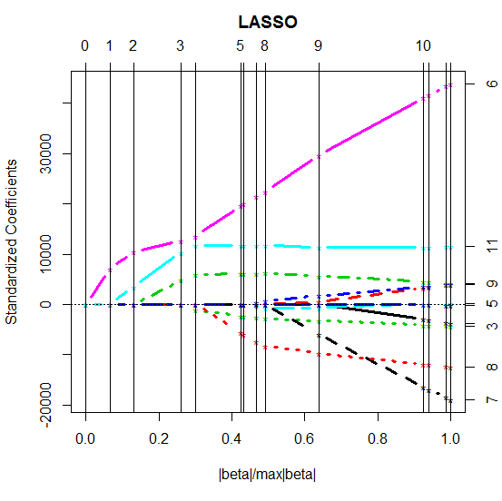
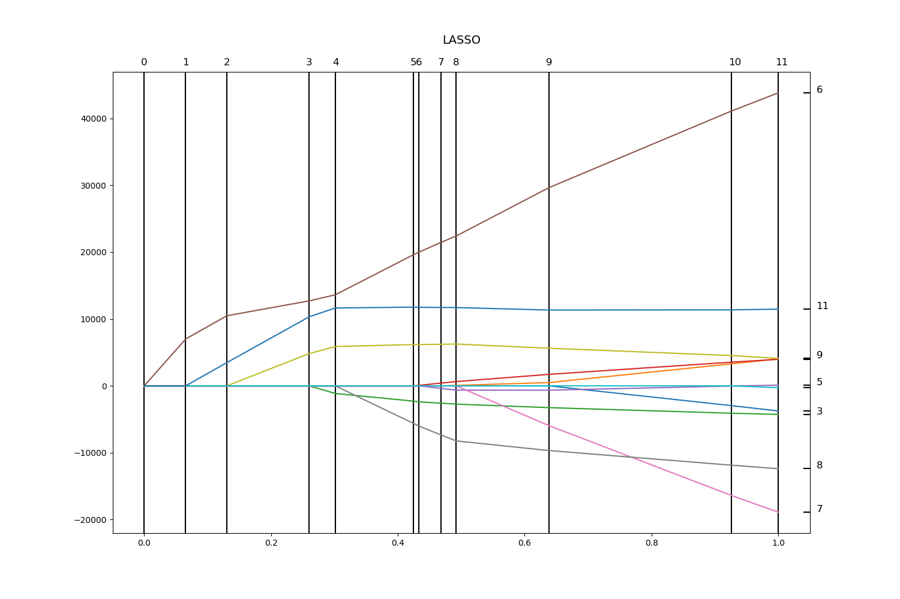

[](http://quantlet.de/)

## [](http://quantlet.de/) **MVAlassoregress** [](http://quantlet.de/)

```yaml


Name of QuantLet: MVAlassoregress

Published in: Applied Multivariate Statistical Analysis

Description: 'Performs a standardized regression using the Lasso methodology. The 
estimates become nonzero at a point that means the variables enter the model equation 
sequentially as the scaled shrinkage parameter increases. The Lasso technique results 
in variable selection. Finally, the resulting Lasso estimates are plotted.'

Keywords: estimation, lasso, lasso shrinkage, logit, regression, forecast, data visualization, plot, graphical representation, financial

See also: MVAlassocontour, MVAlassologit, SMSlassocar, SMSlassoridge, LCPvariance

Author: Sergey Nasekin, Dedy D. Prastyo

Author[Python]: 'Matthias Fengler, Liudmila Gorkun-Voevoda'

Submitted: Tue, September 16 2014 by Sergey Nasekin

Submitted[Python]: 'Wed, April 22 2020 by Liudmila Gorkun-Voevoda'

Datafiles: carc.dat

Example: Plot of lasso estimates for different scaled parameter.

```





### R Code
```r


# clear variables and close windows
rm(list = ls(all = TRUE))
graphics.off()

# install and load packages
libraries = c("lars")
lapply(libraries, function(x) if (!(x %in% installed.packages())) {
install.packages(x)
})
lapply(libraries, library, quietly = TRUE, character.only = TRUE)

# load data
data = read.table("carc.dat")

y   = data[, 2]
x1  = data[, 3]
x2  = data[, 4]
x3  = data[, 5]
x4  = data[, 6]
x5  = data[, 7]
x6  = data[, 8]
x7  = data[, 9]
x8  = data[, 10]
x9  = data[, 11]
x10 = data[, 12]
x11 = data[, 13]
x12 = data[, 14]

x   = cbind(x2, x3, x4, x5, x6, x7, x8, x9, x10, x11, x12)
(lasso.regress = lars(x, y, type = "lasso", normalize = TRUE, intercept = TRUE, max.steps = 1000))
summary(lasso.regress)

# plot
plot.lars(lasso.regress, lwd = 3)

```

automatically created on 2020-04-22

### PYTHON Code
```python

import pandas as pd
import numpy as np
import matplotlib.pyplot as plt
from sklearn import linear_model

data = pd.read_csv("carc.dat", sep = "\s+", header=None)

y = data[1]

for i in range(1, 13):
    globals()["x" + str(i)] = data[i+1]

x = pd.DataFrame(data=[globals()["x" + str(r)] for r in range(2, 13)]).transpose()

for j in [3, 4]:
    g = []
    for v in x[j]:
        try: g.append(int(v)+1)
        except ValueError:
            g.append(1)
    x[j] = g

for u in [5, 6, 12]:
    x[u] = x[u].astype(float)

for u in list(range(7, 12)) + [13]:
    x[u] = x[u].astype(np.int64)

lasso_regress = linear_model.Lars(fit_intercept = True, normalize = True, fit_path=True).fit(np.array(x), np.array(y))


lasso_path = np.sum(np.abs(lasso_regress.coef_path_.T), axis=1)
lasso_path /= lasso_path[-1]

fig, ax = plt.subplots(figsize = (15, 10))
ax.plot(lasso_path, lasso_regress.coef_path_.T)

ymin, ymax = plt.ylim()
xmin, xmax = plt.xlim()

ax.set_ylim([ymin,ymax])
ax.set_xlim([xmin,xmax])

ax.vlines(lasso_path, ymin, ymax)
ax.hlines(lasso_regress.coef_path_.T[-1], xmax-0.01, xmax)

for i in [6, 11, 9, 5, 3, 8, 7]:
    plt.text(xmax + 0.01, lasso_regress.coef_path_.T[-1][i-1], str(i), fontsize=12)
for i in range(0, len(lasso_path)):
    plt.text(lasso_path[i]-0.005, ymax+1000, str(i), fontsize=12)
    
plt.title("LASSO", y = 1.05, fontsize=14)

plt.show()


```

automatically created on 2020-04-22