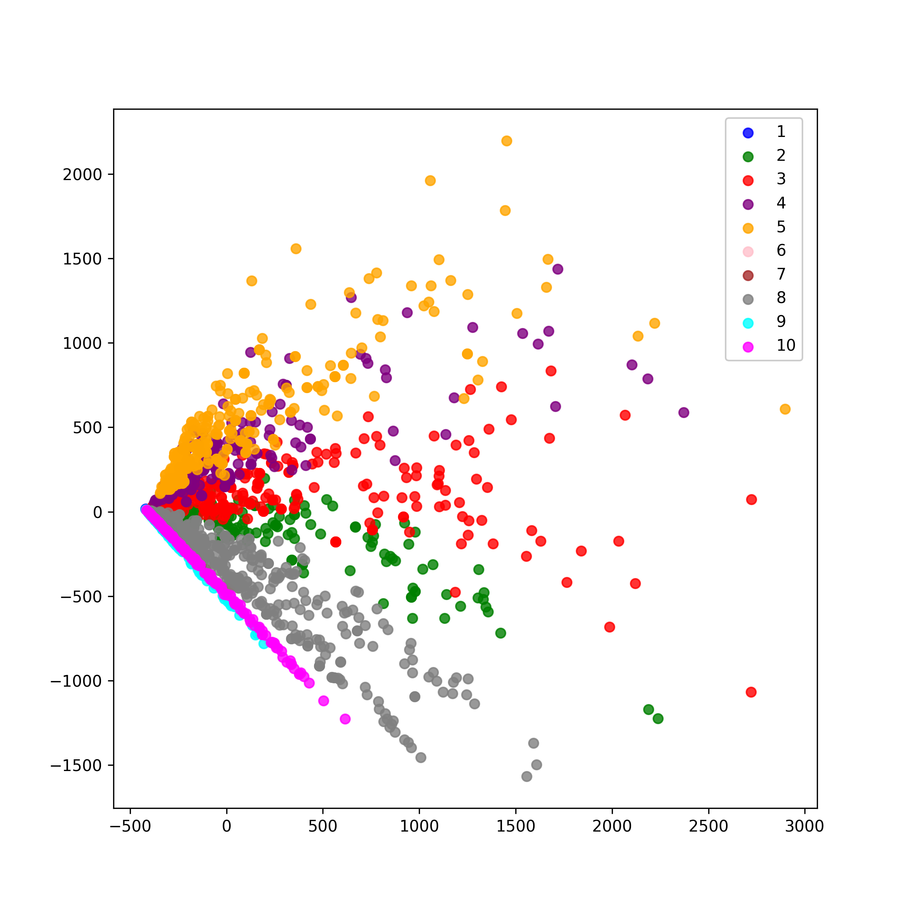
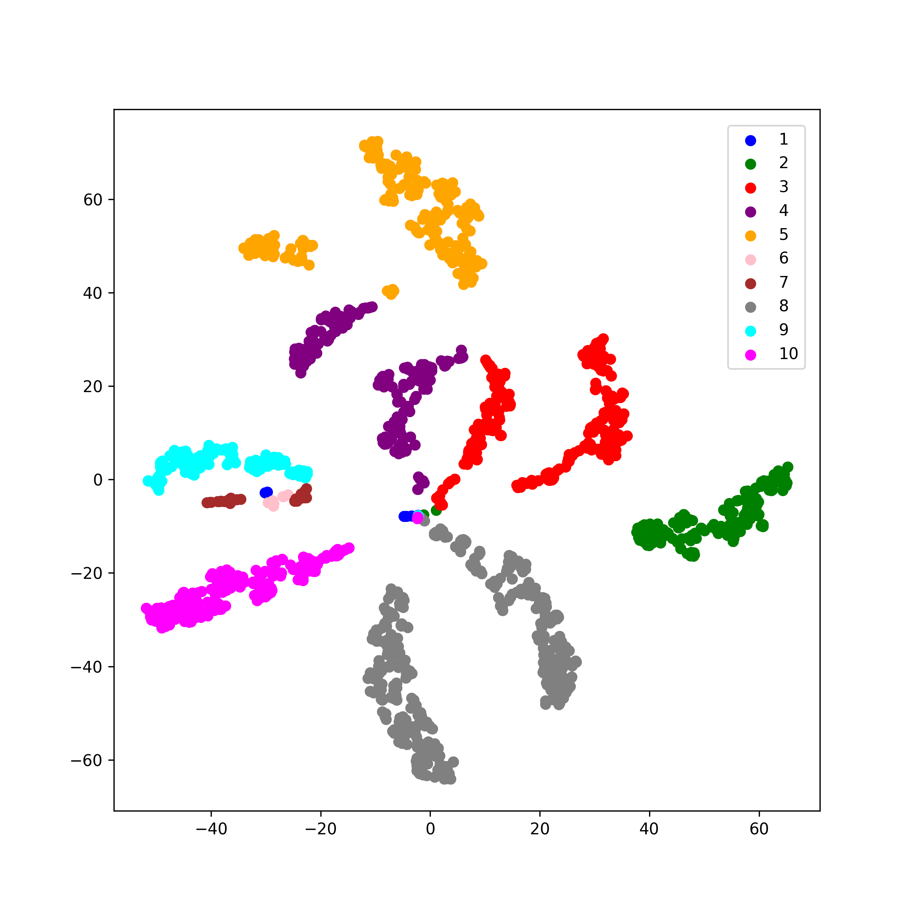

[](http://quantlet.de/)

## [](http://quantlet.de/) **MVAtsneqtlkeywords** [](http://quantlet.de/)

```yaml

Name of QuantLet: MVAtsneqtlkeywords

Published in: Applied Multivariate Statistical Analysis

Description: 'Quantlet clustering with PCA and t-SNE projection.'

Keywords: Quantlet, 't-SNE', plot, python, cluster, PCA

See also: MVAtsnegausst1, MVAtsnetrefoil, DEDA_HClustering_quantlets

Author: Matthias Fengler, Tim Dass

Datafile: data_file_20181203.json
```





### [IPYNB Code: MVAtsneqtlkeywords.ipynb](MVAtsneqtlkeywords.ipynb)


automatically created on 2023-10-02