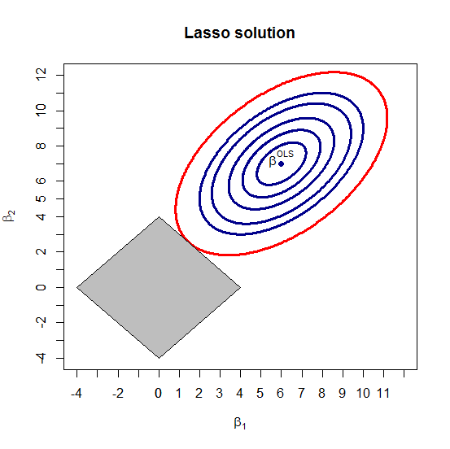
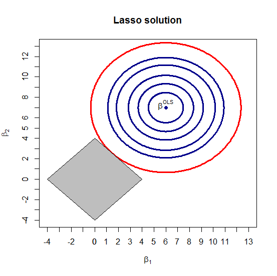

[](http://quantlet.de/)

## [](http://quantlet.de/) **MVAlassocontour** [](http://quantlet.de/)

```yaml

Name of QuantLet : MVAlassocontour

Published in : Applied Multivariate Statistical Analysis

Description : 'Plots the Lasso solution under the least squares loss function. The contour plots of
the quadratic form objective function are produced which are centered at the least squares solution
(beta_1,beta_2)^t = (6,7)^t in the two-dimensional case for the case of both the non-orthonormal
and orthonormal design. The tuning parameter s being equal to 4.'

Keywords : contour, least-squares, lasso, lasso shrinkage, plot, graphical representation

See also : LCPvariance, MVAlassologit, MVAlassoregress, SMSlassocar, SMSlassoridge

Author : Sergey Nasekin

Submitted : Sun, May 03 2015 by Awdesch Melzer

Input: 
- s: lasso tuning parameter
- orthonorm: logical (1 if orthonormal design is required to be plotted, 0 if non-orthonormal)
- beta: basic OLS solution around which the quadratic form objective function is centered.

Example: 
- 1: Lasso solution in the general design case.
- 2: Lasso solution in the orthonormal design case.

```






### R Code:
```r

# clear variables and close windows
rm(list = ls(all = TRUE))
graphics.off()

# install and load packages
libraries = c("clusterGeneration", "ellipse", "MASS")
lapply(libraries, function(x) if (!(x %in% installed.packages())) {
    install.packages(x)
})
lapply(libraries, library, quietly = TRUE, character.only = TRUE)

orthonorm = 0
s = 4
beta = c(6, 7)

# plot 
if (orthonorm == 1) {
    corrmat = matrix(c(1, 0, 0, 1), nrow = 2, ncol = 2)
    ellip1 = ellipse(x = corrmat, scale = c(2.45, 2.45), centre = c(beta[1], beta[2]), 
        level = 0.965, npoints = 500)
    plot(-3:10, -3:10, type = "n", xlim = c(-4, 13), ylim = c(-4, 13), xlab = expression(beta[1]), 
        ylab = expression(beta[2]), main = "Lasso solution")
    axis(1, -4:1:13, labels = TRUE)
    axis(2, -4:1:13, labels = TRUE)
} else if (orthonorm == 0) {
    corrmat = matrix(c(1, 0.5, 0.5, 1), nrow = 2, ncol = 2)
    ellip1 = ellipse(x = corrmat, scale = c(2, 2), centre = c(6, 7), level = 0.965, 
        npoints = 500)
    plot(-3:10, -3:10, type = "n", xlim = c(-4, 12), ylim = c(-4, 12), xlab = expression(beta[1]), 
        ylab = expression(beta[2]), main = "Lasso solution")
    axis(1, -4:1:12, labels = TRUE)
    axis(2, -4:1:12, labels = TRUE)
} else {
    paste("Give either 1 or 0")
}
lines(ellip1, type = "l", col = "red", lwd = 3)
polygon(x = c(-s, 0, s, 0), y = c(0, s, 0, -s), col = "gray")
conflev = as.matrix(c(0.865, 0.765, 0.565, 0.365, 0.165))
if (orthonorm == 1) {
    for (i in 1:length(conflev)) {
        add = ellipse(x = corrmat, scale = c(2.45, 2.45), centre = c(6, 7), level = conflev[i], 
            npoints = 500)
        lines(add[, 1], add[, 2], col = "darkblue", lwd = 3)
    }
    points(x = 6, y = 7, pch = 16, lwd = 2, col = "darkblue")
    text(6, 7.3, expression(paste(beta^OLS)))
} else if (orthonorm == 0) {
    for (i in 1:length(conflev)) {
        add = ellipse(x = corrmat, scale = c(2, 2), centre = c(6, 7), level = conflev[i], 
            npoints = 500)
        lines(add[, 1], add[, 2], col = "darkblue", lwd = 3)
    }
    points(x = 6, y = 7, pch = 16, lwd = 2, col = "darkblue")
    text(6, 7.3, expression(paste(beta^OLS)))
} else {
    paste("Give either 1 or 0")
}

```
