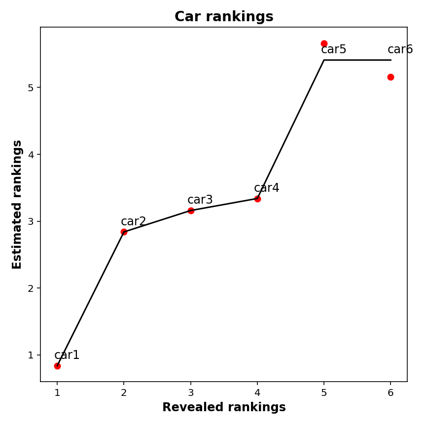
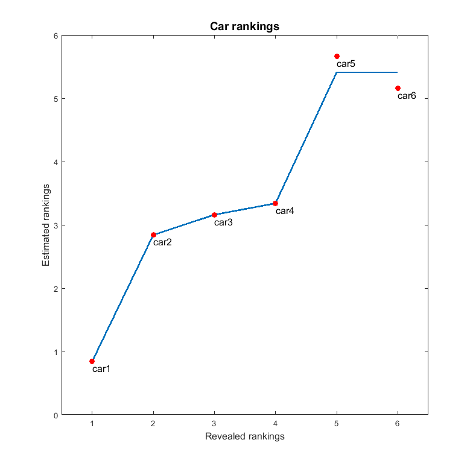
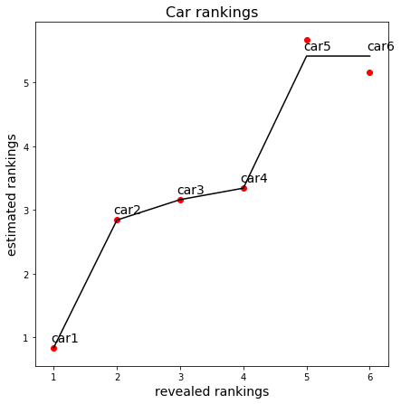

[](http://quantlet.de/)

## [](http://quantlet.de/) **MVAcarrankings** [](http://quantlet.de/)

```yaml

Name of QuantLet: MVAcarrankings

Published in: Applied Multivariate Statistical Analysis

Description: Performs a monotone transformation to the estimated stimulus utilities of the car example by applying the pool-adjacent-violators (PAV) algorithm.

Keywords: MDS, non-metric-MDS, multi-dimensional, scaling, PAV, violators, Shepard-Kruskal, regression, plot, graphical representation

See also: MVAMDScity1, MVAMDScity2, MVAMDSpooladj, MVAmdscarm, MVAnmdscar1, MVAnmdscar2, MVAnmdscar3, MVAMDSnonmstart, PAVAlgo

Author: Zografia Anastasiadou
Author[Python]: Matthias Fengler, Liudmila Gorkun-Voevoda
Author[Matlab]: Awdesch Melzer

Submitted: Thu, September 11 2014 by Franziska Schulz
Submitted[Python]: Wed, January 6 2021 by Liudmila Gorkun-Voevoda
Submitted[Matlab]: Mon, December 16 by Piedad Castro

Input: 
- x : the reported preference orderings for the car example
- y : the fitted values of x

Example: Plot of estimated preference orderings vs revealed rankings and PAV fit.

Note: The matlab version uses the function pava that you can find in the quantlet with the same name.

```







### MATLAB Code
```matlab

%% clear all variables and console and close windows
clear
clc
close all

%% the reported preference orderings
x = (1:6)';

% the estimated preference orderings according to the additive model (16.1) 
% and the metric solution (Table 16.6) in book
y = [0.84, 2.84, 3.16, 3.34, 5.66, 5.16]';
z = [x, y];

%% use PAV algorithm
gp = pava(y);

%% the reported preference orderings
gp = [x, gp];

%% plot
figure(1)
hold on
plot(gp, z, 'w')
xlabel('Revealed rankings', 'FontSize', 12)
ylabel('Estimated rankings', 'FontSize', 12)
title('Car rankings', 'FontSize', 14)
box on
line(gp(:, 1), gp(:, 2), 'LineWidth', 2)
scatter(x, y, 'MarkerEdgeColor', 'red', 'MarkerFaceColor', 'red')%'filled', true)
xlim([0.5, 6.5])
labels = {'car1', 'car2', 'car3', 'car4', 'car5', 'car6'};
text(x, y - 0.1, labels, 'FontSize',12)
hold off

```

automatically created on 2021-07-10

### PYTHON Code
```python

from sklearn.isotonic import IsotonicRegression
import matplotlib.pyplot as plt

# the reported preference orderings
x = list(range(1, 7))
# the estimated preference orderings according to the additive model (16.1) and 
# the metric solution (Table 16.6) in MVA
y = [0.84, 2.84, 3.16, 3.34, 5.66, 5.16]

gp = IsotonicRegression()
y_gp = gp.fit_transform(x, y)

fig, ax = plt.subplots(figsize = (7, 7))
ax.plot(x, y_gp, c = "k")
ax.scatter(x, y, c = "r")
for i in range(0, len(y)):
    ax.text(x[i]-0.05, y_gp[i]+0.1, "car" + str(i+1), fontsize = 14)
plt.xlabel("revealed rankings", fontsize = 14)
plt.ylabel("estimated rankings", fontsize = 14)
plt.title("Car rankings", fontsize = 16)
plt.show()
```

automatically created on 2021-07-10

### R Code
```r


# clear all variables
rm(list = ls(all = TRUE))
graphics.off()

# install and load packages
libraries = c("isotone")
lapply(libraries, function(x) if (!(x %in% installed.packages())) {
    install.packages(x)
})
lapply(libraries, library, quietly = TRUE, character.only = TRUE)

# the reported preference orderings
x = c(1:6)
# the estimated preference orderings according to the additive model (16.1) and the metric solution (Table 16.6) in MVA
y = c(0.84, 2.84, 3.16, 3.34, 5.66, 5.16)
z = cbind(x, y)

# PAV algorithm
gp = gpava(x, y)
a  = gp$z              # the reported preference orderings
b  = gp$x              # the estimated preference orderings after PAV algorithm
gp = cbind(a, b)

# Plot of car rankings
plot(gp, z, type = "n", xlab = "revealed rankings", ylab = "estimated rankings", 
    main = "Car rankings", cex.lab = 1.4, cex.axis = 1.4, cex.main = 1.6)
lines(a, b, lwd = 2)
points(x, y, pch = 19, col = "red")
text(x[1], y[1] - 0.1, "car1", font = 2)
text(x[2], y[2] - 0.1, "car2", font = 2)
text(x[3], y[3] - 0.1, "car3", font = 2)
text(x[4], y[4] - 0.1, "car4", font = 2)
text(x[5], y[5] - 0.1, "car5", font = 2)
text(x[6], y[6] - 0.1, "car6", font = 2) 

```

automatically created on 2021-07-10