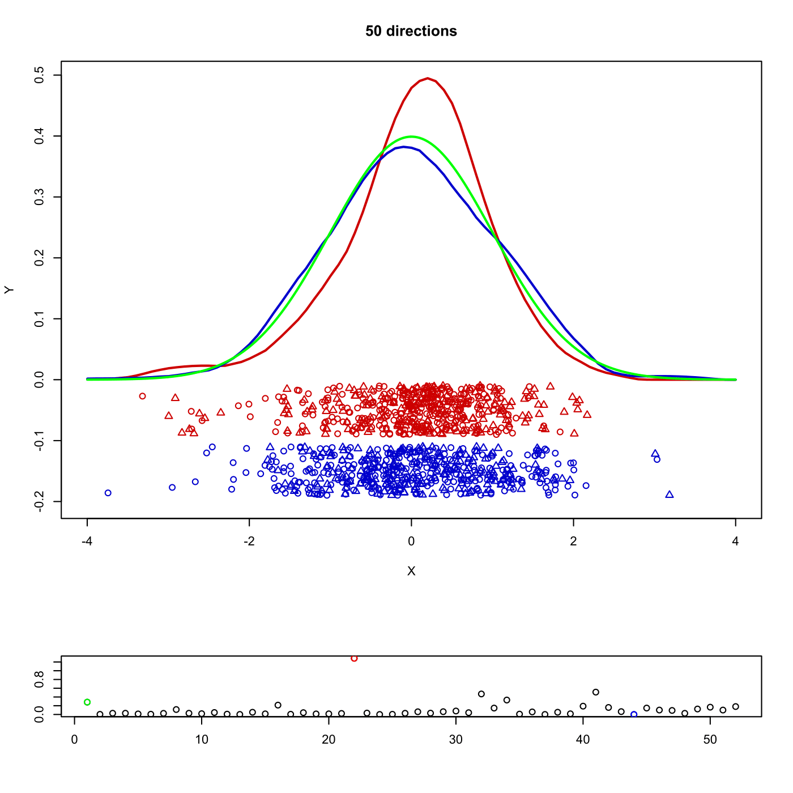

[](http://quantlet.de/)

## [](http://quantlet.de/) **MVAppsib** [](http://quantlet.de/)

```yaml

Name of QuantLet : MVAppsib

Published in : Applied Multivariate Statistical Analysis

Description : 'Reads the Boston housing data and spheres them to run Exploratory Projection Pursuit
(EPP) on them. We select n (=50) randomly chosen one-dimensional projections in the space of the
data. For each set of projected data the Sibson Jones index is applied, which considers the
deviations from the normal density for univariate data, to judge the interestingness- of the
projection.'

Keywords : 'projection-pursuit, projection, EPP, exploratory-projection-pursuit, plot, graphical
representation, Jones and Sibson index, estimation, density, data visualization, financial'

See also : 'MVAsimdep1, MVAsirdata, MVAsir2data, MVAsimdepex, MVAppexample, ppsib, ppsibexample,
ppexample, ppf'

Author : Awdesch Melzer

Submitted : Wed, September 25 2013 by Awdesch Melzer

Datafile : bostonh.dat

Example : 'Projection Pursuit with the Sibson-Jones index for the original data set for 50 randomly
chosen directions. The figure shows the density for the standard, normally distributed data (green)
and the estimated densities for the best (red) and the worst (blue) projections found. A dotplot of
the projections is also presented. In the lower part we see the values of the Sibson Jones index.'

```




### R Code:
```r

# clear all variables
rm(list = ls(all = TRUE))
graphics.off()

# install and load packages
libraries = c("locpol")
lapply(libraries, function(x) if (!(x %in% installed.packages())) {
    install.packages(x)
})
lapply(libraries, library, quietly = TRUE, character.only = TRUE)

ppexample = function(x, h, n) {
    xg = seq(-4, by = 0.1, length = 81)
    id = rbind(matrix(3, 100, 1), matrix(4, 100, 1))
    
    # select a starting vector
    p = rnorm(ncol(x))
    p = p/sqrt(sum(p^2))
    
    # compute index for starting vector
    xp      = x %*% p
    imin    = ppsib(xp)
    imax    = imin
    
    xi      = cbind(xp, runif(length(xp), 0, 1))
    xi[, 2] = -0.11 - 0.08 * xi[, 2]
    fi      = PRDenEstC(xp, xeval = xg, bw = h, kernel = EpaK)
    xa      = cbind(xp, runif(length(xp), 0, 1))
    xa[, 2] = -0.01 - 0.08 * xa[, 2]
    fa      = PRDenEstC(xp, xeval = xg, bw = h, kernel = EpaK)
    
    # plot
    plot(xa, type = "n", ylab = "Y", xlab = "X", ylim = c(-0.2, max(fi[, 2], fa[, 
        2])), xlim = c(-4, 4))
    points(xa, col = "red3", pch = c(rep(1, 100), rep(2, 100)))
    points(xi, col = "blue3", pch = c(rep(1, 100), rep(2, 100)))
    lines(fa, col = "red3", lwd = 2, lty = 1)
    lines(fi, col = "blue3", lwd = 2)
    inds = c(1/sqrt(4 * pi), imax)
    pind = cbind((1:length(inds)), inds)
    
    # search for better projection vector
    i       = 0
    pmin    = 1
    pmax    = 1
    while (i < n) {
        i       = i + 1
        tit     = toString(paste(i, "directions"))
        p       = rnorm(ncol(x))
        p       = p/sqrt(sum(p^2))
        xp      = x %*% p
        ind     = ppsib(xp)
        inds    = c(inds, ind)
        pind    = cbind(1:length(inds), inds)
        
        if (ind > imax) {
            imax    = ind
            xa      = cbind(xp, runif(xp, 0, 1))
            xa[, 2] = -0.01 - 0.08 * xa[, 2]
            fa      = PRDenEstC(xp, xeval = xg, bw = h, kernel = EpaK)  # line red dashed
            
            # plot
            plot(xa, type = "n", ylab = "Y", xlab = "X", ylim = c(-0.2, max(fi[, 
                2], fa[, 2])), xlim = c(-4, 4))
            points(xa, col = "red3", pch = c(rep(1, 100), rep(2, 100)))
            points(xi, col = "blue3", pch = c(rep(1, 100), rep(2, 100)))
            lines(fa, col = "red3", lwd = 2, lty = 1)
            lines(fi, col = "blue3", lwd = 2)
            title(tit)
            pmin = i
        }
        if (ind < imin) {
            imin    = ind
            xi      = cbind(xp, runif(xp, 0, 1))
            xi[, 2] = -0.11 - 0.08 * xi[, 2]
            fi      = PRDenEstC(xp, xeval = xg, bw = h, kernel = EpaK)  # blue line
            
            # plot
            plot(xa, type = "n", ylab = "Y", xlab = "X", ylim = c(-0.2, max(fi[, 
                2], fa[, 2])), xlim = c(-4, 4))
            points(xa, col = "red3", pch = c(rep(1, 100), rep(2, 100)))
            points(xi, col = "blue3", pch = c(rep(1, 100), rep(2, 100)))
            lines(fa, col = "red3", lwd = 2, lty = 1)
            lines(fi, col = "blue3", lwd = 2)
            title(tit)
            pmax = i
            mini = p
        }
    }
    cind = pind[, 2]
    cind[pind[, 2] > which.min(pind[, 2]) | pind[, 2] < which.max(pind[, 2])] = 0
    cind[which.min(pind[, 2])] = 1
    cind[which.max(pind[, 2])] = 4
    cind[1] = 2
    
    return(list(xa = xa, xi = xi, fa = fa, fi = fi, tit = tit, pind = pind, cind = cind))
}

ppsib = function(px) {
    n   = NROW(px)
    m   = NCOL(px)
    cx  = px - matrix(colMeans(px), nrow = n, ncol = m, byrow = T)
    mu  = rbind(apply(cx, 2, mean), apply(cx^2, 2, mean), apply(cx^3, 2, mean), apply(cx^4, 
        2, mean))
    k3  = mu[3]
    k4  = mu[4] - (3 * (mu[2]^2))
    ind = ((k3^2) + ((k4^2)/4))/12
    return(ind)
}

# sphere data transform
sphere = function(x) {
    x = x - matrix(colMeans(x), nrow = NROW(x), ncol = NCOL(x), byrow = T)
    s = svd(var(x))
    s = s$u/matrix(sqrt(s$d), nrow(s$u), ncol(s$u), byrow = T)
    x = as.matrix(x) %*% as.matrix(s)
    return(x)
}

# load data
x = read.table("bostonh.dat")

# uncomment the next lines for transformed data
# xt = x; xt[,1] = log(x[,1]); xt[,2] = x[,2]/10; xt[,3] = log(x[,3]);
# xt[,5] = log(x[,5]); xt[,6] = log(x[,6]); xt[,7] = (x[,7]^(2.5))/10000;
# xt[,8] = log(x[,8]); xt[,9] = log(x[,9]); xt[,10] = log(x[,10]);
# xt[,11] = exp(0.4*x[,11])/1000; xt[,12] = x[,12]/100;
# xt[,13] = sqrt(x[,13]); xt[,14] = log(x[,14]); x = xt[,-4];

x       = x[, -4]                   # select variables
x       = sphere(as.matrix(x))      # sphere the data
set.seed(0)
h       = 2.62 * nrow(x)^(-1/5)     # choose bandwidth related to Scott's rule
n       = 50                        # choose number of projections
inde    = ppexample(as.matrix(x), h, n)

layout(c(1, 1, 1, 2))

# Plot
plot(inde$xa, type = "n", ylab = "Y", xlab = "X", ylim = c(-0.2, max(inde$fi[, 2], 
    inde$fa[, 2])), xlim = c(-4, 4))
points(inde$xa, col = "red3", pch = c(rep(1, 100), rep(2, 100)))
points(inde$xi, col = "blue3", pch = c(rep(1, 100), rep(2, 100)))
lines(inde$fa, col = "red3", lwd = 2, lty = 1)
lines(inde$fi, col = "blue3", lwd = 2)
title(inde$tit)
lines(seq(-4, 4, by = 0.01), dnorm(seq(-4, 4, by = 0.01), 0, 1), col = "green", lwd = 2)
plot(inde$pind, xlab = "", ylab = "")
points(inde$pind[which(inde$cind == 4), 1], inde$pind[which(inde$cind == 4), 2], 
    col = "red")
points(inde$pind[which(inde$cind == 1), 1], inde$pind[which(inde$cind == 1), 2], 
    col = "blue")
points(inde$pind[which(inde$cind == 2), 1], inde$pind[which(inde$cind == 2), 2], 
    col = "green") 

```
