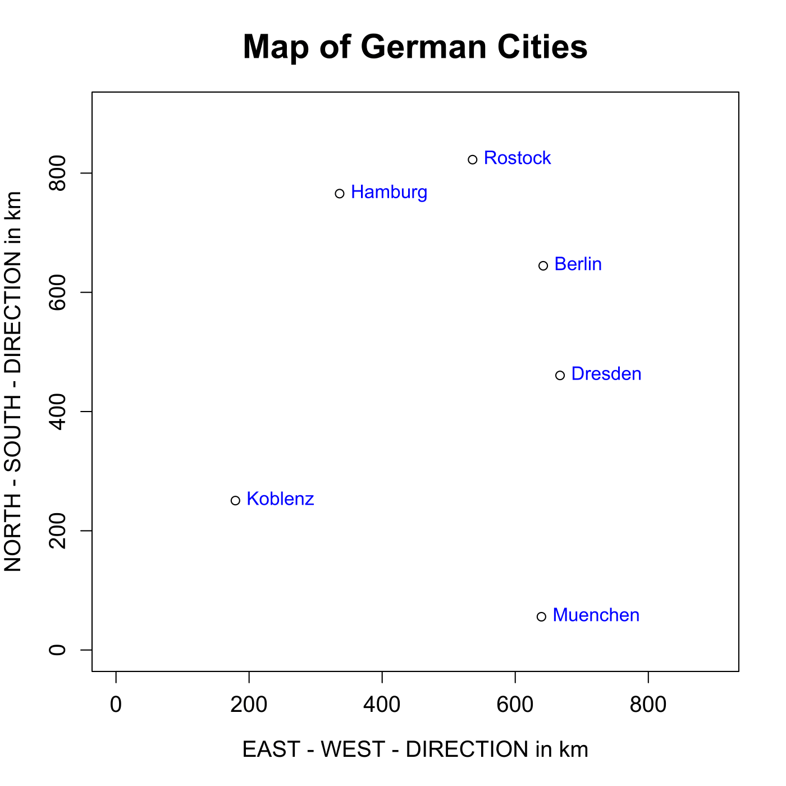
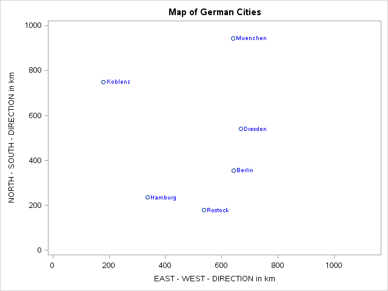

[](http://quantlet.de/)

## [](http://quantlet.de/) **MVAMDScity2** [](http://quantlet.de/)

```yaml

Name of QuantLet : MVAMDScity2

Published in : Applied Multivariate Statistical Analysis

Description : 'Computes the map of the cities by application of multidimensional scaling. Reflects
and rotates the figure by 90 degrees.'

Keywords : MDS, multi-dimensional, scaling, plot, graphical representation, sas

See also : 'MVAMDScity1, MVAMDSnonmstart, MVAMDSpooladj, MVAmdscarm, MVAnmdscar1, MVAnmdscar2,
MVAnmdscar3'

Author : Zografia Anastasiadou

Author[SAS] : Svetlana Bykovskaya

Submitted : Tue, October 28 2014 by Felix Jung

Submitted[SAS] : Tue, April 5 2016 by Svetlana Bykovskaya

Example : 'Metric MDS solution for the intercity road distances after reflection and 90 degrees
rotation.'

```






### R Code:
```r

# clear all variables
rm(list = ls(all = TRUE))
graphics.off()

# Intercity road distances
ber  = c(0, 214, 279, 610, 596, 237)
dre  = c(214, 0, 492, 533, 496, 444)
ham  = c(279, 492, 0, 520, 772, 140)
kob  = c(610, 533, 520, 0, 521, 687)
mue  = c(596, 496, 772, 521, 0, 771)
ros  = c(237, 444, 140, 687, 771, 0)

dist = cbind(ber, dre, ham, kob, mue, ros)

# a, b, h, i, r, x, xx1, xx2 are matrices
a    = (dist^2) * (-0.5)
i    = diag(6)
u    = rep(1, 6)
h    = i - (1/6 * (u %*% t(u)))
b    = h %*% a %*% h             # Determine the inner product matrix
e    = eigen(b)
g1   = cbind(e$vectors[, 1], -e$vectors[, 2])
g2   = diag(e$values[1:2])
xx1  = g1 %*% (g2^0.5)           # Determine the coordinate matrix
x    = cos(pi/2)
y    = sin(pi/2)
z    = -sin(pi/2)
r1   = c(x, z)
r2   = c(y, x)
r    = rbind(r1, r2)
xx2  = xx1 %*% r

xx   = cbind((xx2[, 1] * (-1)) + 500, xx2[, 2] + 500)

# Plot: Map of German Cities
plot(xx[, 1], xx[, 2], xlim = c(0, 900), ylim = c(0, 900), xlab = "EAST - WEST - DIRECTION in km", 
    ylab = "NORTH - SOUTH - DIRECTION in km", main = "Map of German Cities", cex.axis = 1.2, 
    cex.lab = 1.2, cex.main = 1.8)
text(xx[, 1], xx[, 2], labels = c("Berlin", "Dresden", "Hamburg", "Koblenz", "Muenchen", 
    "Rostock"), pos = 4, col = "blue") 

```

### SAS Code:
```sas

proc iml;
  * matrix "multiplication" where missing values are propagated;
  start MVMult(A, B);
    C = j(nrow(A), ncol(B), .);
    rows = loc(countmiss(A, "ROW")=0);
    cols = loc(countmiss(B, "COL")=0);
    if ncol(rows)>0 & ncol(cols)>0 then
      C[rows, cols] = A[rows,] * B[,cols];
    return(C);
  finish;
  
  * Intercity road distances;
  ber  = {0, 214, 279, 610, 596, 237};
  dre  = {214, 0, 492, 533, 496, 444};
  ham  = {279, 492, 0, 520, 772, 140};
  kob  = {610, 533, 520, 0, 521, 687};
  mue  = {596, 496, 772, 521, 0, 771};
  ros  = {237, 444, 140, 687, 771, 0};
  
  dist = ber || dre || ham || kob || mue || ros;
  
  * a, b, h, i, r, x, xx1, xx2 are matrices;
  a   = (dist ## 2) * (-0.5);
  u   = j(6,1,1);
  i   = diag(u);
  h   = i - (1/6 * (u * t(u)));
  b   = h * a * h;              * Determine the inner product matrix;
  V   = eigvec(b);
  g1  = V[,1] ||(-V[,2]);
  g2  = diag((eigval(b))[1:2,]);
  xx1 = MVMult(g1,(g2 ## 0.5)); * Determine the coordinate matrix;
  
  pi  = constant("pi");
  x   = cos(pi/2);
  y   = sin(pi/2);
  z   = -sin(pi/2);
  r1  = x || z;
  r2  = y || x;
  r   = r1 // r2;
  xx2 = MVMult(xx1,r);
  
  xx  = (xx2[, 1] * (-1)) + 500 || xx2[, 2] + 500; 
  
  x1  = xx[,1];
  x2  = xx[,2];
  cities = {'Berlin', 'Dresden', 'Hamburg', 'Koblenz', 'Muenchen', 'Rostock'};
  
  create plot var {"x1" "x2" "cities"};
    append;
  close plot;
quit;
 
proc sgplot data = plot;
  title 'Map of German Cities';
  scatter x = x1 y = x2 / datalabel = cities
    datalabelattrs = (color = blue) datalabelpos = right;
  xaxis min = 0 max = 1000 label = 'EAST - WEST - DIRECTION in km';
  yaxis min = 0 max = 1000 label = 'NORTH - SOUTH - DIRECTION in km';
run;


```
