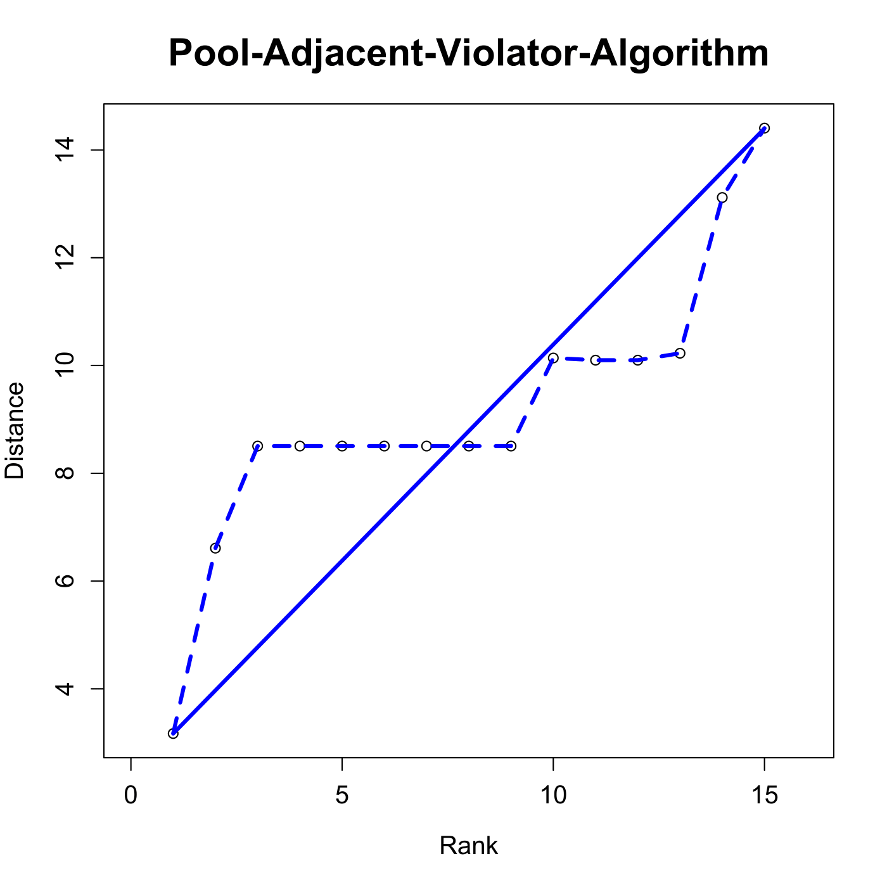
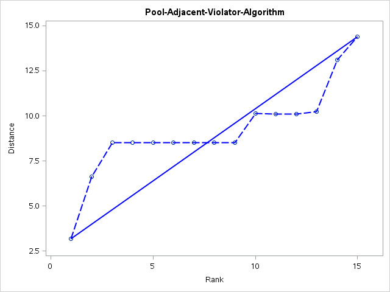

[](http://quantlet.de/)

## [](http://quantlet.de/) **MVAMDSpooladj** [](http://quantlet.de/)

```yaml

Name of QuantLet : MVAMDSpooladj

Published in : Applied Multivariate Statistical Analysis

Description : Computes the pool adjacent violator algorithm (PAV).

Keywords : 'MDS, non-metric-MDS, multi-dimensional, scaling, PAV, violators, Shepard-Kruskal, plot,
graphical representation, sas'

See also : 'MVAMDScity1, MVAMDScity2, MVAMDSnonmstart, MVAmdscarm, MVAnmdscar1, MVAnmdscar2,
MVAnmdscar3, MVAcarrankings, PAVAlgo'

Author : Zografia Anastasiadou

Author[SAS] : Svetlana Bykovskaya

Submitted : Tue, October 28 2014 by Felix Jung

Submitted[SAS] : Tue, April 5 2016 by Svetlana Bykovskaya

```






### R Code:
```r

# clear all variables
rm(list = ls(all = TRUE))
graphics.off()

ber = c(0, 2, 4, 12, 11, 3)
dre = c(2, 0, 6, 10, 7, 5)
ham = c(4, 6, 0, 8, 15, 1)
kob = c(12, 10, 8, 0, 9, 13)
mue = c(11, 7, 15, 9, 0, 14)
ros = c(3, 5, 1, 13, 14, 0)

dist = rbind(ber, dre, ham, kob, mue, ros)

# a,b,h,i are matrices
a = (dist^2) * (-0.5)
i = diag(6)
u = rep(1, 6)
h = i - (1/6 * (u %*% t(u)))
b = h %*% a %*% h           # Determine the inner product matrix
e = eigen(b)

g1  = cbind(e$vectors[, 1], e$vectors[, 2])
g2  = diag(e$values[1:2])
x   = g1 %*% (g2^0.5)       # Determine the coordinate matrix

# Determine the dissimilarities
d12 = ((x[1, 1] - x[2, 1])^2 + (x[1, 2] - x[2, 2])^2)^0.5
d13 = ((x[1, 1] - x[3, 1])^2 + (x[1, 2] - x[3, 2])^2)^0.5
d14 = ((x[1, 1] - x[4, 1])^2 + (x[1, 2] - x[4, 2])^2)^0.5
d15 = ((x[1, 1] - x[5, 1])^2 + (x[1, 2] - x[5, 2])^2)^0.5
d16 = ((x[1, 1] - x[6, 1])^2 + (x[1, 2] - x[6, 2])^2)^0.5

d23 = ((x[2, 1] - x[3, 1])^2 + (x[2, 2] - x[3, 2])^2)^0.5
d24 = ((x[2, 1] - x[4, 1])^2 + (x[2, 2] - x[4, 2])^2)^0.5
d25 = ((x[2, 1] - x[5, 1])^2 + (x[2, 2] - x[5, 2])^2)^0.5
d26 = ((x[2, 1] - x[6, 1])^2 + (x[2, 2] - x[6, 2])^2)^0.5

d34 = ((x[3, 1] - x[4, 1])^2 + (x[3, 2] - x[4, 2])^2)^0.5
d35 = ((x[3, 1] - x[5, 1])^2 + (x[3, 2] - x[5, 2])^2)^0.5
d36 = ((x[3, 1] - x[6, 1])^2 + (x[3, 2] - x[6, 2])^2)^0.5

d45 = ((x[4, 1] - x[5, 1])^2 + (x[4, 2] - x[5, 2])^2)^0.5
d46 = ((x[4, 1] - x[6, 1])^2 + (x[4, 2] - x[6, 2])^2)^0.5

d56 = ((x[5, 1] - x[6, 1])^2 + (x[5, 2] - x[6, 2])^2)^0.5

d14 = (d14 + d15)/2
d15 = d14
d16 = (d14 + d15 + d16 + d23 + d24 + d25 + d26)/7
d14 = d16
d15 = d16
d23 = d16
d24 = d16
d25 = d16
d26 = d16
d35 = (d35 + d36)/2
d36 = d35

dd = rbind(c(0, d12, d13, d14, d15, d16), c(d12, 0, d23, d24, d25, d26), c(d13, 
    d23, 0, d34, d35, d36), c(d14, d24, d34, 0, d45, d46), c(d15, d25, d35, d45, 
    0, d56), c(d16, d26, d36, d46, d56, 0))

f = cbind(c(1:15), c(d12, d13, d14, d15, d16, d23, d24, d25, d26, d34, d35, d36, 
    d45, d46, d56))

l = cbind(c(15, 1), c(14.4, 3.17))

# Plot
plot(f, xlim = c(0, 16), xlab = "Rank", ylab = "Distance", main = "Pool-Adjacent-Violator-Algorithm", 
    cex.axis = 1.2, cex.lab = 1.2, cex.main = 1.8)
lines(f, lty = 2, lwd = 3, col = "blue")
segments(l[1, 1], l[1, 2], l[2, 1], l[2, 2], lwd = 3, col = "blue") 

```

### SAS Code:
```sas
proc iml;
  * matrix "multiplication" where missing values are propagated;
  start MVMult(A, B);
    C = j(nrow(A), ncol(B), .);
    rows = loc(countmiss(A, "ROW")=0);
    cols = loc(countmiss(B, "COL")=0);
    if ncol(rows)>0 & ncol(cols)>0 then
      C[rows, cols] = A[rows,] * B[,cols];
    return(C);
  finish;

  * Intercity road distances;
  ber  = {0, 2, 4, 12, 11, 3};
  dre  = {2, 0, 6, 10, 7, 5};
  ham  = {4, 6, 0, 8, 15, 1};
  kob  = {12, 10, 8, 0, 9, 13};
  mue  = {11, 7, 15, 9, 0, 14};
  ros  = {3, 5, 1, 13, 14, 0};
  
  dist = ber || dre || ham || kob || mue || ros;
  
  * a,b,h,i are matrices;
  a  = (dist ## 2) * (-0.5);
  u  = j(6,1,1);
  i  = diag(u);
  h  = i - (1/6 * (u * t(u)));
  b  = h * a * h;              * Determine the inner product matrix;
  V  = eigvec(b);
  g1 = V[,1] || V[,2];
  g2 = diag((eigval(b))[1:2,]);
  x  = MVMult(g1,(g2 ## 0.5)); * Determine the coordinate matrix;
  
  * Determine the dissimilarities;
  d12 = ((x[1, 1] - x[2, 1]) ## 2 + (x[1, 2] - x[2, 2]) ## 2) ## 0.5;
  d13 = ((x[1, 1] - x[3, 1]) ## 2 + (x[1, 2] - x[3, 2]) ## 2) ## 0.5;
  d14 = ((x[1, 1] - x[4, 1]) ## 2 + (x[1, 2] - x[4, 2]) ## 2) ## 0.5;
  d15 = ((x[1, 1] - x[5, 1]) ## 2 + (x[1, 2] - x[5, 2]) ## 2) ## 0.5;
  d16 = ((x[1, 1] - x[6, 1]) ## 2 + (x[1, 2] - x[6, 2]) ## 2) ## 0.5;

  d23 = ((x[2, 1] - x[3, 1]) ## 2 + (x[2, 2] - x[3, 2]) ## 2) ## 0.5;
  d24 = ((x[2, 1] - x[4, 1]) ## 2 + (x[2, 2] - x[4, 2]) ## 2) ## 0.5;
  d25 = ((x[2, 1] - x[5, 1]) ## 2 + (x[2, 2] - x[5, 2]) ## 2) ## 0.5;
  d26 = ((x[2, 1] - x[6, 1]) ## 2 + (x[2, 2] - x[6, 2]) ## 2) ## 0.5;

  d34 = ((x[3, 1] - x[4, 1]) ## 2 + (x[3, 2] - x[4, 2]) ## 2) ## 0.5;
  d35 = ((x[3, 1] - x[5, 1]) ## 2 + (x[3, 2] - x[5, 2]) ## 2) ## 0.5;
  d36 = ((x[3, 1] - x[6, 1]) ## 2 + (x[3, 2] - x[6, 2]) ## 2) ## 0.5;

  d45 = ((x[4, 1] - x[5, 1]) ## 2 + (x[4, 2] - x[5, 2]) ## 2) ## 0.5;
  d46 = ((x[4, 1] - x[6, 1]) ## 2 + (x[4, 2] - x[6, 2]) ## 2) ## 0.5;

  d56 = ((x[5, 1] - x[6, 1]) ## 2 + (x[5, 2] - x[6, 2]) ## 2) ## 0.5;
  
  d14 = (d14 + d15)/2;
  d15 = d14;
  d16 = (d14 + d15 + d16 + d23 + d24 + d25 + d26)/7;
  d14 = d16;
  d15 = d16;
  d23 = d16;
  d24 = d16;
  d25 = d16;
  d26 = d16;
  d35 = (d35 + d36)/2;
  d36 = d35;
    
  dd = (0   || d12 || d13 || d14 || d15 || d16) //
    (d12 || 0   || d23 || d24 || d25 || d26) //
    (d13 || d23 || 0   || d34 || d35 || d36) //
    (d14 || d24 || d34 || 0   || d45 || d46) //
    (d15 || d25 || d35 || d45 || 0   || d56) //
    (d16 || d26 || d36 || d46 || d56 || 0);
    
  * Determine the rank order to dissimilarities;
  f  = (1:15)` || (d12 || d13 || d14 || d15 || d16 || 
    d23 || d24 || d25 || d26 || d34 || d35 || d36 || d45 || d46 || d56)`;
	
  l  = {15, 1} || {14.4, 3.17};
      
  x1 = f[,1];
  x2 = f[,2];
  x3 = l[,1];
  x4 = l[,2];
	
  create plot var {"x1" "x2" "x3" "x4"};
    append;
  close plot;
quit;

proc sgplot data = plot
    noautolegend;
  title 'Pool-Adjacent-Violator-Algorithm';
  scatter x = x1 y = x2;
  series  x = x1 y = x2 / lineattrs = (pattern = 4 color = blue THICKNESS = 2);
  series  x = x3 y = x4 / lineattrs = (color = blue THICKNESS = 2);
  xaxis min = 0 max = 16 label = 'Rank';
  yaxis label = 'Distance'; 
run;


  
```
