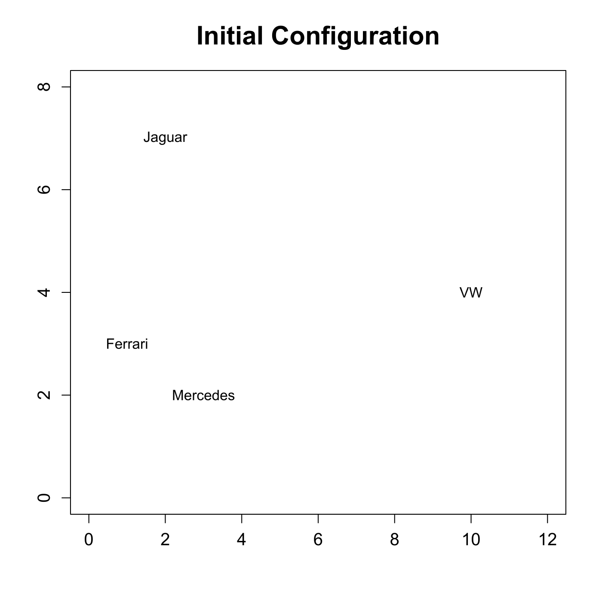
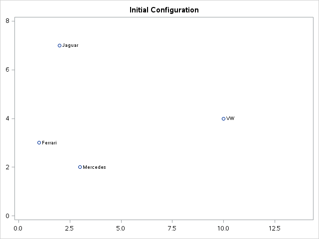

[](http://quantlet.de/)

## [](http://quantlet.de/) **MVAnmdscar1** [](http://quantlet.de/)

```yaml

Name of QuantLet : MVAnmdscar1

Published in : Applied Multivariate Statistical Analysis

Description : Plots the initial configuration of the points for nonmetric MDS for car marks data.

Keywords : 'MDS, non-metric-MDS, multi-dimensional, scaling, PAV, violators, plot, graphical
representation, sas'

See also : 'MVAMDScity1, MVAMDScity2, MVAMDSnonmstart, MVAMDSpooladj, MVAmdscarm, MVAnmdscar2,
MVAnmdscar3, PAVAlgo, MVAcarrankings'

Author : Zografia Anastasiadou

Author[SAS] : Svetlana Bykovskaya

Submitted : Thu, November 06 2014 by Sergey Nasekin

Submitted[SAS] : Tue, April 5 2016 by Svetlana Bykovskaya

```






### R Code:
```r

# clear all variables
rm(list = ls(all = TRUE))
graphics.off()

x = cbind(c(3, 2, 1, 10), c(2, 7, 3, 4))

# plot
plot(x, type = "n", xlim = c(0, 12), ylim = c(0, 8), xlab = "", ylab = "", main = "Initial Configuration", 
    cex.axis = 1.2, cex.main = 1.8)
text(x, labels = c("Mercedes", "Jaguar", "Ferrari", "VW"))

```

### SAS Code:
```sas
proc iml;
  x  = {3, 2, 1, 10} || {2, 7, 3, 4};
  
  x1 = x[,1];
  x2 = x[,2];
  cars = {'Mercedes', 'Jaguar', 'Ferrari', 'VW'};
	
  create plot var {"x1" "x2" "cars"};
    append;
  close plot;
quit;

proc sgplot data = plot;
  title 'Initial Configuration';
  scatter x = x1 y = x2 / datalabel = cars datalabelpos = right;
  xaxis min = 0 max = 12 display = (nolabel);
  yaxis min = 0 max = 8  display = (nolabel); 
run;
```
