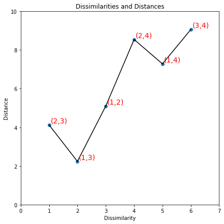

[](http://quantlet.de/)

## [](http://quantlet.de/) **MVAnmdscar2** [](http://quantlet.de/)

```yaml

Name of QuantLet: MVAnmdscar2

Published in: Applied Multivariate Statistical Analysis

Description: Illustrates the PAV algorithm for nonmetric MDS for car marks data.

Keywords: MDS, non-metric-MDS, multi-dimensional, scaling, PAV, violators, plot, graphical representation, scatterplot, sas

See also: MVAMDScity1, MVAMDScity2, MVAMDSnonmstart, MVAMDSpooladj, MVAmdscarm, MVAnmdscar1, MVAnmdscar3, MVAcarrankings, PAVAlgo

Author: Zografia Anastasiadou
Author[SAS]: Svetlana Bykovskaya
Author[Python]: Matthias Fengler, Liudmila Gorkun-Voevoda

Submitted: Tue, January 11 2011 by Zografia Anastasiadou   
Submitted[SAS]: Tue, April 5 2016 by Svetlana Bykovskaya    
Submitted[Python]: Wed, January 6 2021 by Liudmila Gorkun-Voevoda

Example: Scatterplot of dissimilarities against distances.

```




### PYTHON Code
```python

import numpy as np
import matplotlib.pyplot as plt

x = np.array([[3, 2, 1, 10], [2, 7, 3, 4]]).T

d = np.zeros([len(x), len(x)])

for i in range(0, len(x)):
    for j in range(0, len(x)):
        d[i, j] = np.linalg.norm(x[i, :] - x[j, :])

f1 = [1, d[1, 2]]
f2 = [2, d[0, 2]]
f3 = [3, d[0, 1]]
f4 = [4, d[1, 3]]
f5 = [5, d[0, 3]]
f6 = [6, d[2, 3]]

y = [d[1, 2], d[0, 2], d[0, 1], d[1, 3], d[0, 3], d[2, 3]]
labels = ["(2,3)", "(1,3)", "(1,2)", "(2,4)", "(1,4)", "(3,4)"]


fig, ax = plt.subplots(figsize = (7, 7))
ax.plot(range(1, 7), y, c = "k")
ax.scatter(range(1, 7), y)
for i in range(0, 6):
    ax.text(i+1 +0.05, y[i] +0.1, labels[i], fontsize = 14, c = "r")

plt.xlim(0, 7)
plt.ylim(0, 10)

plt.xlabel("Dissimilarity")
plt.ylabel("Distance")

plt.title("Dissimilarities and Distances")
plt.show()
```

automatically created on 2021-01-08

### R Code
```r


# clear all variables
rm(list = ls(all = TRUE))
graphics.off()

x = cbind(c(3, 2, 1, 10), c(2, 7, 3, 4))

d = as.matrix(dist(x))

d1 = c(1, 2, 3, d[1, 2])
d2 = c(1, 3, 2, d[1, 3])
d3 = c(1, 4, 5, d[1, 4])
d4 = c(2, 3, 1, d[2, 3])
d5 = c(2, 4, 4, d[2, 4])
d6 = c(3, 4, 6, d[3, 4])
delta = cbind(d1, d2, d3, d4, d5, d6)

f1 = c(1, d[2, 3])
f2 = c(2, d[1, 3])
f3 = c(3, d[1, 2])
f4 = c(4, d[2, 4])
f5 = c(5, d[1, 4])
f6 = c(6, d[3, 4])
fig = rbind(f1, f2, f3, f4, f5, f6)

# plot
plot(fig, pch = 15, col = "blue", xlim = c(0, 7), ylim = c(0, 10), xlab = "Dissimilarity", 
    ylab = "Distance", main = "Dissimilarities and Distances", cex.axis = 1.2, cex.lab = 1.2, 
    cex.main = 1.8)
lines(fig, lwd = 3)
text(fig, labels = c("(2,3)", "(1,3)", "(1,2)", "(2,4)", "(1,4)", "(3,4)"), pos = 4, 
    col = "red") 

```

automatically created on 2021-01-08

### SAS Code
```sas

proc iml;
  x   = {3, 2, 1, 10} || {2, 7, 3, 4};
  d   = distance(x);
  
  f1  = {1} || d[2, 3];
  f2  = {2} || d[1, 3];
  f3  = {3} || d[1, 2];
  f4  = {4} || d[2, 4];
  f5  = {5} || d[1, 4];
  f6  = {6} || d[3, 4];
  fig = f1 // f2 // f3 // f4 // f5 // f6;
  
  x1  = fig[,1];
  x2  = fig[,2];
  points = {'(2,3)', '(1,3)', '(1,2)', '(2,4)', '(1,4)', '(3,4)'};
	
  create plot var {"x1" "x2" "points"};
    append;
  close plot;
quit;

proc sgplot data = plot
    noautolegend;
  title 'Dissimilarities and Distances';
  scatter x = x1 y = x2 / datalabel = points 
    datalabelattrs = (color = red) datalabelpos = right
    markerattrs = (symbol = squarefilled);
  series  x = x1 y = x2 / lineattrs = (color = black THICKNESS = 2);
  xaxis min = 0 max = 7  label = 'Dissimilarity';
  yaxis min = 0 max = 10 label = 'Distance'; 
run;
  
```

automatically created on 2021-01-08