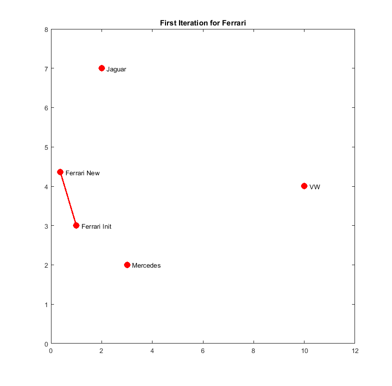
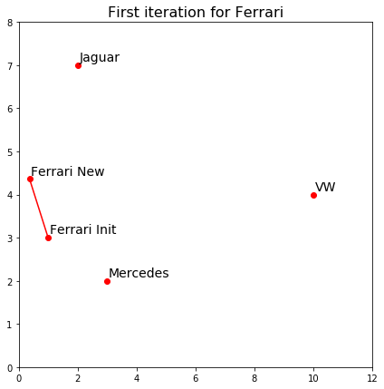

[](http://quantlet.de/)

## [](http://quantlet.de/) **MVAnmdscar3** [](http://quantlet.de/)

```yaml

Name of QuantLet: MVAnmdscar3

Published in: Applied Multivariate Statistical Analysis

Description: Shows the first iteration of the PAV algorithm for nonmetric MDS for car marks data.

Keywords: MDS, non-metric-MDS, multi-dimensional, scaling, PAV, violators, plot, graphical representation, sas

See also: MVAMDScity1, MVAMDScity2, MVAMDSnonmstart, MVAMDSpooladj, MVAmdscarm, MVAnmdscar2, MVAnmdscar3, MVAcarrankings, PAVAlgo

Author: Zografia Anastasiadou
Author[SAS]: Svetlana Bykovskaya
Author[Python]: Matthias Fengler, Liudmila Gorkun-Voevoda
Author[Matlab]: Wolfgang Haerdle, Vladimir Georgescu, Song Song

Submitted: Tue, January 11 2011 by Zografia Anastasiadou
Submitted[SAS]: Tue, April 5 2016 by Svetlana Bykovskaya
Submitted[Python]: Wed, January 6 2021 by Liudmila Gorkun-Voevoda
Submitted[Matlab]: Mon, December 16 2016 by Piedad Castro

Example: First iteration for Ferrari.

```







### MATLAB Code
```matlab

%% clear all variables and console and close windows
clear
clc
close all

x = [3    2
    2    7
    1    3
    0.37 4.36
    10   4];

x = x';

%% plot
hold on
title('First Iteration for Ferrari')
xlim([0 12])
ylim([0 8])
labels = {'Mercedes    ', 'Jaguar      ', 'Ferrari Init',...
          'Ferrari New ', 'VW          '}
scatter(x(1, :), x(2, :), 90, 'r', 'fill')
text(x(1, :) + 0.2, x(2, :), labels)
line([x(1, 3) x(1, 4)], [x(2, 3) x(2, 4)], 'Color', 'r', 'LineWidth', 2)
box on
hold off

```

automatically created on 2021-07-10

### PYTHON Code
```python

import numpy as np
import matplotlib.pyplot as plt

x = np.array([[3, 2], [2, 7], [1, 3], [0.37, 4.36], [10, 4]])
brands = ["Mercedes", "Jaguar", "Ferrari Init", "Ferrari New", "VW"]


fig, ax = plt.subplots(figsize = (7, 7))
ax.scatter(x[:, 0], x[:, 1], c = "r")
for i in range(0, len(x)):
    ax.text(x[i, 0]+0.05, x[i, 1]+0.1, brands[i], fontsize = 14)
ax.plot(x[2:4, 0], x[2:4, 1], c = "r")

plt.xlim(0, 12)
plt.ylim(0, 8)

plt.title("First iteration for Ferrari", fontsize = 16)
plt.show()
```

automatically created on 2021-07-10

### R Code
```r


# clear all variables
rm(list = ls(all = TRUE))
graphics.off()

x = rbind(c(3, 2), c(2, 7), c(1, 3), c(0.37, 4.36), c(10, 4))

# plot
plot(x, pch = 19, col = "red", xlim = c(0, 12), ylim = c(0, 8), xlab = "", ylab = "", 
    main = "First iteration for Ferrari", cex.axis = 1.2, cex.lab = 1.2, cex.main = 1.8)
segments(x[3, 1], x[3, 2], x[4, 1], x[4, 2], lwd = 3, col = "red")
text(x, labels = c("Mercedes", "Jaguar", "Ferrari Init", "Ferrari New", "VW"), pos = 4) 

```

automatically created on 2021-07-10

### SAS Code
```sas

proc iml;
  x  = ({3, 2} || {2, 7} || {1, 3} || {0.37, 4.36} || {10, 4})`;
  l  = (x[3, 1] // x[4, 1]) || (x[3, 2] // x[4, 2]);
  
  x1 = x[,1];
  x2 = x[,2];
  x3 = l[,1];
  x4 = l[,2];
  points = {'Mercedes', 'Jaguar', 'Ferrari Init', 'Ferrari New', 'VW'};
  
  create plot var {"x1" "x2" "x3" "x4" "points"};
    append;
  close plot;
quit;

proc sgplot data = plot
    noautolegend;
  title 'First iteration for Ferrari';
  scatter x = x1 y = x2 / datalabel = points 
    datalabelattrs = (color = red) datalabelpos = right
    markerattrs = (symbol = circlefilled color = red);
  series x = x3 y = x4 / lineattrs = (color = red THICKNESS = 2);
  xaxis min = 0 max = 12 display = (nolabel);
  yaxis min = 0 max = 8  display = (nolabel); 
run;


```

automatically created on 2021-07-10