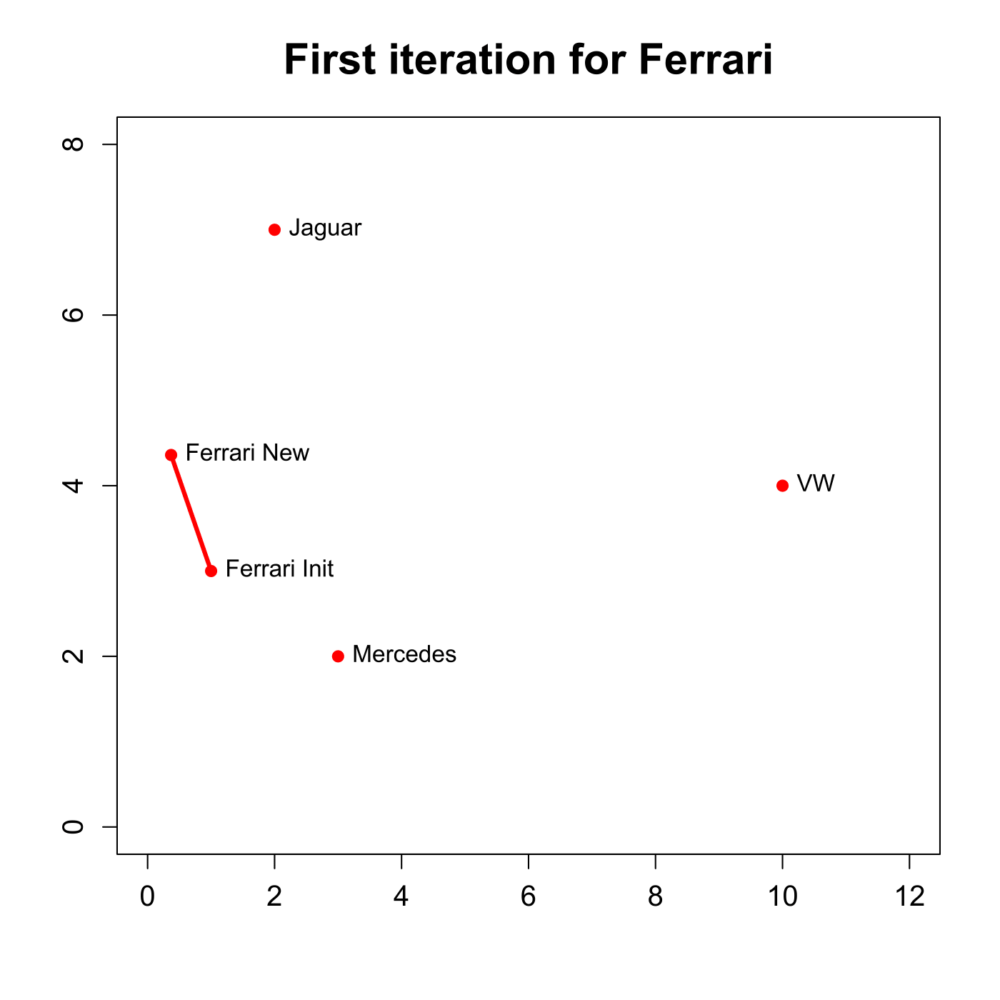
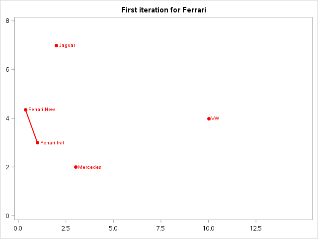

[](http://quantlet.de/)

## [](http://quantlet.de/) **MVAnmdscar3** [](http://quantlet.de/)

```yaml

Name of QuantLet : MVAnmdscar3

Published in : Applied Multivariate Statistical Analysis

Description : Shows the first iteration of the PAV algorithm for nonmetric MDS for car marks data.

Keywords : 'MDS, non-metric-MDS, multi-dimensional, scaling, PAV, violators, plot, graphical
representation, sas'

See also : 'MVAMDScity1, MVAMDScity2, MVAMDSnonmstart, MVAMDSpooladj, MVAmdscarm, MVAnmdscar2,
MVAnmdscar3, MVAcarrankings, PAVAlgo'

Author : Zografia Anastasiadou

Author[SAS] : Svetlana Bykovskaya

Submitted : Tue, January 11 2011 by Zografia Anastasiadou

Submitted[SAS] : Tue, April 5 2016 by Svetlana Bykovskaya

Example : First iteration for Ferrari.

```






### R Code:
```r

# clear all variables
rm(list = ls(all = TRUE))
graphics.off()

x = rbind(c(3, 2), c(2, 7), c(1, 3), c(0.37, 4.36), c(10, 4))

# plot
plot(x, pch = 19, col = "red", xlim = c(0, 12), ylim = c(0, 8), xlab = "", ylab = "", 
    main = "First iteration for Ferrari", cex.axis = 1.2, cex.lab = 1.2, cex.main = 1.8)
segments(x[3, 1], x[3, 2], x[4, 1], x[4, 2], lwd = 3, col = "red")
text(x, labels = c("Mercedes", "Jaguar", "Ferrari Init", "Ferrari New", "VW"), pos = 4) 

```

### SAS Code:
```sas
proc iml;
  x  = ({3, 2} || {2, 7} || {1, 3} || {0.37, 4.36} || {10, 4})`;
  l  = (x[3, 1] // x[4, 1]) || (x[3, 2] // x[4, 2]);
  
  x1 = x[,1];
  x2 = x[,2];
  x3 = l[,1];
  x4 = l[,2];
  points = {'Mercedes', 'Jaguar', 'Ferrari Init', 'Ferrari New', 'VW'};
  
  create plot var {"x1" "x2" "x3" "x4" "points"};
    append;
  close plot;
quit;

proc sgplot data = plot
    noautolegend;
  title 'First iteration for Ferrari';
  scatter x = x1 y = x2 / datalabel = points 
    datalabelattrs = (color = red) datalabelpos = right
    markerattrs = (symbol = circlefilled color = red);
  series x = x3 y = x4 / lineattrs = (color = red THICKNESS = 2);
  xaxis min = 0 max = 12 display = (nolabel);
  yaxis min = 0 max = 8  display = (nolabel); 
run;


```
