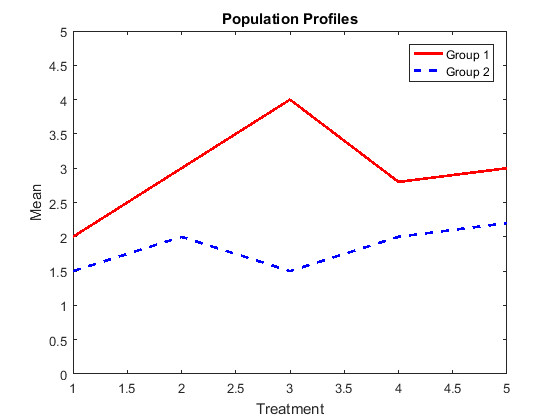
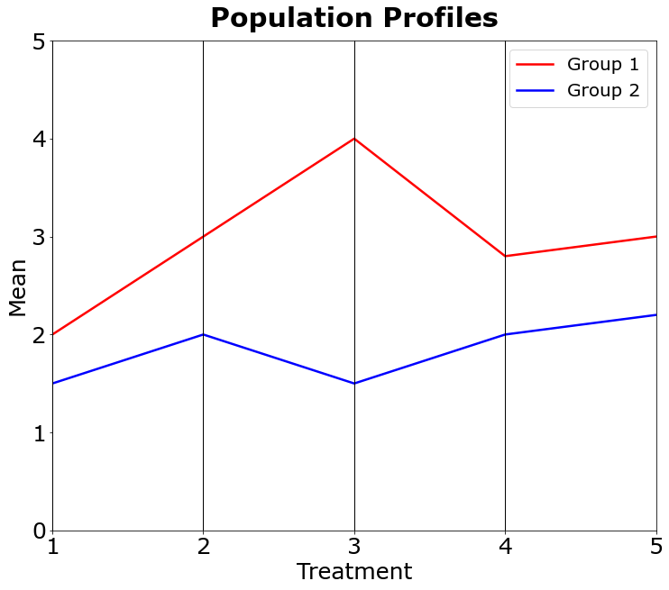

[](http://quantlet.de/)

## [](http://quantlet.de/) **MVAprofil** [](http://quantlet.de/)

```yaml

Name of QuantLet: MVAprofil

Published in: Applied Multivariate Statistical Analysis

Description: Plots an example of population files.

Keywords: profile, test, hypothesis-testing, population, plot, graphical representation, sas

See also: SMSprofil, SMSprofplasma

Author: Zografia Anastasiadou
Author[SAS]: Svetlana Bykovskaya
Author[Matlab]: Wolfgang Haerdle, Vladimir Georgescu, Jorge Patron and Song Song
Author[Python]: Matthias Fengler, Tim Dass

Submitted: Tue, January 11 2011 by Zografia Anastasiadou
Submitted[SAS]: Tue, April 5 2016 by Svetlana Bykovskaya
Submitted[Matlab]: Thu, December 08 by Piedad Castro
Submitted[Python]: Tue, April 16 2024 by Tim Dass

```







### MATLAB Code
```matlab

%% clear all variables and console and close windows
clear
clc
close all

%% data
x1 = [2 3 4 2.8 3];         %Define group 1
x2 = [1.5 2 1.5 2 2.2];     %Define group 2

%% plot
plot(x1,'r','LineWidth',2)
title('Population Profiles')
xlabel('Treatment')
ylabel('Mean')
hold on 
plot(x2,'b','LineWidth',2,'Linestyle','--')
legend('Group 1','Group 2')
axis([1 5 0 5])
hold off

```

automatically created on 2024-04-25

### PYTHON Code
```python

#works on pandas 1.5.3, numpy 1.24.3 and matplotlib 3.6.2
import pandas as pd
import numpy as np
import matplotlib.pyplot as plt
from pandas.plotting import parallel_coordinates

data = {"name":["Group 1","Group 2"],1:[2,1.5],2:[3,2],3:[4,1.5],4:[2.8,2],5:[3,2.2]}
df = pd.DataFrame(data)

fig, ax = plt.subplots(figsize = (12,10))

parallel_coordinates(df, "name", color = ("red", "blue"), linewidth ="2.5")
ax.tick_params(axis='both', labelsize = 25)
ax.set_xlabel("Treatment", fontsize = 25)
ax.set_ylabel("Mean", fontsize = 25)
ax.yaxis.set_ticks(np.arange(0, 5.1, 1))
ax.legend(fontsize = 20)
plt.title(label = "Population Profiles", 
          fontsize = 30, fontweight = "bold", pad = 15)
ax.grid(False)
plt.show()
```

automatically created on 2024-04-25

### R Code
```r


# clear all variables
rm(list = ls(all = TRUE))
graphics.off()

x   = c(2, 3, 4, 2.8, 3)        # Define group 1
xx  = c(1.5, 2, 1.5, 2, 2.2)    # Define group 2

# plot
plot(x, type = "l", col = "red", lwd = 2, xlim = c(1, 5), ylim = c(1, 5), xlab = "Treatment", 
    ylab = "Mean", main = "Population Profiles", cex.lab = 1.2, cex.axis = 1.2, cex.main = 1.8)
lines(xx, col = "blue", lwd = 2, lty = 2)
legend(4.1, 5.1, legend = c("Group 1", "Group 2"), lty = c(1, 2), lwd = c(2, 2), 
    col = c("red", "blue"))

```

automatically created on 2024-04-25

### SAS Code
```sas

proc iml;
  x  = (1:5)`;
  y1 = {2, 3, 4, 2.8, 3};  * Define group 1;
  y2 = {1.5, 2, 1.5, 2, 2.2}; * Define group 2;
	
  create plot var {"x" "y1" "y2"};
    append;
  close plot;
quit;

data plot;
  set plot;
  title 'Population Profiles';

  proc sgplot data = plot;
    series x = x y = y1 / lineattrs = (color = red THICKNESS = 2) 
      legendlabel = "Group 1";
    series x = x y = y2 / lineattrs = (pattern = 4 color = blue THICKNESS = 2)
      legendlabel = "Group 2";
    xaxis min = 1 max = 5 label = 'Treatment';
    yaxis min = 1 max = 5 label = 'Mean';
  run;
quit;
  
```

automatically created on 2024-04-25