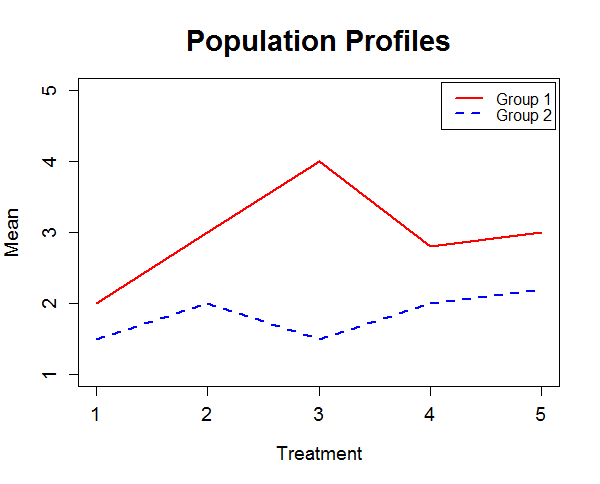
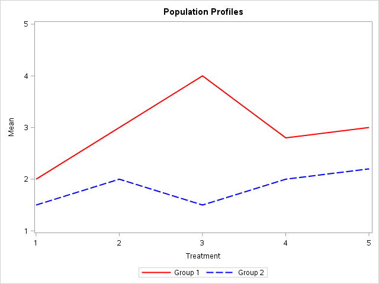

[](http://quantlet.de/)

## [](http://quantlet.de/) **MVAprofil** [](http://quantlet.de/)

```yaml

Name of QuantLet : MVAprofil

Published in : Applied Multivariate Statistical Analysis

Description : Plots an example of population files.

Keywords : profile, test, hypothesis-testing, population, plot, graphical representation, sas

See also : SMSprofil, SMSprofplasma

Author : Zografia Anastasiadou

Author[SAS] : Svetlana Bykovskaya

Submitted : Tue, January 11 2011 by Zografia Anastasiadou

Submitted[SAS] : Tue, April 5 2016 by Svetlana Bykovskaya

```






### R Code:
```r

# clear all variables
rm(list = ls(all = TRUE))
graphics.off()

x   = c(2, 3, 4, 2.8, 3)        # Define group 1
xx  = c(1.5, 2, 1.5, 2, 2.2)    # Define group 2

# plot
plot(x, type = "l", col = "red", lwd = 2, xlim = c(1, 5), ylim = c(1, 5), xlab = "Treatment", 
    ylab = "Mean", main = "Population Profiles", cex.lab = 1.2, cex.axis = 1.2, cex.main = 1.8)
lines(xx, col = "blue", lwd = 2, lty = 2)
legend(4.1, 5.1, legend = c("Group 1", "Group 2"), lty = c(1, 2), lwd = c(2, 2), 
    col = c("red", "blue"))

```

### SAS Code:
```sas
proc iml;
  x  = (1:5)`;
  y1 = {2, 3, 4, 2.8, 3};  * Define group 1;
  y2 = {1.5, 2, 1.5, 2, 2.2}; * Define group 2;
	
  create plot var {"x" "y1" "y2"};
    append;
  close plot;
quit;

data plot;
  set plot;
  title 'Population Profiles';

  proc sgplot data = plot;
    series x = x y = y1 / lineattrs = (color = red THICKNESS = 2) 
      legendlabel = "Group 1";
    series x = x y = y2 / lineattrs = (pattern = 4 color = blue THICKNESS = 2)
      legendlabel = "Group 2";
    xaxis min = 1 max = 5 label = 'Treatment';
    yaxis min = 1 max = 5 label = 'Mean';
  run;
quit;
  
```
