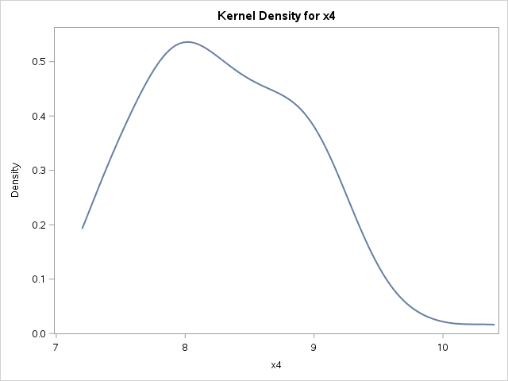
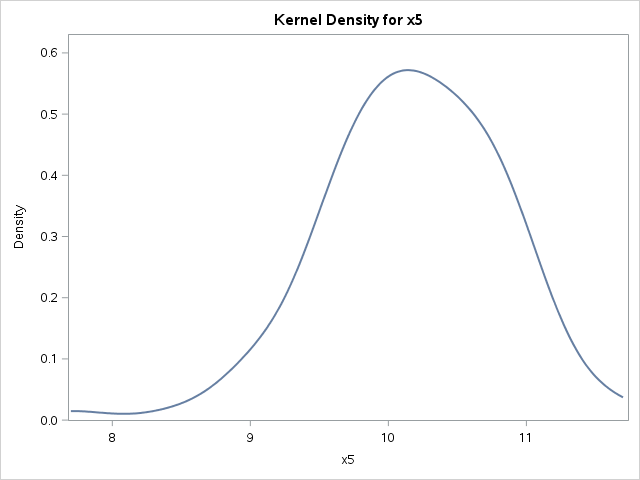
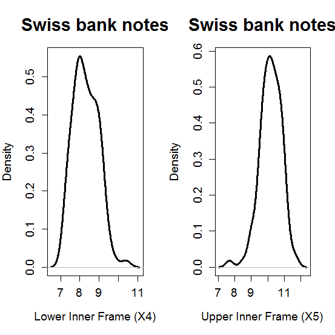

[](http://quantlet.de/)

## [](http://quantlet.de/) **MVAdenbank2** [](http://quantlet.de/)

```yaml

Name of QuantLet : MVAdenbank2

Published in : Applied Multivariate Statistical Analysis

Description : Computes the univariate densities of X4 and X5 of the genuine Swiss bank notes.

Keywords : 'data visualization, plot, graphical representation, financial, density, descriptive,
descriptive-statistics, empirical, smoothing, gaussian, kde, kernel, visualization, sas'

See also : 'MVAcontbank3, MVAdenbank, MVAdenbank3, MVAscabank45, MVAscabank456, SPMdenepatri,
SPMkdeconstruct, SPMkernel'

Author : Zografia Anastasiadou

Author[SAS] : Svetlana Bykovskaya

Submitted : Tue, September 09 2014 by Awdesch Melzer

Submitted[SAS] : Tue, April 5 2016 by Svetlana Bykovskaya

Datafiles : bank2.dat

Example : Univariate estimates of the density X4 (left) and X5 (right) of the bank notes.

```








### R Code:
```r

# clear variables and close windows
rm(list = ls(all = TRUE))
graphics.off()

# Observation: Density estimates are different because R uses a 'gaussian' kernel as default, whereas Xplore uses a Quartic Kernel.

# load data
x = read.table("bank2.dat")

x4 = x[1:100, 4]
x5 = x[1:100, 5]

f4 = density(x4)
f5 = density(x5)

# plot
par(mfrow = c(1, 2))
plot(f4, type = "l", lwd = 3, xlab = "Lower Inner Frame (X4)", ylab = "Density", main = "Swiss bank notes", 
    cex.lab = 1.2, cex.axis = 1.2, cex.main = 1.8)
plot(f5, type = "l", lwd = 3, xlab = "Upper Inner Frame (X5)", ylab = "Density", main = "Swiss bank notes", 
    cex.lab = 1.2, cex.axis = 1.2, cex.main = 1.8)
	
```

### SAS Code:
```sas

* Import the data;
data bank2;
  infile '/folders/myfolders/data/bank2.dat';
  input temp1-temp6;
run;

proc iml;
  * Read data into a matrix;
  use bank2;
    read all var _ALL_ into x; 
  close bank2;
  
  x4 = x[1:100, 4];
  x5 = x[1:100, 5];
  
  create plot var {"x4" "x5"};
    append;
  close plot;
quit;

ods graphics on;

proc kde data = plot;
  title 'Swiss bank notes';
  univar x4 / plots = (densityoverlay) noprint;
  univar x5 / plots = (densityoverlay) noprint;
run;

ods graphics off;

```
