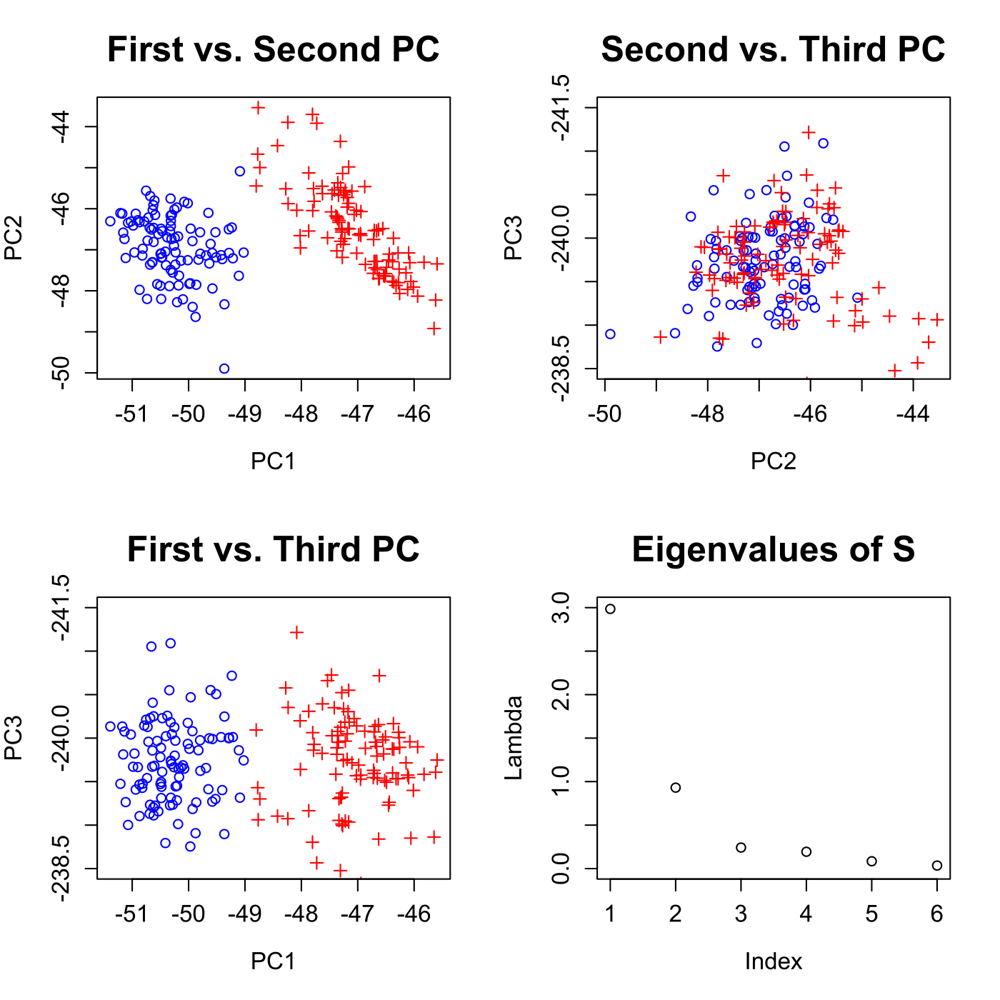
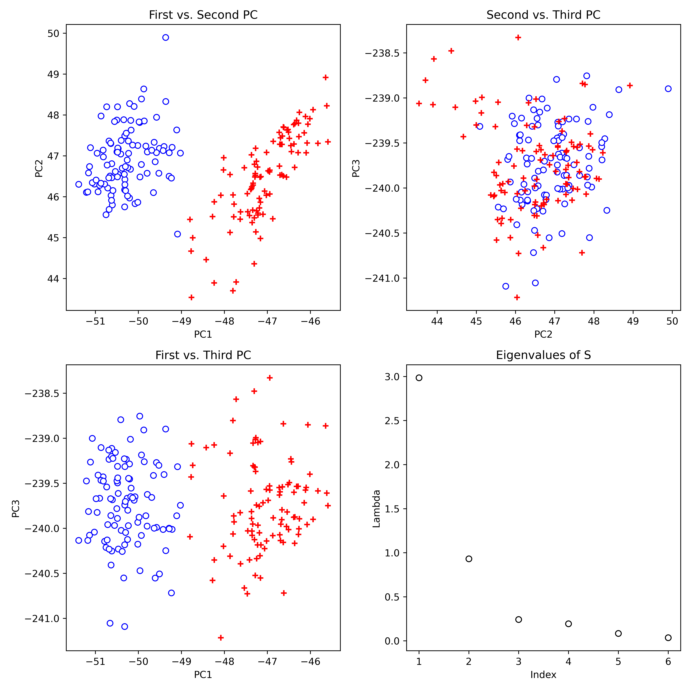
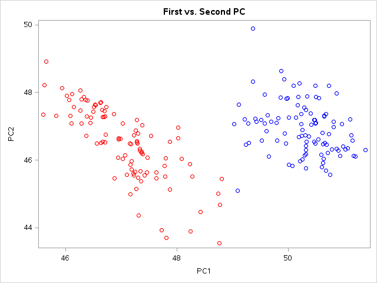
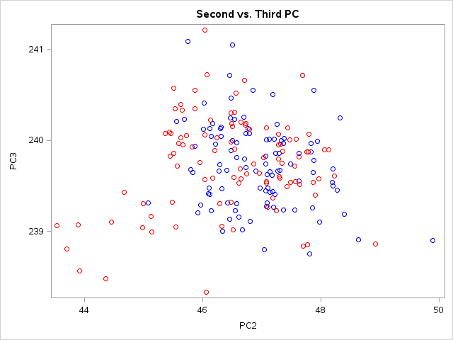
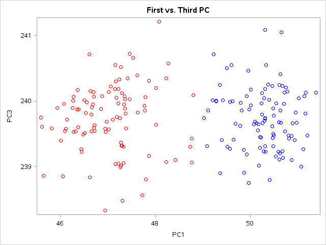
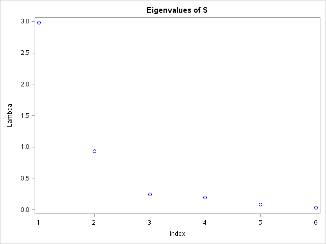

[](http://quantlet.de/)

## [](http://quantlet.de/) **MVApcabank** [](http://quantlet.de/)

```yaml

Name of QuantLet: MVApcabank

Published in: Applied Multivariate Statistical Analysis

Description: Performs a PCA for the Swiss bank notes and shows the first three principal components in two-dimensional scatterplots. Additionally, a screeplot of the eigenvalues is displayed.

Keywords: principal-components, pca, eigenvalues, screeplot, scatterplot, plot, graphical representation, data visualization, sas

See also: MVAnpcabanki, MVAnpcabank, MVAnpcahousi, MVAnpcatime, MVAnpcafood, MVAnpcausco, MVAnpcausco2, MVAnpcausco2i, MVAcpcaiv, MVAnpcahous, MVApcabanki, MVApcabankr, MVApcasimu

Author: Zografia Anastasiadou
Author[SAS]: Svetlana Bykovskaya
Author[Python]: 'Matthias Fengler, Liudmila Gorkun-Voevoda'

Submitted: Mon, June 30 2014 by Franziska Schulz
Submitted[SAS]: Tue, April 5 2016 by Svetlana Bykovskaya
Submitted[Python]: 'Wed, April 22 2020 by Liudmila Gorkun-Voevoda'

Datafile: bank2.dat

Example: Principal components of the bank data.

```













### PYTHON Code
```python

#!/usr/bin/env python
# coding: utf-8

# In[2]:


import pandas as pd
import numpy as np
import matplotlib.pyplot as plt

x = pd.read_csv("bank2.dat", sep = "\s+", header=None)
n = len(x)

e = np.linalg.eig((n - 1) * np.cov(x.T)/n)
e1 = e[0]
x  = np.dot(np.array(x), e[1])


# In[13]:


fig, axes = plt.subplots(2, 2, figsize = (10, 10))
axes[0, 0].scatter(x[:100, 0], x[:100, 1], c = "w", edgecolor = "b")
axes[0, 0].scatter(x[100:, 0], x[100:, 1], c = "r", marker = "+")
axes[0, 0].set_title("First vs. Second PC")
axes[0, 0].set_xlabel("PC1")
axes[0, 0].set_ylabel("PC2")

axes[0, 1].scatter(x[:100, 1], x[:100, 2], c = "w", edgecolor = "b")
axes[0, 1].scatter(x[100:, 1], x[100:, 2], c = "r", marker = "+")
axes[0, 1].set_title("Second vs. Third PC")
axes[0, 1].set_xlabel("PC2")
axes[0, 1].set_ylabel("PC3")

axes[1, 0].scatter(x[:100, 0], x[:100, 2], c = "w", edgecolor = "b")
axes[1, 0].scatter(x[100:, 0], x[100:, 2], c = "r", marker = "+")
axes[1, 0].set_title("First vs. Third PC")
axes[1, 0].set_xlabel("PC1")
axes[1, 0].set_ylabel("PC3")

axes[1, 1].scatter(range(1, 7), e1, c = "w", edgecolors = "black")
axes[1, 1].set_title("Eigenvalues of S")
axes[1, 1].set_xlabel("Index")
axes[1, 1].set_ylabel("Lambda")

fig.tight_layout()

plt.show()


```

automatically created on 2020-04-22

### R Code
```r


# clear all variables
rm(list = ls(all = TRUE))
graphics.off()

# load data
x = read.table("bank2.dat")
n = nrow(x)

e  = eigen((n - 1) * cov(x)/n)   # calculates eigenvalues and eigenvectors and sorts them by size
e1 = e$values
x  = as.matrix(x) %*% e$vectors  # data multiplied by eigenvectors

# plot of the first vs. second PC
par(mfrow = c(2, 2))
plot(x[, 1], x[, 2], pch = c(rep(1, 100), rep(3, 100)), col = c(rep("blue", 100), 
    rep("red", 100)), xlab = "PC1", ylab = "PC2", main = "First vs. Second PC", cex.lab = 1.2, 
    cex.axis = 1.2, cex.main = 1.8)

# plot of the second vs. third PC
plot(x[, 2], x[, 3], pch = c(rep(1, 100), rep(3, 100)), col = c(rep("blue", 100), 
    rep("red", 100)), ylim = c(-238.5, -241.5), xlab = "PC2", ylab = "PC3", main = "Second vs. Third PC", 
    cex.lab = 1.2, cex.axis = 1.2, cex.main = 1.8)

# plot of the first vs. third PC
plot(x[, 1], x[, 3], pch = c(rep(1, 100), rep(3, 100)), col = c(rep("blue", 100), 
    rep("red", 100)), ylim = c(-238.5, -241.5), xlab = "PC1", ylab = "PC3", main = "First vs. Third PC", 
    cex.lab = 1.2, cex.axis = 1.2, cex.main = 1.8)

# plot of the eigenvalues
plot(e1, ylim = c(0, 3), xlab = "Index", ylab = "Lambda", main = "Eigenvalues of S", 
    cex.lab = 1.2, cex.axis = 1.2, cex.main = 1.8) 

```

automatically created on 2020-04-22

### SAS Code
```sas


* Import the data;
data bank2;
  infile '/folders/myfolders/data/bank2.dat';
  input temp1-temp6;
run;

proc iml;
  * Read data into a matrix;
  use bank2;
    read all var _ALL_ into x; 
  close bank2;
  
  n  = nrow(x);
  e  = (n - 1) * cov(x)/n; * calculates eigenvalues and eigenvectors and sorts them by size; 
  e1 = 1:6;
  e2 = eigval(e);
  id = (repeat ({1}, 1, 100) || repeat ({2}, 1, 100))`;
  x  = x * eigvec(e);      * data multiplied by eigenvectors;
  
  x1 = x[,1];
  x2 = x[,2];
  x3 = x[,3];
  create plot var {"x1" "x2" "x3" "e1" "e2" "id"};
    append;
  close plot;
quit;

proc sgplot data = plot
    noautolegend;
  title 'First vs. Second PC';
  scatter x = x1 y = x2 / colorresponse = id colormodel = (blue red);
  xaxis label = 'PC1';
  yaxis label = 'PC2';
run;

proc sgplot data = plot
    noautolegend;
  title 'Second vs. Third PC';
  scatter x = x2 y = x3 / colorresponse = id colormodel = (blue red);
  xaxis label = 'PC2';
  yaxis label = 'PC3';
run;

proc sgplot data = plot
    noautolegend;
  title 'First vs. Third PC';
  scatter x = x1 y = x3 / colorresponse = id colormodel = (blue red);
  xaxis label = 'PC1';
  yaxis label = 'PC3';
run;

proc sgplot data = plot
    noautolegend;
  title 'Eigenvalues of S';
  scatter x = e1 y = e2 / markerattrs = (color = blue);
  xaxis label = 'Index';
  yaxis label = 'Lambda';
run;


```

automatically created on 2020-04-22