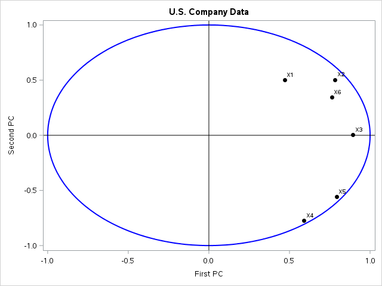
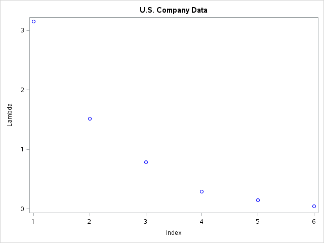
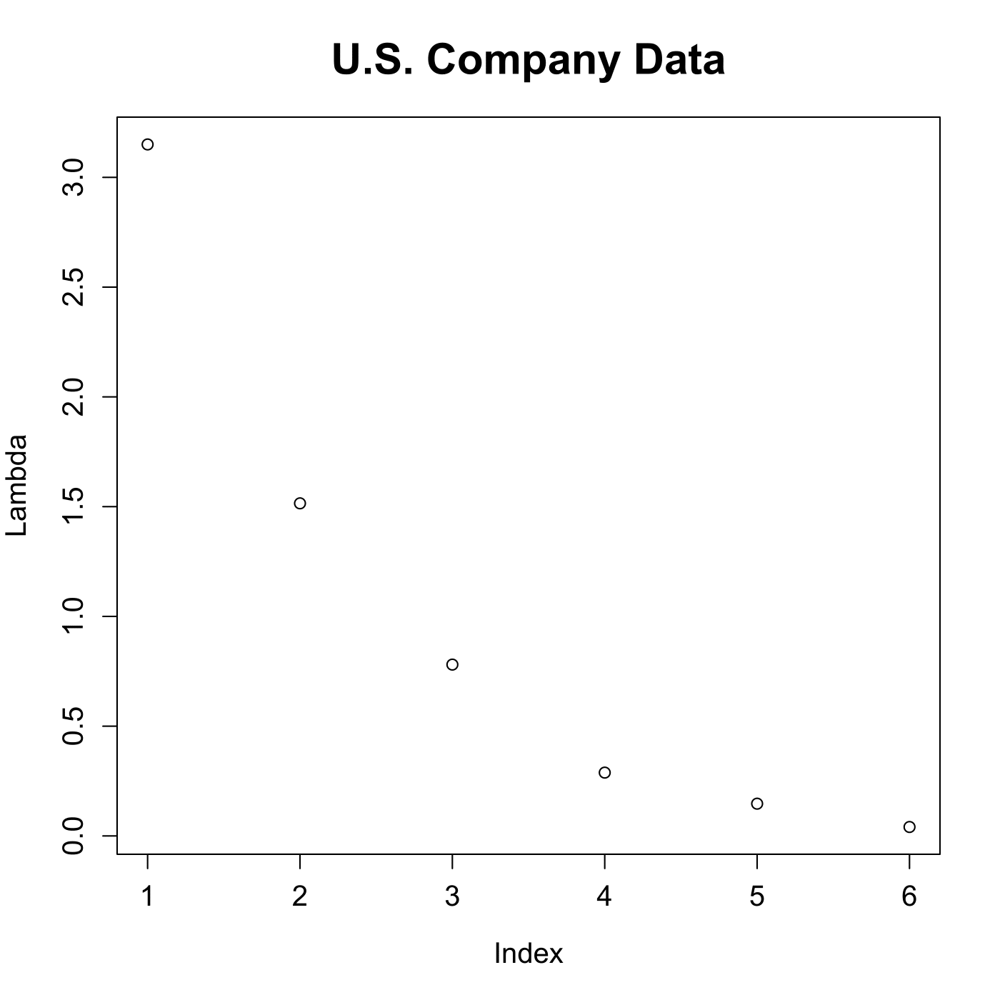
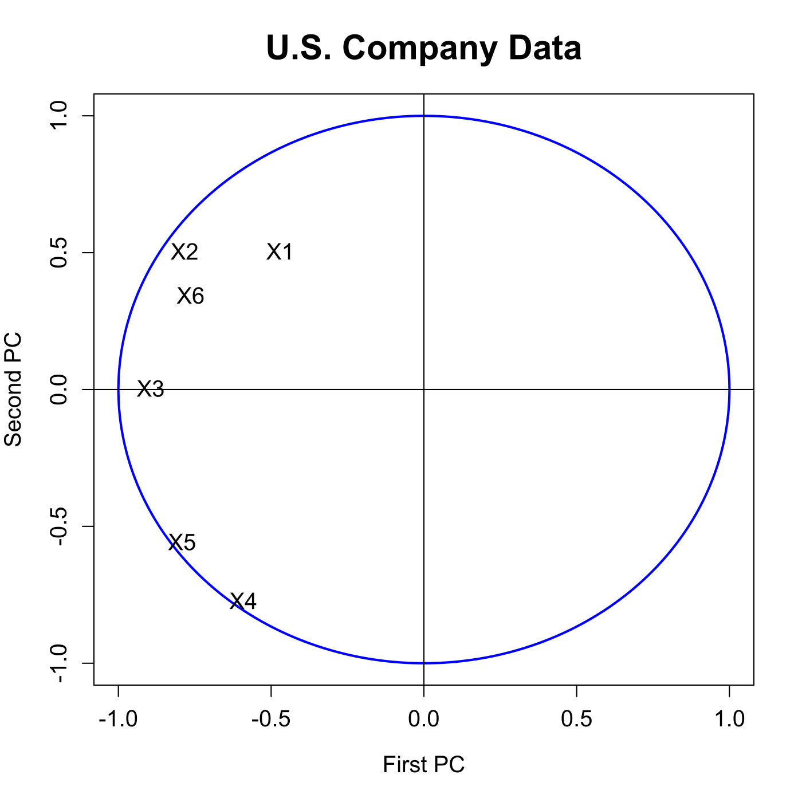

[](http://quantlet.de/)

## [](http://quantlet.de/) **MVAnpcausco2i** [](http://quantlet.de/)

```yaml

Name of QuantLet : MVAnpcausco2i

Published in : Applied Multivariate Statistical Analysis

Description : 'Shows a screeplot of the eigenvalues for the PCA of the standardized US company
data. It computes the correlations between the variables and the principal components and displays
the first two of them.'

Keywords : 'principal-components, pca, npca, eigenvalues, standardization, spectral-decomposition,
screeplot, plot, graphical representation, data visualization, correlation, sas'

See also : 'MVAnpcabanki, MVAnpcabank, MVAnpcahousi, MVAnpcatime, MVAnpcafood, MVAnpcahous,
MVAnpcausco, MVAnpcausco2, MVAcpcaiv, MVApcabank, MVApcabanki, MVApcabankr, MVApcasimu'

Author : Zografia Anastasiadou

Author[SAS] : Svetlana Bykovskaya

Submitted : Tue, March 18 2014 by Awdesch Melzer

Submitted[SAS] : Tue, April 5 2016 by Svetlana Bykovskaya

Datafile : uscomp2.dat

Example: 
- 1: Screeplot of the eigenvalues for the PCA of the standardized US company data.
- 2: First vs Second PC.

```










### R Code:
```r

# clear all variables
rm(list = ls(all = TRUE))
graphics.off()

# load data
x  = read.table("uscomp2.dat")
x  = x[, 2:7]
x  = rbind(x[1:37, ], x[39, ], x[41:79, ])
n  = nrow(x)
x  = scale(x)                   # standardizes the data matrix
e  = eigen((n - 1) * cov(x)/n)  # calculates eigenvalues and eigenvectors and sorts them by size
e1 = e$values

# plot for the relative proportion of variance explained by PCs
plot(e1, xlab = "Index", ylab = "Lambda", main = "U.S. Company Data", cex.lab = 1.2, 
    cex.axis = 1.2, cex.main = 1.8)

m    = mean(x)
temp = as.matrix(x - matrix(m, n, ncol(x), byrow = T))
r    = temp %*% e$vectors
r    = cor(cbind(r, x))         # correlation between PCs and variables
r1   = r[7:12, 1:2]             # correlation of the two most important PCs and variables

# plot for the correlation of the original variables with the PCs
dev.new()
ucircle = cbind(cos((0:360)/180 * pi), sin((0:360)/180 * pi))
plot(ucircle, type = "l", lty = "solid", col = "blue", xlab = "First PC", ylab = "Second PC", 
    main = "U.S. Company Data", cex.lab = 1.2, cex.axis = 1.2, cex.main = 1.8, lwd = 2)
abline(h = 0, v = 0)
label = c("X1", "X2", "X3", "X4", "X5", "X6")
text(r1, label, cex = 1.2) 

```

### SAS Code:
```sas

* Import the data;
data uscomp2;
  infile '/folders/myfolders/data/uscomp2.dat';
  input Company $ A $ S $ MV $ P $ CF $ E $ Sector $;
run;

proc iml;
  * Read data into a matrix;
  use uscomp2;
    read all var _ALL_ into x; 
  close uscomp2;

  x = num(x[, 2:7]);
  x = x[1:37, ] // x[39, ] // x[41:79, ];
  n = nrow(x);
  create stx from x[colname={"x1" "x2" "x3" "x4" "x5" "x6"}];
    append from x;
  close stx;
quit;

* standardize the data matrix;
proc standard data = stx mean = 0 std = 1 out = y;
  var x1 x2 x3 x4 x5 x6;
run;

proc iml;
  * Read standardized data into a matrix;
  use y;
    read all var _ALL_ into x; 
  close y;
  
  n  = nrow(x);
  e  = (n - 1) * cov(x) / n; * spectral decomposition;
  e1 = 1:6;
  e2 = eigval(e);
  
  m  = x[:];
  t  = x - repeat(m, n, ncol(x));
  r  = t * eigvec(e);
  r  = corr(r || x);  * correlation between PCs and variables;
  r  = r[7:12, 1:2];    * correlation of the two most important PCs and variables;
  r1 = r[,1];
  r2 = r[,2];
  
  pi = constant("pi");
  uc = (cos((0:360)/180 * pi) // sin((0:360)/180 * pi))`;
  u1 = uc[,1];
  u2 = uc[,2];
  names = {"X1", "X2", "X3", "X4", "X5", "X6"};

  create plot var {"e1" "e2" "u1" "u2" "r1" "r2" "names"};
    append;
  close plot;
quit;

proc sgplot data = plot
    noautolegend;
  title 'U.S. Company Data';
  series  x = u1 y = u2 / lineattrs = (color = blue THICKNESS = 2);
  scatter x = r1 y = r2 / markerattrs = (color = black symbol = circlefilled)
    datalabel = names;
  refline 0 / lineattrs = (color = black);
  refline 0 / axis = x lineattrs = (color = black);
  xaxis label = 'First PC';
  yaxis label = 'Second PC';
run;

proc sgplot data = plot
    noautolegend;
  title 'U.S. Company Data';
  scatter x = e1 y = e2 / markerattrs = (color = blue);
  xaxis label = 'Index';
  yaxis label = 'Lambda';
run;


```
